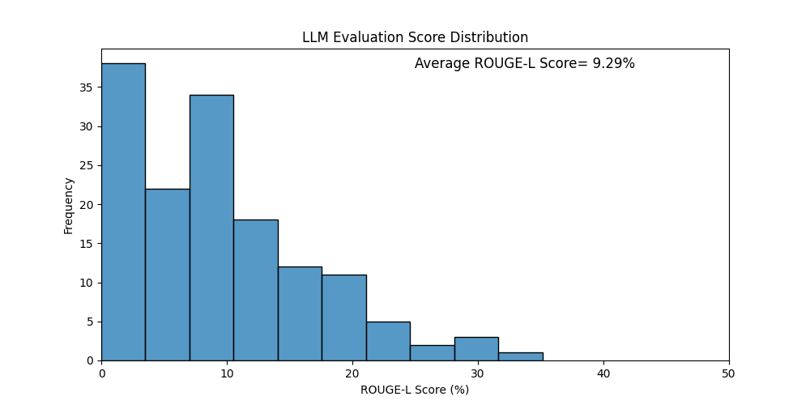
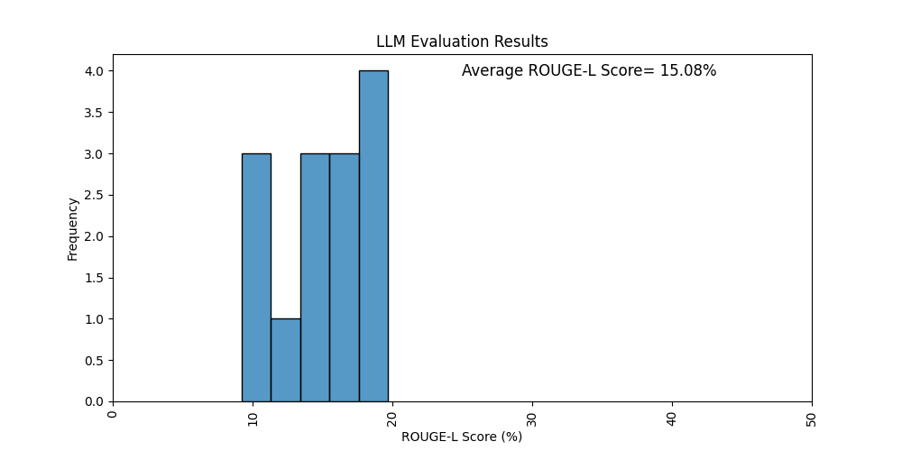

# Programming Languages

## Rogue L Evaluation Metric Results
### Rogue L Scores per Question

| Question ID       | ROUGE-L Score | BLEU Score | BERTScore | F1 Score |
|--------------------|---------------|------------|-----------|----------|
| request_2040_36_0_0 | 1.32% | 0.07% | 77.36% | 2.68% |
| request_2040_36_0_1 | 8.42% | 0.00% | 78.03% | 0.00% |
| request_2040_36_0_2 | 2.88% | 0.09% | 79.30% | 1.67% |
| request_2040_36_0_3 | 3.55% | 0.08% | 76.62% | 3.82% |
| request_2040_36_0_4 | 0.70% | 0.06% | 77.67% | 1.22% |
| request_2040_36_0_5 | 5.13% | 0.00% | 76.06% | 0.00% |
| request_2040_36_0_6 | 5.63% | 0.00% | 76.54% | 0.00% |
| request_2040_36_0_7 | 2.82% | 0.00% | 76.25% | 0.00% |
| request_2040_36_0_8 | 7.27% | 0.00% | 76.08% | 0.00% |
| request_2040_36_0_9 | 8.54% | 0.23% | 80.78% | 7.02% |
| request_2040_36_0_10 | 9.64% | 0.27% | 82.36% | 6.25% |
| request_2040_36_1_0 | 15.05% | 0.07% | 83.83% | 4.00% |
| request_2040_36_1_1 | 14.17% | 0.00% | 82.96% | 0.00% |
| request_2040_36_1_2 | 12.70% | 0.06% | 80.85% | 1.77% |
| request_2040_36_1_3 | 18.35% | 0.07% | 81.67% | 1.18% |
| request_2040_36_2_0 | 6.86% | 0.22% | 82.38% | 5.61% |
| request_2040_36_2_1 | 0.00% | 0.00% | 78.61% | 0.00% |
| request_2040_36_2_2 | 1.73% | 0.00% | 77.72% | 0.00% |
| request_2040_36_2_3 | 1.04% | 0.11% | 79.45% | 3.30% |
| request_2040_36_2_4 | 2.46% | 0.13% | 79.85% | 3.24% |
| request_2040_36_2_5 | 4.97% | 0.00% | 80.21% | 0.00% |
| request_2040_36_3_0 | 6.06% | 0.00% | 75.89% | 0.00% |
| request_2040_36_3_1 | 8.16% | 0.09% | 77.65% | 2.38% |
| request_2040_36_3_2 | 6.55% | 0.07% | 77.91% | 5.41% |
| request_2040_36_3_3 | 30.93% | 6.39% | 84.49% | 27.34% |
| request_2040_36_3_4 | 7.33% | 0.00% | 78.67% | 0.00% |
| request_2040_36_4_0 | 4.17% | 0.17% | 79.97% | 6.33% |
| request_2040_36_4_1 | 18.31% | 0.07% | 82.45% | 2.06% |
| request_2040_36_4_2 | 7.45% | 0.49% | 83.34% | 15.32% |
| request_0adb_17_0_0 | 10.02% | 0.00% | 81.96% | 0.00% |
| request_0adb_17_0_1 | 6.74% | 0.35% | 84.36% | 9.84% |
| request_0adb_17_0_2 | 22.69% | 0.17% | 84.82% | 8.33% |
| request_0adb_17_0_3 | 10.54% | 1.09% | 78.97% | 10.08% |
| request_0adb_17_1_0 | 5.50% | 0.08% | 78.47% | 3.85% |
| request_0adb_17_1_1 | 8.92% | 0.14% | 84.11% | 2.56% |
| request_0adb_17_1_2 | 7.91% | 0.00% | 79.52% | 0.00% |
| request_0adb_17_1_3 | 15.18% | 0.16% | 82.16% | 5.05% |
| request_0adb_17_1_4 | 4.84% | 0.05% | 78.54% | 1.03% |
| request_c67e_21_0_0 | 0.94% | 0.00% | 75.06% | 0.00% |
| request_c67e_21_0_1 | 0.83% | 0.00% | 74.42% | 0.00% |
| request_c67e_21_0_2 | 2.71% | 0.10% | 77.91% | 3.39% |
| request_c67e_21_0_3 | 0.87% | 0.00% | 76.06% | 0.00% |
| request_c67e_21_0_4 | 0.81% | 0.07% | 75.06% | 1.38% |
| request_c67e_21_0_5 | 0.62% | 0.00% | 74.31% | 0.00% |
| request_c67e_21_0_6 | 0.00% | 0.00% | 74.53% | 0.00% |
| request_c67e_21_0_7 | 1.78% | 0.05% | 75.78% | 1.04% |
| request_c67e_21_0_8 | 0.71% | 0.00% | 74.90% | 0.00% |
| request_c67e_21_1_0 | 9.09% | 0.00% | 80.61% | 0.00% |
| request_c67e_21_1_1 | 7.55% | 0.08% | 81.34% | 1.42% |
| request_c67e_21_1_2 | 10.06% | 0.19% | 76.43% | 9.12% |
| request_c67e_21_2_0 | 8.73% | 0.18% | 78.55% | 10.88% |
| request_c67e_21_2_1 | 18.15% | 0.07% | 80.97% | 3.35% |
| request_c67e_21_2_2 | 8.23% | 0.10% | 78.64% | 7.20% |
| request_c67e_21_2_3 | 11.16% | 0.33% | 80.30% | 7.75% |
| request_c67e_21_2_4 | 13.24% | 0.65% | 80.33% | 13.33% |
| request_c67e_21_2_5 | 6.94% | 0.39% | 82.79% | 10.76% |
| request_c67e_21_2_6 | 0.97% | 0.05% | 75.20% | 1.86% |
| request_c67e_21_3_0 | 29.06% | 3.06% | 82.89% | 15.73% |
| request_c67e_21_3_1 | 4.31% | 0.13% | 80.69% | 2.08% |
| request_c67e_21_3_2 | 11.11% | 0.11% | 82.67% | 4.55% |
| request_gnment1_0_0 | 2.40% | 0.06% | 79.70% | 2.97% |
| request_gnment1_0_1 | 2.67% | 0.16% | 79.81% | 5.23% |
| request_gnment1_0_2 | 13.90% | 0.39% | 83.14% | 16.46% |
| request_gnment1_0_3 | 8.91% | 0.29% | 81.33% | 8.70% |
| request_gnment1_0_4 | 5.71% | 0.00% | 81.44% | 0.00% |
| request_gnment1_0_5 | 7.53% | 0.24% | 84.57% | 9.46% |
| request_gnment1_0_6 | 0.00% | 0.00% | 0.00% | 0.00% |
| request_gnment1_0_7 | 0.00% | 0.00% | 0.00% | 0.00% |
| request_gnment1_0_8 | 9.88% | 0.37% | 84.74% | 12.28% |
| request_gnment1_1_0 | 35.14% | 0.00% | 83.85% | 0.00% |
| request_gnment1_1_1 | 22.66% | 0.00% | 83.20% | 0.00% |
| request_gnment1_1_2 | 28.70% | 0.00% | 84.08% | 0.00% |
| request_gnment1_1_3 | 14.12% | 0.00% | 83.37% | 0.00% |
| request_gnment1_2_0 | 3.51% | 0.11% | 79.29% | 5.16% |
| request_gnment1_2_1 | 17.63% | 4.51% | 84.47% | 12.50% |
| request_gnment1_2_2 | 12.29% | 0.14% | 82.64% | 4.44% |
| request_gnment1_2_3 | 20.79% | 0.87% | 83.03% | 14.75% |
| request_gnment1_2_4 | 9.00% | 0.11% | 81.51% | 6.02% |
| request_gnment1_3_0 | 3.84% | 0.28% | 78.68% | 7.04% |
| request_gnment1_3_1 | 25.75% | 2.44% | 83.70% | 14.61% |
| request_gnment1_3_2 | 11.42% | 1.49% | 81.01% | 6.43% |
| request_gnment1_4_0 | 20.00% | 1.52% | 86.93% | 22.41% |
| request_gnment1_4_1 | 18.48% | 4.87% | 86.10% | 22.58% |
| request_gnment1_4_2 | 23.26% | 5.08% | 86.93% | 26.38% |
| request_46c7_33_0_0 | 0.66% | 0.00% | 74.89% | 0.00% |
| request_46c7_33_0_1 | 0.60% | 0.05% | 74.55% | 1.18% |
| request_46c7_33_0_2 | 0.00% | 0.00% | 74.12% | 0.00% |
| request_46c7_33_1_0 | 24.21% | 2.75% | 83.20% | 12.38% |
| request_46c7_33_1_1 | 24.73% | 0.94% | 83.34% | 13.21% |
| request_46c7_33_1_2 | 18.47% | 0.81% | 80.66% | 11.45% |
| request_46c7_33_1_3 | 13.94% | 0.71% | 84.11% | 16.54% |
| request_46c7_33_2_0 | 20.94% | 0.25% | 82.96% | 9.79% |
| request_46c7_33_2_1 | 9.82% | 0.13% | 76.66% | 4.30% |
| request_46c7_33_2_2 | 9.38% | 0.09% | 78.33% | 4.47% |
| request_46c7_33_2_3 | 14.41% | 0.08% | 79.23% | 6.25% |
| request_46c7_33_3_0 | 11.33% | 0.80% | 81.76% | 9.91% |
| request_46c7_33_3_1 | 9.09% | 0.81% | 82.59% | 8.93% |
| request_46c7_33_3_2 | 6.73% | 0.21% | 80.91% | 10.63% |
| request_ab34_16_0_0 | 4.55% | 0.21% | 77.77% | 4.51% |
| request_ab34_16_0_1 | 4.24% | 0.21% | 78.30% | 5.44% |
| request_ab34_16_0_2 | 10.96% | 0.33% | 80.74% | 12.40% |
| request_ab34_16_0_3 | 8.39% | 0.46% | 81.18% | 7.73% |
| request_ab34_16_0_4 | 7.48% | 0.34% | 81.87% | 8.26% |
| request_ab34_16_1_0 | 14.88% | 0.00% | 80.69% | 0.00% |
| request_ab34_16_1_1 | 1.81% | 0.22% | 80.53% | 3.19% |
| request_ab34_16_1_2 | 21.05% | 0.12% | 81.95% | 11.11% |
| request_ab34_16_2_0 | 8.63% | 2.83% | 85.25% | 14.19% |
| request_ab34_16_2_1 | 12.47% | 0.75% | 80.91% | 5.67% |
| request_ab34_16_2_2 | 3.25% | 0.04% | 77.49% | 0.81% |
| request_ab34_16_3_0 | 7.69% | 0.29% | 82.00% | 4.12% |
| request_ab34_16_3_1 | 9.32% | 0.48% | 83.30% | 9.09% |
| request_ab34_16_3_2 | 14.60% | 0.16% | 81.72% | 1.99% |
| request_ab84_18_0_0 | 2.14% | 0.08% | 77.52% | 2.35% |
| request_ab84_18_0_1 | 1.16% | 0.00% | 76.14% | 0.00% |
| request_ab84_18_0_2 | 0.60% | 0.00% | 73.30% | 0.00% |
| request_ab84_18_0_3 | 0.62% | 0.00% | 73.20% | 0.00% |
| request_ab84_18_1_0 | 14.34% | 0.51% | 82.11% | 10.08% |
| request_ab84_18_1_1 | 16.81% | 2.64% | 83.33% | 21.69% |
| request_ab84_18_2_0 | 12.60% | 0.41% | 79.59% | 10.23% |
| request_ab84_18_2_1 | 10.87% | 0.06% | 79.67% | 1.63% |
| request_ab84_18_2_2 | 8.62% | 0.04% | 79.41% | 0.84% |
| request_ab84_18_3_0 | 10.84% | 0.00% | 78.92% | 0.00% |
| request_ab84_18_3_1 | 2.37% | 0.00% | 78.90% | 0.00% |
| request_ab84_18_3_2 | 3.48% | 0.00% | 79.39% | 0.00% |
| request_ab84_18_3_3 | 15.69% | 0.00% | 78.93% | 0.00% |
| request_8b0d_34_0_0 | 1.10% | 0.05% | 74.43% | 0.99% |
| request_8b0d_34_0_1 | 1.15% | 0.00% | 75.96% | 0.00% |
| request_8b0d_34_0_2 | 0.58% | 0.05% | 73.39% | 0.98% |
| request_8b0d_34_0_3 | 0.48% | 0.04% | 73.63% | 0.87% |
| request_8b0d_34_1_0 | 24.41% | 0.00% | 79.80% | 0.00% |
| request_8b0d_34_1_1 | 7.72% | 0.00% | 77.36% | 0.00% |
| request_8b0d_34_1_2 | 3.91% | 0.05% | 78.64% | 2.28% |
| request_8b0d_34_2_0 | 3.61% | 0.00% | 79.67% | 0.00% |
| request_8b0d_34_2_1 | 11.82% | 0.00% | 79.52% | 0.00% |
| request_8b0d_34_2_2 | 6.78% | 0.00% | 79.15% | 0.00% |
| request_8b0d_34_2_3 | 8.70% | 0.00% | 79.20% | 0.00% |
| request_8b0d_34_2_4 | 10.36% | 0.00% | 78.58% | 0.00% |
| request_8b0d_34_2_5 | 15.31% | 0.67% | 76.00% | 15.13% |
| request_8b0d_34_3_0 | 17.68% | 0.06% | 81.26% | 1.06% |
| request_8b0d_34_3_1 | 7.82% | 0.63% | 78.21% | 5.06% |
| request_8b0d_34_3_2 | 14.32% | 0.07% | 77.76% | 3.28% |
| request_8b0d_34_3_3 | 5.51% | 0.30% | 79.23% | 7.66% |
| request_8b0d_34_4_0 | 7.83% | 1.23% | 82.74% | 8.87% |
| request_8b0d_34_4_1 | 12.55% | 0.00% | 81.72% | 0.00% |
| request_8b0d_34_4_2 | 8.56% | 0.00% | 79.86% | 0.00% |
| request_8b0d_34_4_3 | 11.67% | 0.35% | 83.45% | 12.80% |
| **Average**            | 9.29% | 0.42% | 78.78% | 5.04% |

### Evaluation Score Distribution

## One Shot Evaluation Results

| Question ID       | ROUGE-L Score | BLEU Score | BERTScore | F1 Score |
|--------------------|---------------|------------|-----------|----------|
| request_2040_36_0_0 | 2.37% | 0.13% | 79.30% | 3.92% |
| request_2040_36_0_1 | 6.63% | 0.00% | 78.81% | 0.00% |
| request_2040_36_0_2 | 3.26% | 0.10% | 79.27% | 1.89% |
| request_2040_36_0_3 | 3.16% | 0.10% | 75.90% | 4.20% |
| request_2040_36_0_4 | 1.26% | 0.12% | 78.82% | 2.13% |
| request_2040_36_0_5 | 5.88% | 0.00% | 77.23% | 0.00% |
| request_2040_36_0_6 | 4.71% | 0.00% | 76.40% | 0.00% |
| request_2040_36_0_7 | 6.06% | 0.00% | 76.79% | 0.00% |
| request_2040_36_0_8 | 6.59% | 0.00% | 75.75% | 0.00% |
| request_2040_36_0_9 | 10.00% | 0.31% | 79.73% | 8.13% |
| request_2040_36_0_10 | 6.97% | 0.22% | 81.69% | 5.04% |
| request_2040_36_1_0 | 32.04% | 0.17% | 85.22% | 5.13% |
| request_2040_36_1_1 | 80.60% | 0.00% | 92.99% | 0.00% |
| request_2040_36_1_2 | 20.63% | 0.08% | 82.16% | 2.27% |
| request_2040_36_1_3 | 30.77% | 0.13% | 84.45% | 3.08% |
| request_2040_36_2_0 | 14.89% | 0.64% | 84.25% | 6.67% |
| request_2040_36_2_1 | 0.00% | 0.00% | 81.05% | 0.00% |
| request_2040_36_2_2 | 6.74% | 0.21% | 80.66% | 4.35% |
| request_2040_36_2_3 | 4.44% | 0.24% | 83.55% | 5.71% |
| request_2040_36_2_4 | 3.23% | 0.16% | 81.75% | 2.94% |
| request_2040_36_2_5 | 9.33% | 0.00% | 82.31% | 0.00% |
| request_2040_36_3_0 | 16.67% | 0.09% | 81.98% | 1.80% |
| request_2040_36_3_1 | 11.39% | 0.13% | 79.76% | 4.05% |
| request_2040_36_3_2 | 13.51% | 0.17% | 80.28% | 4.62% |
| request_2040_36_3_3 | 36.53% | 10.34% | 83.02% | 32.67% |
| request_2040_36_3_4 | 22.91% | 0.10% | 81.69% | 1.48% |
| request_2040_36_4_0 | 5.49% | 0.20% | 81.62% | 7.27% |
| request_2040_36_4_1 | 31.51% | 0.12% | 85.57% | 2.78% |
| request_2040_36_4_2 | 10.06% | 2.10% | 84.88% | 21.00% |
| request_0adb_17_0_0 | 8.00% | 0.00% | 81.26% | 0.00% |
| request_0adb_17_0_1 | 7.18% | 0.37% | 84.19% | 11.76% |
| request_0adb_17_0_2 | 31.36% | 0.27% | 84.61% | 10.93% |
| request_0adb_17_0_3 | 15.65% | 0.80% | 80.19% | 9.45% |
| request_0adb_17_1_0 | 6.56% | 0.09% | 81.69% | 2.82% |
| request_0adb_17_1_1 | 15.89% | 0.28% | 85.69% | 4.08% |
| request_0adb_17_1_2 | 11.62% | 0.09% | 80.38% | 1.44% |
| request_0adb_17_1_3 | 21.43% | 0.31% | 83.68% | 8.00% |
| request_0adb_17_1_4 | 2.18% | 0.00% | 74.48% | 0.00% |
| request_c67e_21_0_0 | 1.43% | 0.00% | 75.83% | 0.00% |
| request_c67e_21_0_1 | 1.21% | 0.10% | 76.37% | 1.98% |
| request_c67e_21_0_2 | 2.29% | 0.10% | 78.01% | 1.94% |
| request_c67e_21_0_3 | 1.98% | 0.18% | 78.16% | 3.03% |
| request_c67e_21_0_4 | 1.18% | 0.10% | 75.29% | 1.90% |
| request_c67e_21_0_5 | 1.03% | 0.09% | 74.57% | 1.98% |
| request_c67e_21_0_6 | 0.00% | 0.00% | 75.37% | 0.00% |
| request_c67e_21_0_7 | 3.36% | 0.15% | 78.93% | 2.53% |
| request_c67e_21_0_8 | 0.71% | 0.00% | 75.72% | 0.00% |
| request_c67e_21_1_0 | 74.58% | 3.63% | 96.52% | 50.00% |
| request_c67e_21_1_1 | 48.39% | 0.99% | 92.61% | 29.33% |
| request_c67e_21_1_2 | 12.56% | 0.12% | 82.11% | 12.00% |
| request_c67e_21_2_0 | 12.25% | 0.22% | 81.13% | 11.37% |
| request_c67e_21_2_1 | 24.43% | 0.12% | 80.61% | 4.40% |
| request_c67e_21_2_2 | 19.35% | 0.19% | 83.85% | 8.82% |
| request_c67e_21_2_3 | 13.61% | 0.42% | 81.49% | 9.45% |
| request_c67e_21_2_4 | 12.44% | 0.41% | 81.27% | 13.14% |
| request_c67e_21_2_5 | 9.73% | 0.71% | 83.87% | 15.79% |
| request_c67e_21_2_6 | 0.78% | 0.07% | 76.55% | 1.29% |
| request_c67e_21_3_0 | 34.48% | 4.20% | 86.30% | 17.35% |
| request_c67e_21_3_1 | 10.53% | 0.92% | 85.07% | 9.20% |
| request_c67e_21_3_2 | 16.48% | 7.00% | 85.24% | 16.67% |
| request_gnment1_0_0 | 2.19% | 0.06% | 79.02% | 0.99% |
| request_gnment1_0_1 | 3.73% | 0.23% | 80.68% | 7.25% |
| request_gnment1_0_2 | 11.96% | 0.20% | 83.28% | 13.57% |
| request_gnment1_0_3 | 13.76% | 0.85% | 86.40% | 22.56% |
| request_gnment1_0_4 | 8.83% | 0.11% | 81.13% | 6.06% |
| request_gnment1_0_5 | 6.72% | 0.29% | 84.41% | 10.00% |
| request_gnment1_0_6 | 0.00% | 0.00% | 0.00% | 0.00% |
| request_gnment1_0_7 | 0.00% | 0.00% | 0.00% | 0.00% |
| request_gnment1_0_8 | 3.30% | 0.11% | 82.03% | 7.18% |
| request_gnment1_1_0 | 53.64% | 0.00% | 85.00% | 0.00% |
| request_gnment1_1_1 | 34.63% | 0.00% | 84.09% | 0.00% |
| request_gnment1_1_2 | 44.85% | 0.00% | 84.59% | 0.00% |
| request_gnment1_1_3 | 15.92% | 0.00% | 83.33% | 0.00% |
| request_gnment1_2_0 | 4.74% | 0.11% | 79.60% | 4.55% |
| request_gnment1_2_1 | 18.18% | 0.65% | 83.95% | 8.64% |
| request_gnment1_2_2 | 20.19% | 0.25% | 84.93% | 10.32% |
| request_gnment1_2_3 | 20.85% | 1.98% | 82.63% | 12.94% |
| request_gnment1_2_4 | 10.39% | 0.11% | 81.98% | 5.68% |
| request_gnment1_3_0 | 5.37% | 0.07% | 77.26% | 2.74% |
| request_gnment1_3_1 | 27.83% | 3.58% | 84.20% | 14.79% |
| request_gnment1_3_2 | 12.00% | 0.52% | 80.25% | 5.88% |
| request_gnment1_4_0 | 16.47% | 1.29% | 86.62% | 18.02% |
| request_gnment1_4_1 | 22.13% | 1.87% | 88.69% | 24.68% |
| request_gnment1_4_2 | 22.60% | 7.28% | 87.53% | 31.37% |
| request_46c7_33_0_0 | 0.96% | 0.08% | 74.97% | 1.61% |
| request_46c7_33_0_1 | 0.72% | 0.00% | 73.73% | 0.00% |
| request_46c7_33_0_2 | 0.00% | 0.00% | 74.04% | 0.00% |
| request_46c7_33_1_0 | 31.52% | 0.47% | 85.40% | 5.50% |
| request_46c7_33_1_1 | 47.79% | 7.64% | 88.80% | 27.54% |
| request_46c7_33_1_2 | 37.63% | 2.58% | 83.74% | 18.84% |
| request_46c7_33_1_3 | 12.96% | 0.38% | 84.41% | 20.49% |
| request_46c7_33_2_0 | 30.77% | 0.40% | 85.58% | 11.11% |
| request_46c7_33_2_1 | 14.04% | 0.21% | 78.78% | 4.17% |
| request_46c7_33_2_2 | 17.98% | 0.20% | 79.57% | 4.21% |
| request_46c7_33_2_3 | 19.29% | 1.88% | 79.83% | 8.43% |
| request_46c7_33_3_0 | 23.46% | 3.19% | 84.18% | 21.67% |
| request_46c7_33_3_1 | 32.34% | 0.70% | 86.05% | 24.76% |
| request_46c7_33_3_2 | 10.49% | 0.31% | 82.80% | 13.83% |
| request_ab34_16_0_0 | 4.76% | 0.14% | 79.68% | 3.64% |
| request_ab34_16_0_1 | 5.13% | 0.24% | 81.33% | 4.76% |
| request_ab34_16_0_2 | 11.11% | 0.87% | 81.07% | 12.50% |
| request_ab34_16_0_3 | 11.43% | 0.50% | 84.08% | 11.11% |
| request_ab34_16_0_4 | 9.38% | 0.46% | 83.50% | 9.88% |
| request_ab34_16_1_0 | 16.87% | 0.00% | 80.95% | 0.00% |
| request_ab34_16_1_1 | 3.52% | 0.22% | 80.92% | 4.14% |
| request_ab34_16_1_2 | 29.39% | 0.14% | 81.01% | 13.33% |
| request_ab34_16_2_0 | 17.60% | 5.97% | 88.00% | 24.44% |
| request_ab34_16_2_1 | 20.41% | 1.65% | 83.93% | 14.04% |
| request_ab34_16_2_2 | 4.44% | 0.07% | 77.01% | 1.99% |
| request_ab34_16_3_0 | 12.77% | 1.22% | 83.42% | 8.96% |
| request_ab34_16_3_1 | 21.71% | 3.01% | 86.06% | 17.98% |
| request_ab34_16_3_2 | 27.44% | 4.91% | 85.86% | 10.32% |
| request_ab84_18_0_0 | 1.54% | 0.07% | 77.11% | 1.20% |
| request_ab84_18_0_1 | 0.00% | 0.00% | 76.80% | 0.00% |
| request_ab84_18_0_2 | 0.93% | 0.00% | 75.98% | 0.00% |
| request_ab84_18_0_3 | 0.75% | 0.00% | 74.96% | 0.00% |
| request_ab84_18_1_0 | 18.72% | 0.51% | 82.00% | 9.52% |
| request_ab84_18_1_1 | 20.07% | 3.65% | 83.00% | 24.53% |
| request_ab84_18_2_0 | 21.64% | 0.23% | 81.34% | 8.79% |
| request_ab84_18_2_1 | 18.03% | 0.08% | 81.70% | 2.12% |
| request_ab84_18_2_2 | 13.64% | 0.07% | 80.42% | 1.18% |
| request_ab84_18_3_0 | 18.06% | 0.00% | 81.37% | 0.00% |
| request_ab84_18_3_1 | 7.02% | 0.00% | 82.66% | 0.00% |
| request_ab84_18_3_2 | 7.59% | 0.00% | 82.88% | 0.00% |
| request_ab84_18_3_3 | 18.60% | 0.12% | 79.66% | 1.48% |
| request_8b0d_34_0_0 | 2.05% | 0.07% | 76.21% | 2.26% |
| request_8b0d_34_0_1 | 0.00% | 0.00% | 77.16% | 0.00% |
| request_8b0d_34_0_2 | 0.81% | 0.00% | 76.49% | 0.00% |
| request_8b0d_34_0_3 | 0.70% | 0.00% | 73.87% | 0.00% |
| request_8b0d_34_1_0 | 29.42% | 0.00% | 79.26% | 0.00% |
| request_8b0d_34_1_1 | 18.84% | 0.00% | 79.35% | 0.00% |
| request_8b0d_34_1_2 | 3.12% | 0.10% | 77.22% | 2.96% |
| request_8b0d_34_2_0 | 9.33% | 0.00% | 82.27% | 0.00% |
| request_8b0d_34_2_1 | 14.51% | 0.00% | 80.30% | 0.00% |
| request_8b0d_34_2_2 | 9.89% | 0.00% | 79.25% | 0.00% |
| request_8b0d_34_2_3 | 13.01% | 0.00% | 80.73% | 0.00% |
| request_8b0d_34_2_4 | 14.34% | 0.00% | 78.97% | 0.00% |
| request_8b0d_34_2_5 | 15.73% | 2.24% | 76.59% | 12.93% |
| request_8b0d_34_3_0 | 26.02% | 0.00% | 82.19% | 0.00% |
| request_8b0d_34_3_1 | 10.32% | 0.97% | 77.87% | 7.19% |
| request_8b0d_34_3_2 | 16.13% | 0.11% | 80.05% | 5.97% |
| request_8b0d_34_3_3 | 6.45% | 0.43% | 80.40% | 9.73% |
| request_8b0d_34_4_0 | 9.67% | 1.60% | 82.52% | 12.05% |
| request_8b0d_34_4_1 | 13.13% | 0.00% | 82.24% | 0.00% |
| request_8b0d_34_4_2 | 11.65% | 0.00% | 80.17% | 0.00% |
| request_8b0d_34_4_3 | 11.66% | 0.70% | 84.33% | 13.51% |
| **Average**            | 14.18% | 0.72% | 80.24% | 6.94% |
---

# Network and Computer Security

## Rogue L Evaluation Results

### Rogue L Scores per Question

| Question ID       | ROUGE-L Score | BLEU Score | BERTScore | F1 Score |
|--------------------|---------------|------------|-----------|----------|
| request_S14_ps1_0_0 | 14.54% | 0.35% | 82.39% | 15.25% |
| request_S14_ps1_0_1 | 10.09% | 0.23% | 78.37% | 12.24% |
| request_S14_ps1_1_0 | 18.81% | 2.27% | 84.68% | 24.74% |
| request_S14_ps1_1_1 | 9.43% | 0.15% | 82.38% | 15.12% |
| request_S14_ps1_1_2 | 14.85% | 2.82% | 82.62% | 21.91% |
| request_S14_ps2_0_0 | 19.67% | 2.04% | 84.62% | 22.37% |
| request_S14_ps2_0_1 | 12.67% | 0.63% | 81.28% | 18.84% |
| request_S14_ps2_0_2 | 17.62% | 4.57% | 83.92% | 31.38% |
| request_S14_ps2_0_3 | 15.84% | 3.79% | 83.05% | 20.41% |
| request_S14_ps2_0_4 | 17.39% | 3.91% | 83.75% | 29.29% |
| request_S14_ps3_0_0 | 15.45% | 0.34% | 81.23% | 18.82% |
| request_S14_ps3_1_0 | 18.60% | 0.46% | 83.64% | 22.22% |
| request_S14_ps3_1_1 | 16.97% | 0.44% | 82.49% | 21.14% |
| request_S14_ps3_1_2 | 9.22% | 0.21% | 78.52% | 9.83% |
| **Average**            | 15.08% | 1.59% | 82.35% | 20.25% |

### Evaluation Score Distribution

