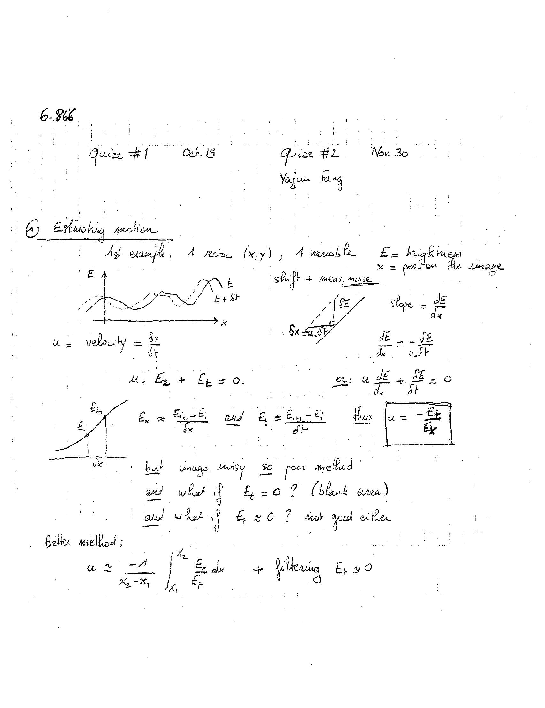
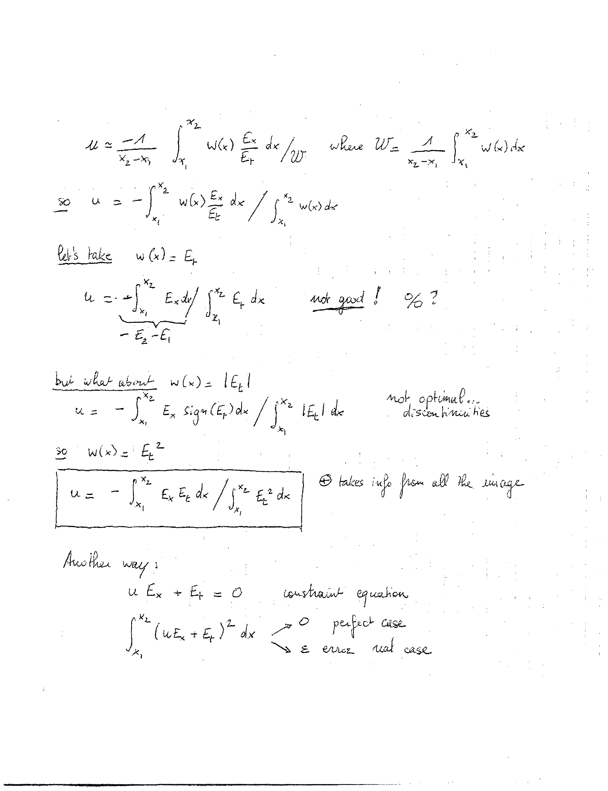
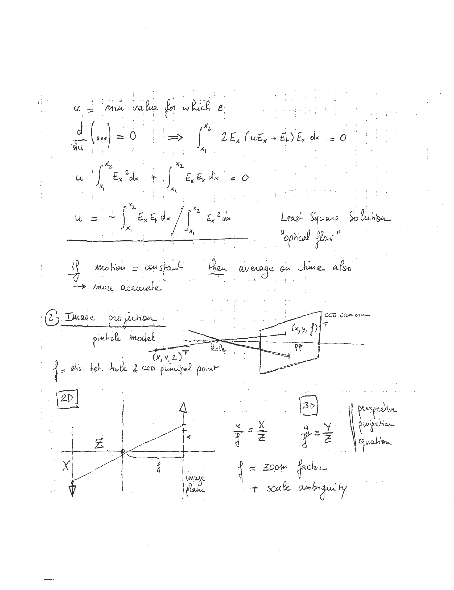
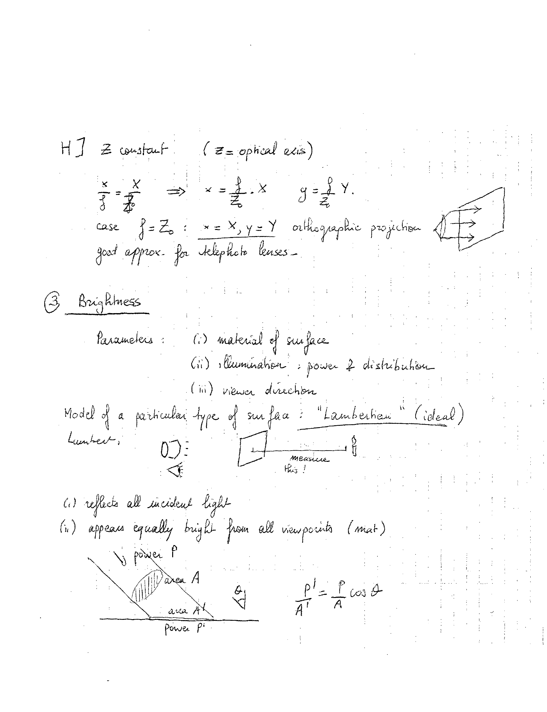
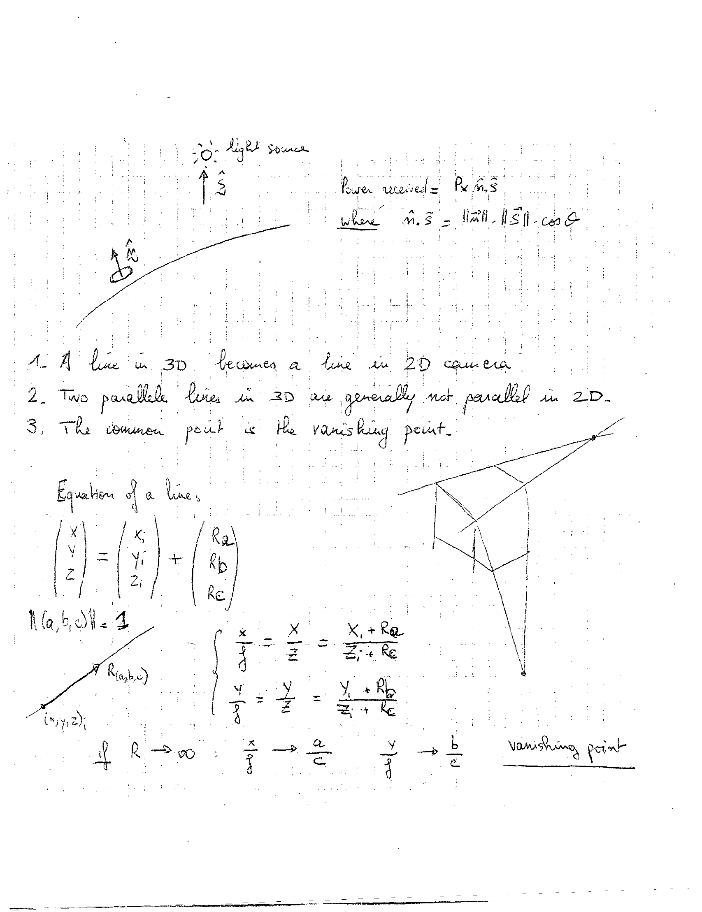

# l01


## 1

```markdown
6.866

Quiz #1    Oct. 19

Quiz #2    Nov. 30

Yajun Fang

1. Estimating motion

1st example, A vector (x, y), A variable

E = brightness

x = pos in the image

u = velocity = δx/δt

Shift + means, noise

slope = δE/δx

δE/δx = -δE/δt

u . Ex + Et = 0.

or: u δE/δx + δE/δt = 0

Ex = δE/δx and Et = δE/δt

thus u = -Et/Ex

but image noisy so poor method

and what if Et = 0? (blank area)

and what if Et ≈ 0? not good either

Better method:

u ≈ -1/(x2-x1) ∫(x1 to x2) Ex/Et dx + filtering Et ≠ 0
```

ASCII Art:

```
   E
   |   /\
   |  /  \
   | /    \
   |/      \
   +----------------> x
  t
t+δt

   δE
  -----
   δx
  \   |
   \  |
    \ |
     \|
     δx = u.δt
```


---

## 2

```markdown
\( u = -\frac{1}{x_2 - x_1} \int_{x_1}^{x_2} w(x) \frac{E_x}{E_t} \, dx / W_f \quad \text{where} \quad W_f = \frac{1}{x_2 - x_1} \int_{x_1}^{x_2} w(x) \, dx \)

so \( u = -\frac{\int_{x_1}^{x_2} w(x) \frac{E_x}{E_t} \, dx}{\int_{x_1}^{x_2} w(x) \, dx} \)

Let's take \( w(x) = E_t \)

\( u = -\frac{\int_{x_1}^{x_2} E_x \, dx}{-E_2 - E_1} \)

not good! \( \%? \)

but what about: \( w(x) = 1|E_t| \)

\( u = -\frac{\int_{x_1}^{x_2} E_x \, \text{sign}(E_t) \, dx}{\int_{x_1}^{x_2} |E_t| \, dx} \)

not optimal... discontinuities

so \( w(x) = E_t^2 \)

\[
u = -\frac{\int_{x_1}^{x_2} E_x E_t \, dx}{\int_{x_1}^{x_2} E_t^2 \, dx}
\]

\(\oplus\) takes info from all the image

Another way:

\( u E_x + E_t = 0 \) constraint equation

\[
\int_{x_1}^{x_2} (u E_x + E_t)^2 \, dx \quad \circ \text{ perfect case}
\]

\(\Rightarrow \epsilon \text{ error real case}\)
```

ASCII Art:

```
  __  __     __  __     ______     ______     ______    
 /\ \_\ \   /\ \_\ \   /\  ___\   /\  ___\   /\  ___\   
 \ \  __ \  \ \  __ \  \ \___  \  \ \ \____  \ \  __\   
  \ \_\ \_\  \ \_\ \_\  \/\_____\  \ \_____\  \ \_____\ 
   \/_/\/_/   \/_/\/_/   \/_____/   \/_____/   \/_____/ 
                                                       
```


---

## 3

```markdown
\( u = \text{min value for which } \varepsilon \)

\[
\frac{d}{du} \left( \cdots \right) = 0 \implies \int_{x_1}^{x_2} 2E_x (uE_x + E_t) E_x \, dx = 0
\]

\[
u \int_{x_1}^{x_2} E_x^2 \, dx + \int_{x_1}^{x_2} E_x E_t \, dx = 0
\]

\[
u = -\frac{\int_{x_1}^{x_2} E_x E_t \, dx}{\int_{x_1}^{x_2} E_x^2 \, dx} \quad \text{Least Squares Solution}
\]

\[
\text{"optical flow"}
\]

\[
\text{if motion = constant} \quad \text{then average on time also}
\]

\[
\rightarrow \text{more accurate}
\]

2. **Image projection**

\[
\text{pinhole model}
\]

\[
(x, y, z)^T \quad \text{hole}
\]

\[
\text{f dist. bet. hole \& CCD principal point}
\]

\[
\begin{array}{c}
\text{2D} \\
\


---

## 4

```markdown
H ] z constant (z = optical axis)

\[
\frac{x}{f} = \frac{X}{Z_0} \implies x = \frac{f}{Z_0} \cdot X \quad y = \frac{f}{Z_0} \cdot Y
\]

case \( f = Z_0 \) : \( x = X, y = Y \) orthographic projection

great approx. for telephoto lenses

3. Brightness

Parameters: 
(i) material of surface
(ii) illuminator: power & distribution
(iii) viewer direction

Model of a particular type of surface "Lambertian" (ideal) 
Lumbert

(1) reflects all incident light
(2) appears equally bright from all viewpoints (mat)

\[
\frac{p}{A'} = \frac{P}{A} \cos \theta
\]

```

ASCII Art:

```
   /\
  /  \
 /    \
/      \
\      /
 \    /
  \  /
   \/
```

```
  -----
 /     \
|       |
 \     /
  -----
```

```
  -----
 /     \
|       |
|       |
|       |
 \     /
  -----
```

```
  -----
 /     \
|       |


---

## 5

```markdown
```
          O: light source
          ^
          | S
          
          Power received = P x n̂ . Ŝ
          where n̂ . Ŝ = ||n̂|| . ||Ŝ|| . cos θ
          
1. A line in 3D becomes a line in 2D camera.
2. Two parallel lines in 3D are generally not parallel in 2D.
3. The common point is the vanishing point.

Equation of a line:

| x |   | x₁ |   | Rₐ |
| y | = | y₁ | + | R_b |
| z |   | z₁ |   | R_c |

n̂(a, b, c) = 1

          x   x   x₁ + Rₐ
          - = - = -------
          y   z   z₁ + R_c

          y   y   y₁ + R_b
          - = - = -------
          z   z   z₁ + R_c

If R -> ∞

          x   a
          - -> -
          y   c

          y   b
          - -> -
          z   c

vanishing point
```

ASCII Art:

```
          O: light source
          ^
          | S
          
          Power received = P x n̂ . Ŝ
          where n̂ . Ŝ = ||n̂|| . ||Ŝ|| . cos θ
          
1. A line in 3D becomes a line in 2D camera.
2. Two parallel lines in 3D are generally not parallel in 2D.
3. The common point is the vanishing point.

Equation of a line:

| x |   | x₁ |   | Rₐ |
| y | = | y₁ | + | R_b |
| z |   | z₁ |   | R_c |

n̂(a, b, c) = 1

          x   x   x₁ + Rₐ
          - = - = -------
          y   z   z₁ + R_c

          y   y   y₁ + R_b
          - = - = -------
          z   z   z₁ + R_c

If R -> ∞

          x   a
          - -> -
          y   c

          y   b
          - -> -
          z   c

vanishing point
```


---
