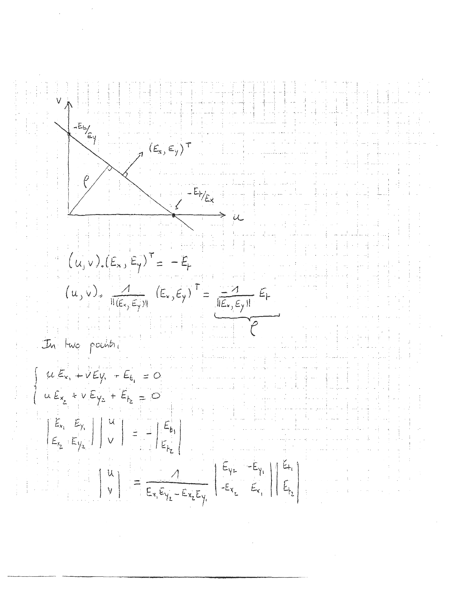

# l02


## 1

```markdown
6.866
10/14/04

Sensitivity to error

```
```
  y
  |
  |     /
  |    /
  |   /
  |  /
  | /
  |/
  +---------------- x
```
```markdown
x = unknown parameter (world)
y = measurement (image)

y = f(x)   δy = df/dx δx

ex:  y = sin x
     f' = α cos x

δx = 1/(α cos x) δy = 1/(α √(1-y²)) δy

→ problem if y ~ 1

x = f⁻¹(y)
δx = df⁻¹/dy δy
f⁻¹(y) = 1/α sin⁻¹(y)

df⁻¹/dy = 1/α 1/√(1-y²)

Variance:

σx² = 1/N ∑(i=1 to N) δxi²

σy² = 1/N ∑(i=1 to N) δyi²
```

ASCII Art:

```
  y
  |
  |     /
  |    /
  |   /
  |  /
  | /
  |/
  +---------------- x
```


---

## 2

```markdown
\[
\sigma_x^2 = \frac{1}{\left( \frac{df}{dx} \right)^2} \sigma_y^2
\]

\[
\sigma_x = \frac{1}{\left| \frac{df}{dx} \right|} \sigma_y
\]

Noise in weighted sum

\[
x = \sum_{i=1}^{n} w_i x_i \quad \left( \sum_{i=1}^{n} w_i = 1 \text{ in general} \right)
\]

Noise

\[
x + e = \sum_{i=1}^{n} w_i (x_i + e_i)
\]

\[
e = \sum_{i=1}^{n} w_i e_i
\]

expected value of \( x \) \quad \(\langle x \rangle = \sum_{i=1}^{n} w_i \langle x_i \rangle\) \quad mean; \(\mu\)

\[
e^2 = \sum_{i=1}^{n} w_i e_i \sum_{j=1}^{n} w_j e_j
\]

\[
e^2 = \sum_{i=1}^{n} w_i w_j e_i e_j
\]
```

ASCII Art:

```
  _______________
 |               |
 |   1           |
 |  --- σ_y      |
 |  |df/dx|      |
 |_______________|
```


---

## 3

```markdown
\[ 
\begin{align*}
e_i e_j &= 
\begin{cases} 
0 & i \neq j \\
e_i^2 & i = j 
\end{cases} 
\Rightarrow e^z = \sum_{i=1}^{n} w_i^2 e_i^2 \\
\sigma_x^2 &= \sum_{i=1}^{n} w_i^2 \sigma_{x_i}^2 \\
e_i q_j &= w_i = \frac{1}{N} \\
\sigma_x^2 &= \frac{1}{N^2} \sum_{i=1}^{n} \sigma_{x_i}^2 = \frac{1}{N} \sigma_x^2 \Rightarrow \sigma_x = \frac{1}{\sqrt{N}} \sigma_x
\end{align*}
\]

**Notation**

- vectors = bold face \(\mathbf{a} = (x, y, z)^T\)
- unit vectors: \(\hat{x}, \hat{y}, \hat{z}\)
- dot product: \(\mathbf{a} \cdot \mathbf{b} = \mathbf{a}^T \mathbf{b}\)
- dyadic product: \(\mathbf{a} \mathbf{b}^T = 
\begin{bmatrix}
a_x b_x & a_y b_y & a_z b_z
\end{bmatrix}
\)

\[
\begin{array}{c}
\text{COP} \\
\bullet \\
\text{IP}
\end{array}
\]

\[
\begin{array}{c}
\mathbf{a} = (x, y, z) \\
\mathbf{b} = (X, Y, Z)^T
\end{array}
\]

\[
\begin{cases}
\frac{x}{z} = \frac{X}{Z} \\
\frac{y}{z} = \frac{Y}{Z} \\
\frac{z}{z} = 1
\end{cases}
\]
```

### ASCII Art

```
| e_i e_j = 
| 0 i ≠ j
| e_i^2 i = j
| => e^z = Σ w_i^2 e_i^2
| σ_x^2 = Σ w_i^2 σ_x_i^2
| e_i q_j = w_i = 1/N
| σ_x^2 = 1/N^2 Σ σ_x_i^2 = 1/N σ_x^2 => σ_x = 1/√N σ_x

Notation

vectors = bold face a = (x, y, z)^T
unit vectors: x̂, ŷ, ẑ
dot product: a · b = a^T b
dyadic product: a b^T = [ a_x b_x a_y b_y a_z b_z ]

COP
  .
  IP

a = (x, y, z)
b = (X, Y, Z)^T

{ x/z = X/Z
  y/z = Y/Z
  z/z = 1
}
```


---

## 4

```markdown
\[
\frac{1}{f} \vec{z} = \frac{1}{\vec{R} \cdot \vec{z}} \vec{R}
\]

In 3D,

\[
\vec{R} = \vec{R_0} + s \hat{u}
\]

\[
\frac{1}{f} \vec{z} = \frac{1}{(\vec{R_0} + s \hat{u}) \cdot \vec{z}} (\vec{R_0} + s \hat{u})
\]

For any \( s \), we can get \( \vec{z} \).

Vanishing point, \( s \to \infty \)

\[
\frac{1}{f} \vec{z}_\infty = \frac{1}{\hat{u} \cdot \vec{z}} \hat{u}
\]

All parallel lines have the same \( \hat{u} \), thus the same vanishing point.

Point on the image:

\[
\frac{\hat{u}}{\hat{u} \cdot \vec{z}} + \frac{1}{b}
\]
```

ASCII Art:

```
+-------------------+
| 1     1           |
| - z = - R         |
| f     R.z         |
+-------------------+

In 3D,
          ^
R = R0 + s u
    ref. point   unit vector direction

1     1
- z = -  (R0 + s u)
f     (R0 + s u).z

For any s, we can get z.

Vanishing point, s -> infinity

+-------------------+
| 1     1           |
| - z_inf = - u     |
| f     u.z         |
+-------------------+

All parallel lines have the same u,
thus the same vanishing point.

Point on the image:

    ^       1
u / u.z + ------
            b
```


---

## 5

```markdown
Example

\[
\begin{align*}
\vec{a} \cdot \vec{S} &= \alpha \\
\vec{b} \cdot \vec{S} &= \beta \\
\vec{c} \cdot \vec{S} &= \gamma
\end{align*}
\]

\[
\begin{bmatrix}
\vec{a}^T \\
\vec{b}^T \\
\vec{c}^T
\end{bmatrix}
\cdot \vec{S} =
\begin{bmatrix}
\alpha \\
\beta \\
\gamma
\end{bmatrix}
\]

\[
\vec{S} = M^{-1}
\begin{bmatrix}
\alpha \\
\beta \\
\gamma
\end{bmatrix}
\]

\[
\text{det}(M) \neq 0
\]

\[
M^{-1} = \frac{1}{[\vec{a} \ \vec{b} \ \vec{c}]}
\begin{bmatrix}
b \times c \\
c \times a \\
a \times b
\end{bmatrix}
\]

triple product: \(\vec{a} \cdot (\vec{b} \times \vec{c}) = (\vec{a} \times \vec{b}) \cdot \vec{c} = \text{det}(M) = \text{volume}
\]

```

### ASCII Art

```
          \vec{a}
          /|\
         / | \
        /  |  \
       /   |   \
      /    |    \
     /     |     \
    /      |      \
   /       |       \
  /        |        \
 /         |         \
/          |          \
------------------------
\vec{b}    \vec{c}    \vec{S}

Source
  \vec{a}
   /|\
  / | \
 /  |  \
/   |   \
    O
```

```
   a
  / \
 /   \
b-----c
```


---

## 6

```markdown
Image motion in 2D

E = E₁                E = E₁
+----------------+    +----------------+
|                |    |                |
|                |    |                |
|                |    |                |
|                |    |                |
|                |    |                |
|                |    |                |
+----------------+    +----------------+
t                 (u, v)               t + dt

Track isophotes (E = E₁)

E(x, y, t) = E

E(x + δx, y + δy, t + δt) = E(x, y, t)

∂E/∂x δx + ∂E/∂y δy + ∂E/∂t δt = ε(||x, y, t||)

(∂E/∂x, ∂E/∂y) = brightness gradient

u = dx/dt
v = dy/dt

u Eₓ + v Eᵧ + Eₜ = 0

constraint equation
```

ASCII Art:

```
Image motion in 2D

E = E₁                E = E₁
+----------------+    +----------------+
|                |    |                |
|                |    |                |
|                |    |                |
|                |    |                |
|                |    |                |
|                |    |                |
+----------------+    +----------------+
t                 (u, v)               t + dt
```


---

## 7

```markdown
```
      v
      ^
      |
      |         (E_x, E_y)^T
      |        /
      |       /
      |      /
      |     /
      |    /
      |   /
      |  /
      | / 
      |/_________________________> u
     /|
    / |
   /  |
  /   |
 /    |
- E_y/E_x

(u, v) . (E_x, E_y)^T = -E_f

(u, v) = 1/||(E_x, E_y)|| (E_x, E_y)^T = -1/||E_x, E_y|| E_f
                                                _________
                                                    ρ

In two points:

{ u E_x1 + v E_y1 - E_t1 = 0
{ u E_x2 + v E_y2 + E_t2 = 0

| E_x1  E_y1 | | u | = - | E_t1 |
| E_x2  E_y2 | | v |     | E_t2 |

| u |     1     |  E_y2  -E_y1 | | E_t1 |
| v | = _______ | -E_x2   E_x1 | | E_t2 |
        E_x1E_y2 - E_x2E_y1
```
```


---
