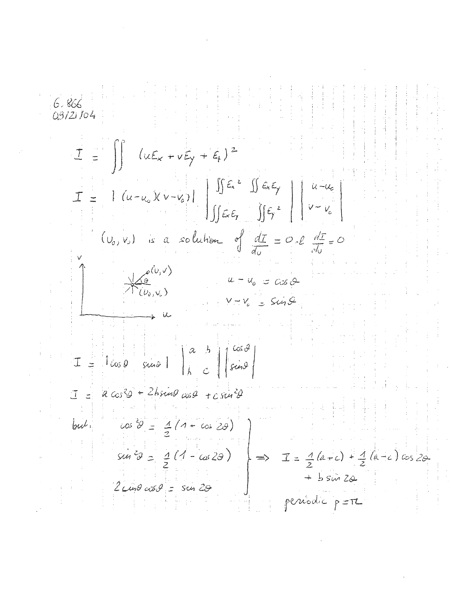
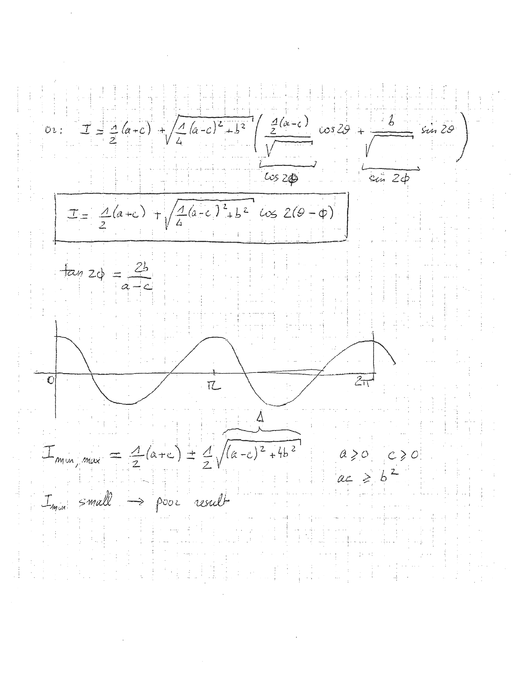
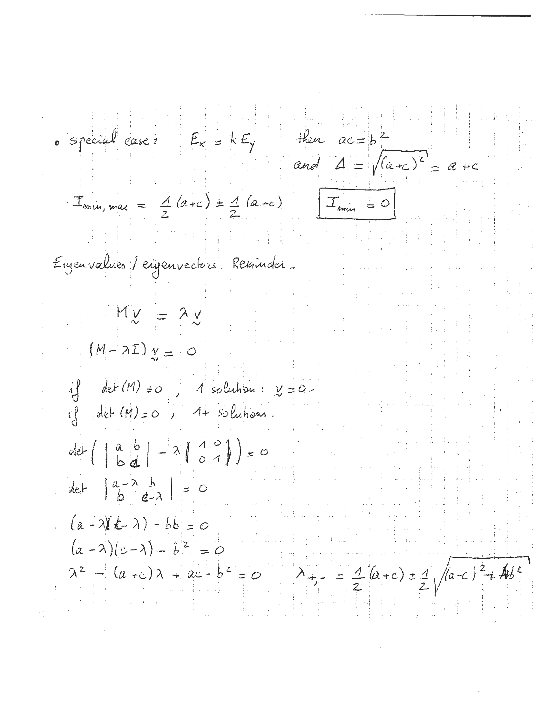
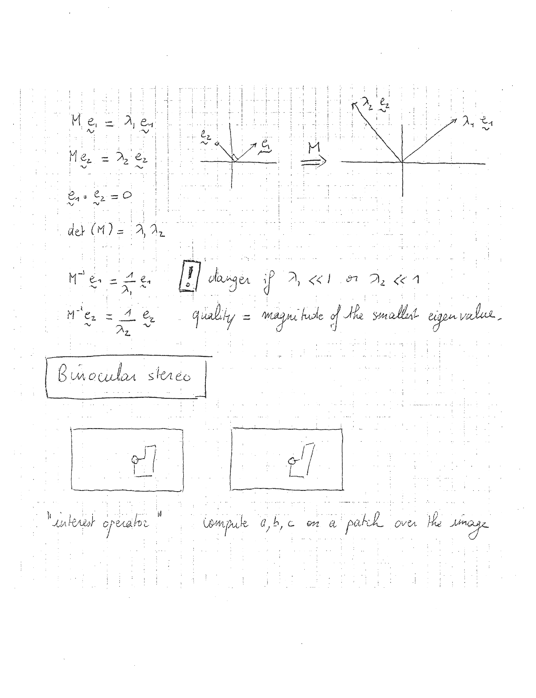
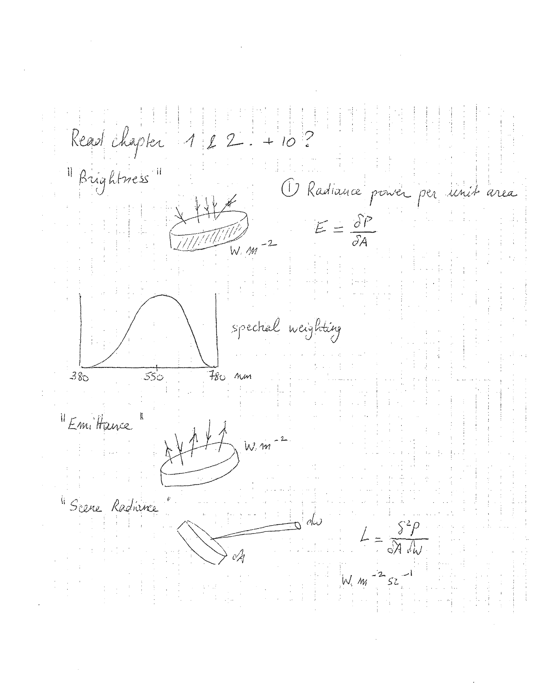
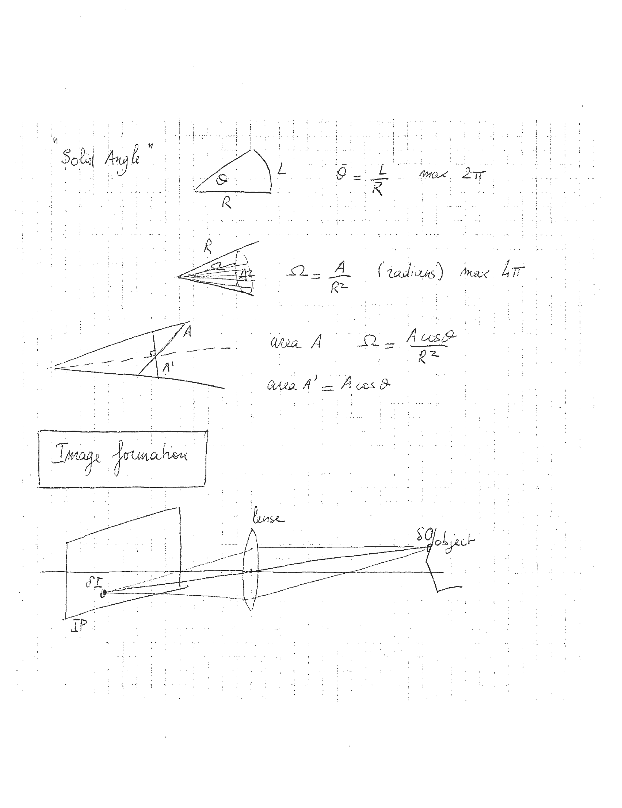
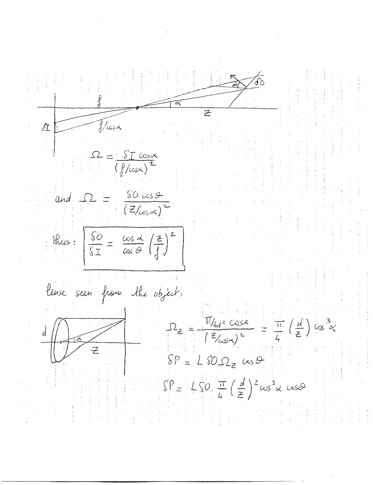
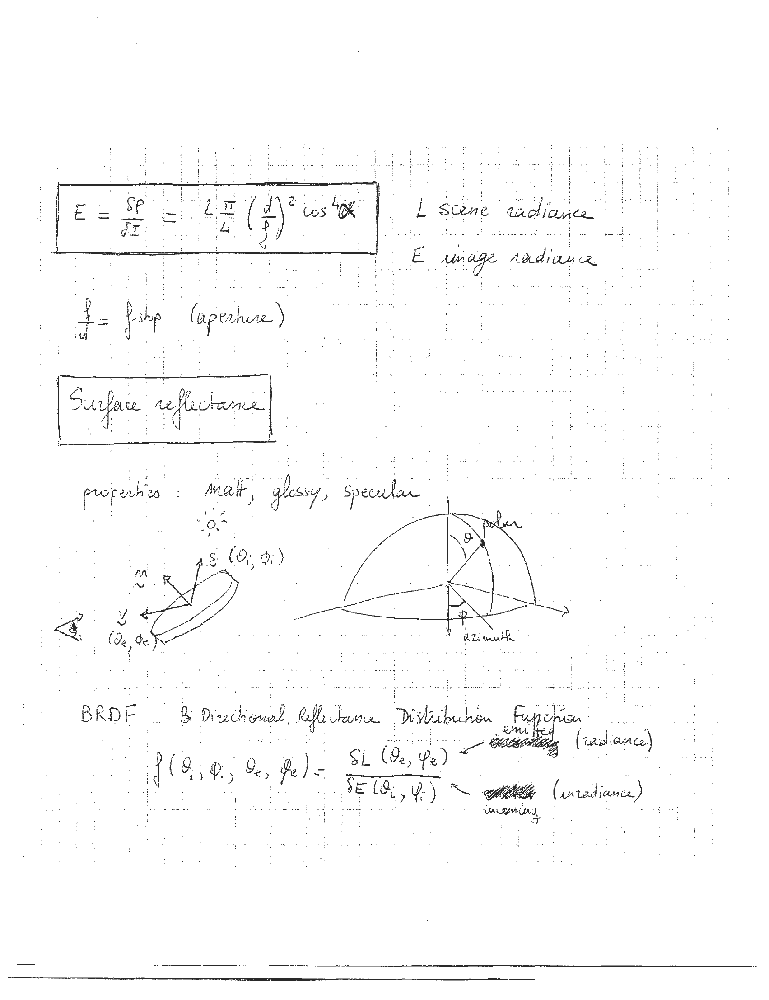
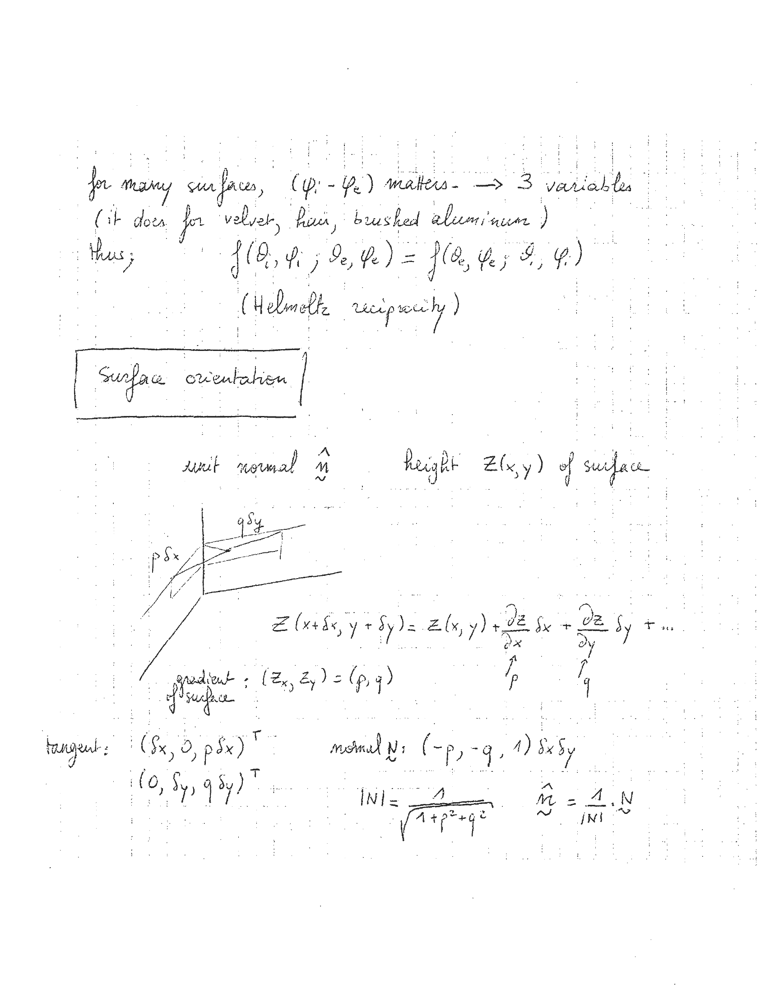

# l04


## 1

```markdown
6.866  
03/21/04  

I = ∫∫∫ (uEₓ + vEᵧ + Eₜ)²  

I = |(u-u₀)(v-v₀)|  
    |∫∫Eₓ²  ∫∫EₓEᵧ  | u-u₀ |  
    |∫∫EₓEᵧ  ∫∫Eᵧ²  | v-v₀ |  

(v₀, v₀) is a solution of  dI/du = 0 & dI/dv = 0  

v  
↑  
|  
| (u₀, v₀)  
|  
| u-u₀ = cosθ  
| v-v₀ = sinθ  
|  



---

## 2

```markdown
01: 
\[ I = \frac{\Delta}{2}(a+c) + \sqrt{\frac{\Delta}{4}(a-c)^2 + b^2} \left( \frac{1}{2}(a-c) \frac{\cos 2\theta}{\sqrt{\cos 2\phi}} + \frac{b \sin 2\theta}{\sqrt{\sin 2\phi}} \right) \]

\[ I = \frac{\Delta}{2}(a+c) + \sqrt{\frac{\Delta}{4}(a-c)^2 + b^2} \cos 2(\theta - \phi) \]

\[ \tan 2\phi = \frac{2b}{a-c} \]

```

```

---

## 3

```markdown
- special case: Ex = kEy then ac = b^2
  and Δ = √((a+c)^2) = a + c

I_min, max = 1/2 (a+c) ± 1/2 (a+c)

I_min = 0

Eigenvalues / eigenvectors Reminder -

Mv = λv

(M - λI)v = 0

if det(M) ≠ 0, 1 solution: v = 0.
if det(M) = 0, 1+ solution.

det( | a b | - λ | 1 0 | ) = 0
    | b d |     | 0 1 |

det | a-λ b | = 0
    | b d-λ |

(a-λ)(d-λ) - bb = 0
(a-λ)(c-λ) - b^2 = 0

λ^2 - (a+c)λ + ac - b^2 = 0

λ_+, - = 1/2 (a+c) ± 1/2 √((a-c)^2 + 4b^2)
```

ASCII Art:

```
- special case: Ex = kEy then ac = b^2
  and Δ = √((a+c)^2) = a + c

I_min, max = 1/2 (a+c) ± 1/2 (a+c)

I_min = 0

Eigenvalues / eigenvectors Reminder -

Mv = λv

(M - λI)v = 0

if det(M) ≠ 0, 1 solution: v = 0.
if det(M) = 0, 1+ solution.

det( | a b | - λ | 1 0 | ) = 0
    | b d |     | 0 1 |

det | a-λ b | = 0
    | b d-λ |

(a-λ)(d-λ) - bb = 0
(a-λ)(c-λ) - b^2 = 0

λ^2 - (a+c)λ + ac - b^2 = 0

λ_+, - = 1/2 (a+c) ± 1/2 √((a-c)^2 + 4b^2)
```


---

## 4

```markdown
M e₁ = λ₁ e₁

M e₂ = λ₂ e₂

e₁ · e₂ = 0

det(M) = λ₁ λ₂

M⁻¹ e₁ = 1/λ₁ e₁

M⁻¹ e₂ = 1/λ₂ e₂

![danger] danger if λ₁ << 1 or λ₂ << 1

quality = magnitude of the smallest eigenvalue

Binocular stereo

"interest operator" compute a, b, c on a patch over the image
```

```
ASCII Art:

       e₂
        ↑
        |
        |
        |
        |
        +--------→ e₁

        M
        ↓

       λ₂ e₂
        ↑
        |
        |
        |
        |
        +--------→ λ₁ e₁

```


---

## 5

```markdown
Read chapter 1 & 2 - + 10?

"Brightness"

  
W.m^-2

1. Radiance power per unit area  
   E = δP / δA

  
spectral weighting  
380  550  780 nm

"Emittance"

  
W.m^-2

"Scene Radiance"

  
dw  
dA

L = δ^2P / δA δw  
W.m^-2 sr^-1
```

ASCII Art:

```
Read chapter 1 & 2 - + 10?

"Brightness"

   \  |  / 
    \ | /
     \|/
  ------
 W.m^-2

1. Radiance power per unit area  
   E = δP / δA

   /\
  /  \
 /    \
/      \
--------
380  550  780 nm

"Emittance"

   \  |  / 
    \ | /
     \|/
  ------
 W.m^-2

"Scene Radiance"

   \  |  / 
    \ | /
     \|/
  ------
   dw  
   dA

L = δ^2P / δA δw  
W.m^-2 sr^-1
```


---

## 6

```markdown
"Solid Angle"

      L
    ______
   /      \
  /        \
 /          \
Q            R

Θ = L/R   max 2π

      R
     / \
    /   \
   /     \
  /_______\
 A1   A2

Ω = A/R²  (radius) max 4π

     A
    / \
   /   \
  /     \
 /_______\
A'        A

area A   Ω = A cos Θ / R²

area A' = A cos Θ

+------------------+
| Image formation  |
+------------------+

   _________
  |         |
   _________


---

## 7

```markdown
# Text Extracted from Image

## Diagram

```
     /\
    /  \
   /    \
  /      \
 /        \
/          \
```

## Equations

\[
\Omega = \frac{S I \cos \alpha}{(f / \cos \alpha)^2}
\]

and

\[
\Omega = \frac{S0 \cos \theta}{(Z / \cos \alpha)^2}
\]

thus:

\[
\frac{S0}{S I} = \frac{\cos \alpha}{\cos \theta} \left(\frac{Z}{f}\right)^2
\]

## Lens Seen from the Object

```
   /|
  / |
 /  |
/___|
```

\[
\Omega_z = \frac{\pi / 4 \cdot \cos \alpha}{(Z / \cos \alpha)^2} = \frac{\pi}{4} \left(\frac{d}{Z}\right) \cos^3 \alpha
\]

\[
\delta P = L S0 \cdot \Omega_z \cos \theta
\]

\[
SP = L S0 \cdot \frac{\pi}{4} \left(\frac{d}{Z}\right)^2 \cos^3 \alpha \cos \theta
\]
```


---

## 8

```markdown
E = \frac{SP}{\pi} = \frac{L \pi}{4} \left( \frac{d}{f} \right)^2 \cos^4 \alpha

L \text{ scene radiance}
E \text{ image radiance}

\frac{f}{d} \text{ f-stop (aperture)}

\text{Surface reflectance}

\text{properties: matte, glossy, specular}

\text{BRDF  Bi-Directional Reflectance Distribution Function}

f(\theta_i, \Phi_i, \theta_e, \Phi_e) = \frac{SL(\theta_e, \Phi_e)}{\delta E(\theta_i, \Phi_i)}

\text{outgoing (radiance)}
\text{incoming (irradiance)}
```

ASCII Art:

```
+---------------------------------------------------+
|                                                   |
+---------------------------------------------------+


---

## 9

```markdown
for many surfaces, \((\psi - \psi_e)\) matters. --> 3 variables  
(it does for velvet, hair, brushed aluminum)  
thus;  
\(f(\theta, \phi; \theta_e, \phi_e) = f(\theta_e, \phi_e; \theta, \phi)\)  
(Helmholtz reciprocity)  

[Surface orientation]

unit normal \(\hat{N}\)  
height \(Z(x, y)\) of surface  

\[
Z(x + \delta x, y + \delta y) = Z(x, y) + \frac{\partial Z}{\partial x} \delta x + \frac{\partial Z}{\partial y} \delta y + \ldots
\]

\[
\frac{\partial Z}{\partial x} = p, \quad \frac{\partial Z}{\partial y} = q
\]

gradient of surface: \((Z_x, Z_y) = (p, q)\)  

tangent: \((\delta x, 0, p \delta x)^T\)  
\((0, \delta y, q \delta y)^T\)  

normal \(N\): \((-p, -q, 1) \delta x \delta y\)  

\[
|N| = \frac{1}{\sqrt{1 + p^2 + q^2}}
\]

\[
\hat{N} = \frac{1}{|N|} N
\]
```

ASCII Art:

```
for many surfaces, (ψ - ψe) matters. --> 3 variables
(it does for velvet, hair, brushed aluminum)
thus;
f(θ, φ; θe, φe) = f(θe, φe; θ, φ)
(Helmholtz reciprocity)

+---------------------+
| Surface orientation |
+---------------------+

unit normal N^
height Z(x, y) of surface

Z(x + δx, y + δy) = Z(x, y) + ∂Z/∂x δx + ∂Z/∂y δy + ...

∂Z/∂x = p, ∂Z/∂y = q

gradient of surface: (Zx, Zy) = (p, q)

tangent: (δx, 0, pδx)^T
         (0, δy, qδy)^T

normal N: (-p, -q, 1) δxδy

|N| = 1/√(1 + p^2 + q^2)

N^ = 1/|N| N
```


---
