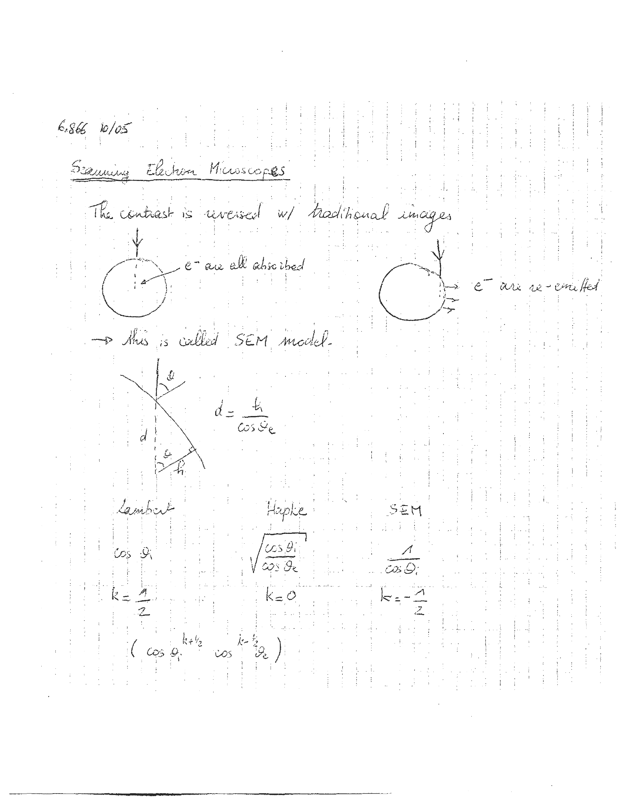
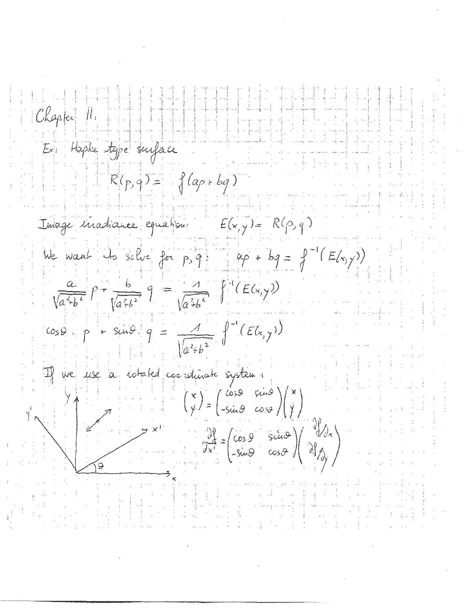
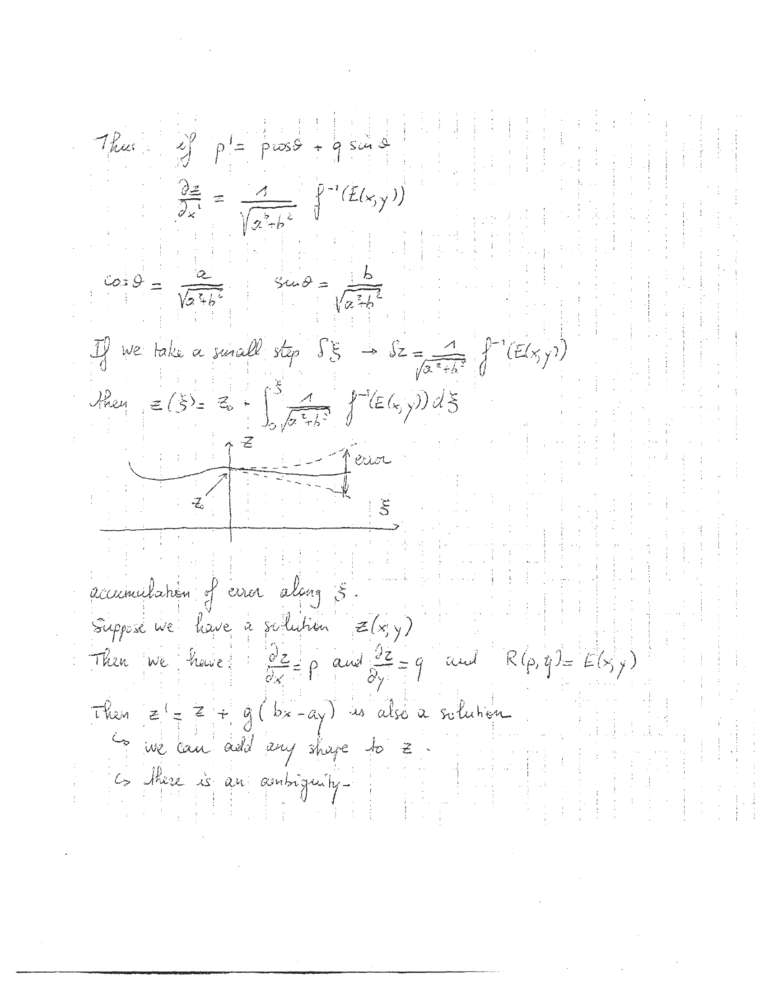
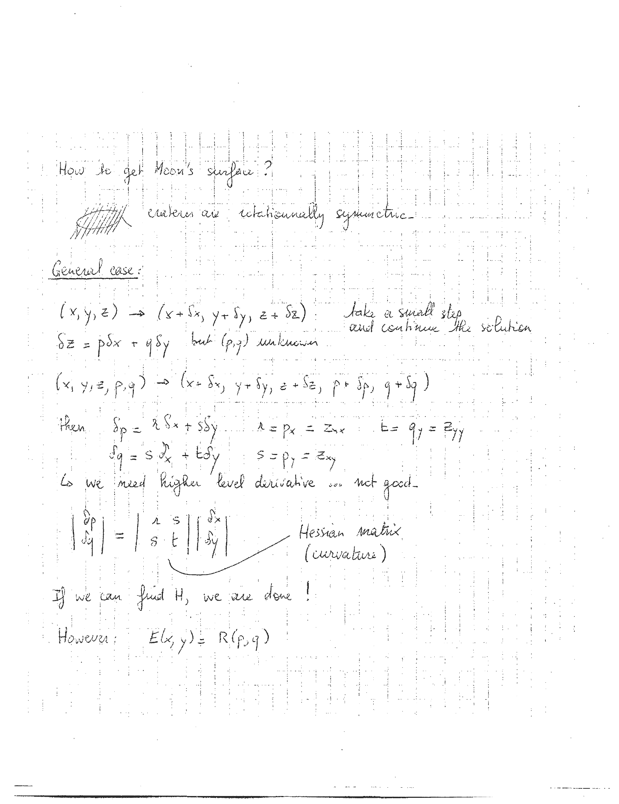
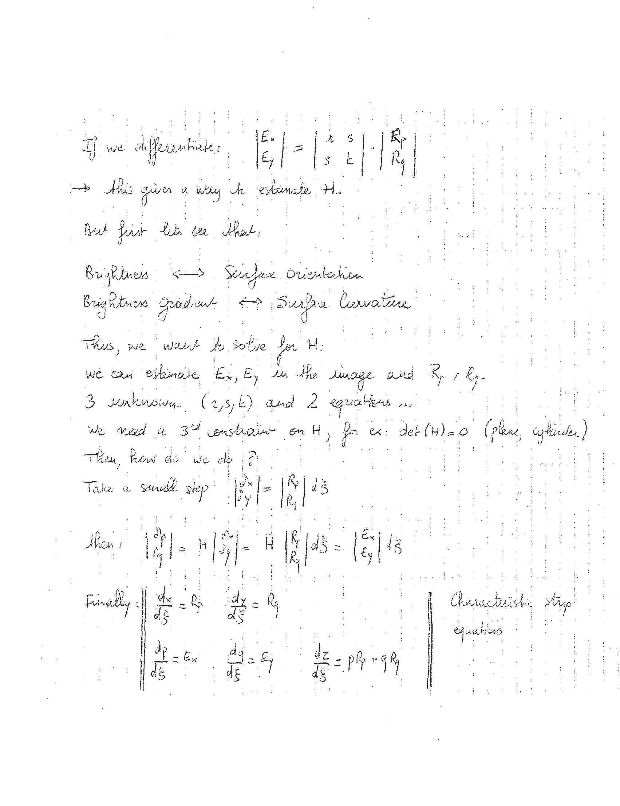
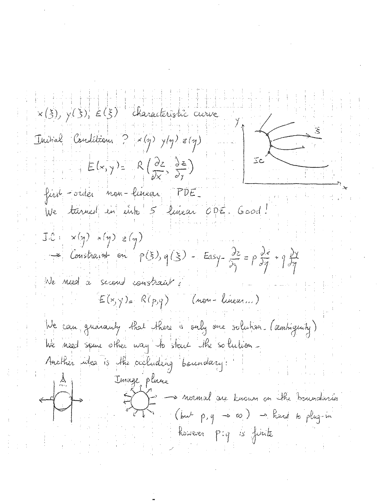
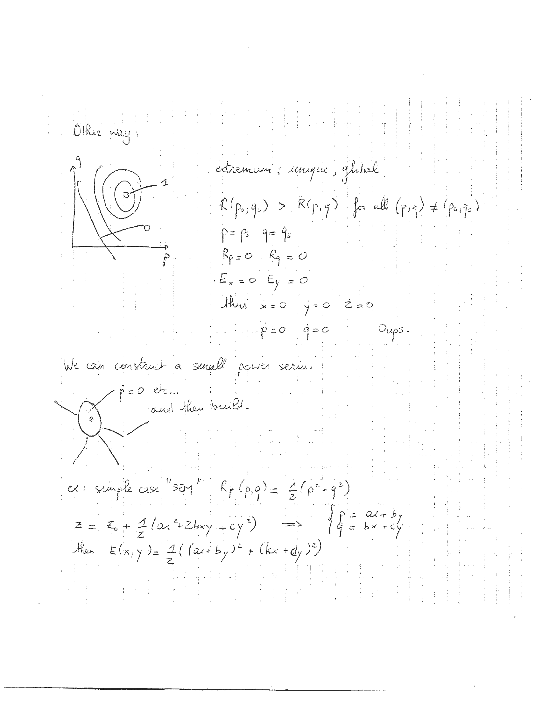
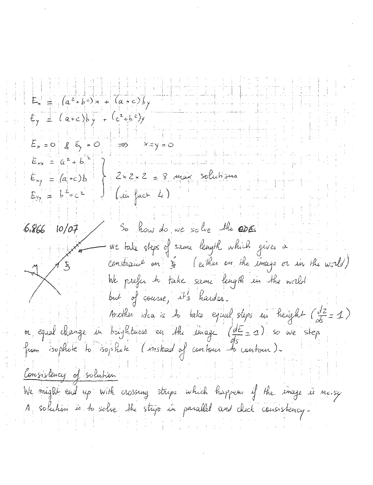

# l08


## 1

```markdown
6.866 10/05

**Scanning Electron Microscopes**

The contrast is reversed w/ traditional images

e⁻ are all absorbed

e⁻ are re-emitted

→ This is called SEM model

d = h / cos θₑ

Lambert

cos θ

k = n / 2

Hapke

√(cos θ / cos θₑ)

k = 0

SEM

1 / cos θ

k = -n / 2

(cos θ₀ᵏ⁺¹/₂ cos θₑᵏ⁻¹/₂)
```

### ASCII Art

```
   -----
 /       \
|    e⁻   |
 \       /
   -----

   -----
 /       \
|    e⁻   |-->
 \       /
   -----

   -----
 /       \
|    e⁻   |-->
 \       /
   -----

   -----
 /       \
|    e⁻   |-->
 \       /
   -----

   -----
 /       \
|    e⁻   |-->
 \       /
   -----

   -----
 /       \
|    e⁻   |-->
 \       /
   -----

   -----
 /       \
|    e⁻   |-->
 \       /
   -----

   -----
 /       \
|    e⁻   |-->
 \       /
   -----

   -----
 /       \
|    e⁻   |-->
 \       /
   -----

   -----
 /       \
|    e⁻   |-->
 \       /
   -----

   -----
 /       \
|    e⁻   |-->
 \       /
   -----

   -----
 /       \
|    e⁻   |-->
 \       /
   -----

   -----
 /       \
|    e⁻   |-->
 \       /
   -----

   -----
 /       \
|    e⁻   |-->
 \       /
   -----

   -----
 /       \
|    e⁻   |-->
 \       /
   -----

   -----
 /       \
|    e⁻   |-->
 \       /
   -----

   -----
 /       \
|    e⁻   |-->
 \       /
   -----

   -----
 /       \
|    e⁻   |-->
 \       /
   -----

   -----
 /       \
|    e⁻   |-->
 \       /
   -----

   -----
 /       \
|    e⁻   |-->
 \       /
   -----

   -----
 /       \
|    e⁻   |-->
 \       /
   -----

   -----
 /       \
|    e⁻   |-->
 \       /
   -----

   -----
 /       \
|    e⁻   |-->
 \       /
   -----

   -----
 /       \
|    e⁻   |-->
 \       /
   -----

   -----
 /       \
|    e⁻   |-->
 \       /
   -----

   -----
 /       \
|    e⁻   |-->
 \       /
   -----

   -----
 /       \
|    e⁻   |-->
 \       /
   -----

   -----
 /       \
|    e⁻   |-->
 \       /
   -----

   -----
 /       \
|    e⁻   |-->
 \       /
   -----

   -----
 /       \
|    e⁻   |-->
 \       /
   -----

   -----
 /       \
|    e⁻   |-->
 \       /
   -----

   -----
 /       \
|    e⁻   |-->
 \       /
   -----

   -----
 /       \
|    e⁻   |-->
 \       /
   -----

   -----
 /       \
|    e⁻   |-->
 \       /
   -----

   -----
 /       \
|    e⁻   |-->
 \       /
   -----

   -----
 /       \
|    e⁻   |-->
 \       /
   -----

   -----
 /       \
|    e⁻   |-->
 \       /
   -----

   -----
 /       \
|    e⁻   |-->
 \       /
   -----

   -----
 /       \
|    e⁻   |-->
 \       /
   -----

   -----
 /       \
|    e⁻   |-->
 \       /
   -----

   -----
 /       \
|    e⁻   |-->
 \       /
   -----

   -----
 /       \
|    e⁻   |-->
 \       /
   -----

   -----
 /       \
|    e⁻   |-->
 \       /
   -----

   -----
 /       \
|    e⁻   |-->
 \       /
   -----

   -----
 /       \
|    e⁻   |-->
 \       /
   -----

   -----
 /       \
|    e⁻   |-->
 \       /
   -----

   -----
 /       \
|    e⁻   |-->
 \       /
   -----

   -----
 /       \
|    e⁻   |-->
 \       /
   -----

   -----
 /       \
|    e⁻   |-->
 \       /
   -----

   -----
 /       \
|    e⁻   |-->
 \       /
   -----

   -----
 /       \
|    e⁻   |-->
 \       /
   -----

   -----
 /       \
|    e⁻   |-->
 \       /
   -----

   -----
 /       \
|    e⁻   |-->
 \       /
   -----

   -----
 /       \
|    e⁻   |-->
 \       /
   -----

   -----
 /       \
|    e⁻   |-->
 \       /
   -----

   -----
 /       \
|    e⁻   |-->
 \       /
   -----

   -----
 /       \
|    e⁻   |-->
 \       /
   -----

   -----
 /       \
|    e⁻   |-->
 \       /
   -----

   -----
 /       \
|    e⁻   |-->
 \       /
   -----

   -----
 /       \
|    e⁻   |-->
 \       /
   -----

   -----
 /       \
|    e⁻   |-->
 \       /
   -----

   -----
 /       \
|    e⁻   |-->
 \       /
   -----

   -----
 /       \
|    e⁻   |-->
 \       /
   -----

   -----
 /       \
|    e⁻   |-->
 \       /
   -----

   -----
 /       \
|    e⁻   |-->
 \       /
   -----

   -----
 /       \
|    e⁻   |-->
 \       /
   -----

   -----
 /       \
|    e⁻   |-->
 \       /
   -----

   -----
 /       \
|    e⁻   |-->
 \       /
   -----

   -----
 /       \
|    e⁻   |-->
 \       /
   -----

   -----
 /       \
|    e⁻   |-->
 \       /
   -----

   -----
 /       \
|    e⁻   |-->
 \       /
   -----

   -----
 /       \
|    e⁻   |-->
 \       /
   -----

   -----
 /       \
|    e⁻   |-->
 \       /
   -----

   -----
 /       \
|    e⁻   |-->
 \       /
   -----

   -----
 /       \
|    e⁻   |-->
 \       /
   -----

   -----
 /       \
|    e⁻   |-->
 \       /
   -----

   -----
 /       \
|    e⁻   |-->
 \       /
   -----

   -----
 /       \
|    e⁻   |-->
 \       /
   -----

   -----
 /       \
|    e⁻   |-->
 \       /
   -----

   -----
 /       \
|    e⁻   |-->
 \       /
   -----

   -----
 /       \
|    e⁻   |-->
 \       /
   -----

   -----
 /       \
|    e⁻   |-->
 \       /
   -----

   -----
 /       \
|    e⁻   |-->
 \       /
   -----

   -----
 /       \
|    e⁻   |-->
 \       /
   -----

   -----
 /       \
|    e⁻   |-->
 \       /
   -----

   -----
 /       \
|    e⁻   |-->
 \       /
   -----

   -----
 /       \
|    e⁻   |-->
 \       /
   -----

   -----
 /       \
|    e⁻   |-->
 \       /
   -----

   -----
 /       \
|    e⁻   |-->
 \       /
   -----

   -----
 /       \
|    e⁻   |-->
 \       /
   -----

   -----
 /       \
|    e⁻   |-->
 \       /
   -----

   -----
 /       \
|    e⁻   |-->
 \       /
   -----

   -----
 /       \
|    e⁻   |-->
 \       /
   -----

   -----
 /       \
|    e⁻   |-->
 \       /
   -----

   -----
 /       \
|    e⁻   |-->
 \       /
   -----

   -----
 /       \
|    e⁻   |-->
 \       /
   -----

   -----
 /       \
|    e⁻   |-->
 \       /
   -----

   -----
 /       \
|    e⁻   |-->
 \       /
   -----

   -----
 /       \
|    e⁻   |-->
 \       /
   -----

   -----
 /       \
|    e⁻   |-->
 \       /
   -----

   -----
 /       \
|    e⁻   |-->
 \       /
   -----

   -----
 /       \
|    e⁻   |-->
 \       /
   -----

   -----
 /       \
|    e⁻   |-->
 \       /
   -----

   -----
 /       \
|    e⁻   |-->
 \       /
   -----

   -----
 /       \
|    e⁻   |-->
 \       /
   -----

   -----
 /       \
|    e⁻   |-->
 \       /
   -----

   -----
 /       \
|    e⁻   |-->
 \       /
   -----

   -----
 /       \
|    e⁻   |-->
 \       /
   -----

   -----
 /       \
|    e⁻   |-->
 \       /
   -----

   -----
 /       \
|    e⁻   |-->
 \       /
   -----

   -----
 /       \
|    e⁻   |-->
 \       /
   -----

   -----
 /       \
|    e⁻   |-->
 \       /
   -----

   -----
 /       \
|    e⁻   |-->
 \       /
   -----

   -----
 /       \
|    e⁻   |-->
 \       /
   -----

   -----
 /       \
|    e⁻   |-->
 \       /
   -----

   -----
 /       \
|    e⁻   |-->
 \       /
   -----

   -----
 /       \
|    e⁻   |-->
 \       /
   -----

   -----
 /       \
|    e⁻   |-->
 \       /
   -----

   -----
 /       \
|    e⁻   |-->
 \       /
   -----

   -----
 /       \
|    e⁻   |-->
 \       /
   -----

   -----
 /       \
|    e⁻   |-->
 \       /
   -----

   -----
 /       \
|    e⁻   |-->
 \       /
   -----

   -----
 /       \
|    e⁻   |-->
 \       /
   -----

   -----
 /       \
|    e⁻   |-->
 \       /
   -----

   -----
 /       \
|    e⁻   |-->
 \       /
   -----

   -----
 /       \
|    e⁻   |-->
 \       /
   -----

   -----
 /       \
|    e⁻   |-->
 \       /
   -----

   -----
 /       \
|    e⁻   |-->
 \       /
   -----

   -----
 /       \
|    e⁻   |-->
 \       /
   -----

   -----
 /       \
|    e⁻   |-->
 \       /
   -----

   -----
 /       \
|    e⁻   |-->
 \       /
   -----

   -----
 /       \
|    e⁻   |-->
 \       /
   -----

   -----
 /       \
|    e⁻   |-->
 \       /
   -----

   -----
 /       \
|    e⁻   |-->
 \       /
   -----

   -----
 /       \
|    e⁻   |-->
 \       /
   -----

   -----
 /       \
|    e⁻   |-->
 \       /
   -----

   -----
 /       \
|    e⁻   |-->
 \       /
   -----

   -----
 /       \
|    e⁻   |-->
 \       /
   -----

   -----
 /       \
|    e⁻   |-->
 \       /
   -----

   -----
 /       \
|    e⁻   |-->
 \       /
   -----

   -----
 /       \
|    e⁻   |-->
 \       /
   -----

   -----
 /       \
|    e⁻   |-->
 \       /
   -----

   -----
 /       \
|    e⁻   |-->
 \       /
   -----

   -----
 /       \
|    e⁻   |-->
 \       /
   -----

   -----
 /       \
|    e⁻   |-->
 \       /
   -----

   -----
 /       \
|    e⁻   |-->
 \       /
   -----

   -----
 /       \
|    e⁻   |-->
 \       /
   -----

   -----
 /       \
|    e⁻   |-->
 \       /
   -----

   -----
 /       \
|    e⁻   |-->
 \       /
   -----

   -----
 /       \
|    e⁻   |-->
 \       /
   -----

   -----
 /       \
|    e⁻   |-->
 \       /
   -----

   -----
 /       \
|    e⁻   |-->
 \       /
   -----

   -----
 /       \
|    e⁻   |-->
 \       /
   -----

   -----
 /       \
|    e⁻   |-->
 \       /
   -----

   -----
 /       \
|    e⁻   |-->
 \       /
   -----

   -----
 /       \
|    e⁻   |-->
 \       /
   -----

   -----
 /       \
|    e⁻   |-->
 \       /
   -----

   -----
 /       \
|    e⁻   |-->
 \       /
   -----

   -----
 /       \
|    e⁻   |-->
 \       /
   -----

   -----
 /       \
|    e⁻   |-->
 \       /
   -----

   -----
 /       \
|    e⁻   |-->
 \       /
   -----

   -----
 /       \
|    e⁻   |-->
 \       /
   -----

   -----
 /       \
|    e⁻   |-->
 \       /
   -----

   -----
 /       \
|    e⁻   |-->
 \       /
   -----

   -----
 /       \
|    e⁻   |-->
 \       /
   -----

   -----
 /       \
|    e⁻   |-->
 \       /
   -----

   -----
 /       \
|    e⁻   |-->
 \       /
   -----

   -----
 /       \
|    e⁻   |-->
 \       /
   -----

   -----
 /       \
|    e⁻   |-->
 \       /
   -----

   -----
 /       \
|    e⁻   |-->
 \       /
   -----

   -----
 /       \
|    e⁻   |-->
 \       /
   -----

   -----
 /       \
|    e⁻   |-->
 \       /
   -----

   -----
 /       \
|    e⁻   |-->
 \       /
   -----

   -----
 /       \
|    e⁻   |-->
 \       /
   -----

   -----
 /       \
|    e⁻   |-->
 \       /
   -----

   -----
 /       \
|    e⁻   |-->
 \       /
   -----

   -----
 /       \
|    e⁻   |-->
 \       /
   -----

   -----
 /       \
|    e⁻   |-->
 \       /
   -----

   -----
 /       \
|    e⁻   |-->
 \       /
   -----

   -----
 /       \
|    e⁻   |-->
 \       /
   -----

   -----
 /       \
|    e⁻   |-->
 \       /
   -----

   -----
 /       \
|    e⁻   |-->
 \       /
   -----

   -----
 /       \
|    e⁻   |-->
 \       /
   -----

   -----
 /       \
|    e⁻   |-->
 \       /
   -----

   -----
 /       \
|    e⁻   |-->
 \       /
   -----

   -----
 /       \
|    e⁻   |-->
 \       /
   -----

   -----
 /       \
|    e⁻   |-->
 \       /
   -----

   -----
 /       \
|    e⁻   |-->
 \       /
   -----

   -----
 /       \
|    e⁻   |-->
 \       /
   -----

   -----
 /       \
|    e⁻   |-->
 \       /
   -----

   -----
 /       \
|    e⁻   |-->
 \       /
   -----

   -----
 /       \
|    e⁻   |-->
 \       /
   -----

   -----
 /       \
|    e⁻   |-->
 \       /
   -----

   -----
 /       \
|    e⁻   |-->
 \       /
   -----

   -----
 /       \
|    e⁻   |-->
 \       /
   -----

   -----
 /       \
|    e⁻   |-->
 \       /
   -----

   -----
 /       \
|    e⁻   |-->
 \       /
   -----

   -----
 /       \
|    e⁻   |-->
 \       /
   -----

   -----
 /       \
|    e⁻   |-->
 \       /
   -----

   -----
 /       \
|    e⁻   |-->
 \       /
   -----

   -----
 /       \
|    e⁻   |-->
 \       /
   -----

   -----
 /       \
|    e⁻   |-->
 \       /
   -----

   -----
 /       \
|    e⁻   |-->
 \       /
   -----

   -----
 /       \
|    e⁻   |-->
 \       /
   -----

   -----
 /       \
|    e⁻   |-->
 \       /
   -----

   -----
 /       \
|    e⁻   |-->
 \       /
   -----

   -----
 /       \
|    e⁻   |-->
 \       /
   -----

   -----
 /       \
|    e⁻   |-->
 \       /
   -----

   -----
 /       \
|    e⁻   |-->
 \       /
   -----

   -----
 /       \
|    e⁻   |-->
 \       /
   -----

   -----
 /       \
|    e⁻   |-->
 \       /
   -----

   -----
 /       \
|    e⁻   |-->
 \       /
   -----

   -----
 /       \
|    e⁻   |-->
 \       /
   -----

   -----
 /       \
|    e⁻   |-->
 \       /
   -----

   -----
 /       \
|    e⁻   |-->
 \       /
   -----

   -----
 /       \
|    e⁻   |-->
 \       /
   -----

   -----
 /       \
|    e⁻   |-->
 \       /
   -----

   -----
 /       \
|    e⁻   |-->
 \       /
   -----

   -----
 /       \
|    e⁻   |-->
 \       /
   -----

   -----
 /       \
|    e⁻   |-->
 \       /
   -----

   -----
 /       \
|    e⁻   |-->
 \       /
   -----

   -----
 /       \
|    e⁻   |-->
 \       /
   -----

   -----
 /       \
|    e⁻   |-->
 \       /
   -----

   -----
 /       \
|    e⁻   |-->
 \       /
   -----

   -----
 /       \
|    e⁻   |-->
 \       /
   -----

   -----
 /       \
|    e⁻   |-->
 \       /
   -----

   -----
 /       \
|    e⁻   |-->
 \       /
   -----

   -----
 /       \
|    e⁻   |-->
 \       /
   -----

   -----
 /       \
|    e⁻   |-->
 \       /
   -----

   -----
 /       \
|    e⁻   |-->
 \       /
   -----

   -----
 /       \
|    e⁻   |-->
 \       /
   -----

   -----
 /       \
|    e⁻   |-->
 \       /
   -----

   -----
 /       \
|    e⁻   |-->
 \       /
   -----

   -----
 /       \
|    e⁻   |-->
 \       /
   -----

   -----
 /       \
|    e⁻   |-->
 \       /
   -----

   -----
 /       \
|    e⁻   |-->
 \       /
   -----

   -----
 /       \
|    e⁻   |-->
 \       /
   -----

   -----
 /       \
|    e⁻   |-->
 \       /
   -----

   -----
 /       \
|    e⁻   |-->
 \       /
   -----

   -----
 /       \
|    e⁻   |-->
 \       /
   -----

   -----
 /       \
|    e⁻   |-->
 \       /
   -----

   -----
 /       \
|    e⁻   |-->
 \       /
   -----

   -----
 /       \
|    e⁻   |-->
 \       /
   -----

   -----
 /       \
|    e⁻   |-->
 \       /
   -----

   -----
 /       \
|    e⁻   |-->
 \       /
   -----

   -----
 /       \
|    e⁻   |-->
 \       /
   -----

   -----
 /       \
|    e⁻   |-->
 \       /
   -----

   -----
 /       \
|    e⁻   |-->
 \       /
   -----

   -----
 /       \
|    e⁻   |-->
 \       /
   -----

   -----
 /       \
|    e⁻   |-->
 \       /
   -----

   -----
 /       \
|    e⁻   |-->
 \       /
   -----

   -----
 /       \
|    e⁻   |-->
 \       /
   -----

   -----
 /       \
|    e⁻   |-->
 \       /
   -----

   -----
 /       \
|    e⁻   |-->
 \       /
   -----

   -----
 /       \
|    e⁻   |-->
 \       /
   -----

   -----
 /       \
|    e⁻   |-->
 \       /
   -----

   -----
 /       \
|    e⁻   |-->
 \       /
   -----

   -----
 /       \
|    e⁻   |-->
 \       /
   -----

   -----
 /       \
|    e⁻   |-->
 \       /
   -----

   -----
 /       \
|    e⁻   |-->
 \       /
   -----

   -----
 /       \
|    e⁻   |-->
 \       /
   -----

   -----
 /       \
|    e⁻   |-->
 \       /
   -----

   -----
 /       \
|    e⁻   |-->
 \       /
   -----

   -----
 /       \
|    e⁻   |-->
 \       /
   -----

   -----
 /       \
|    e⁻   |-->
 \       /
   -----

   -----
 /       \
|    e⁻   |-->
 \       /
   -----

   -----
 /       \
|    e⁻   |-->
 \       /
   -----

   -----
 /       \
|    e⁻   |-->
 \       /
   -----

   -----
 /       \
|    e⁻   |-->
 \       /
   -----

   -----
 /       \
|    e⁻   |-->
 \       /
   -----

   -----
 /       \
|    e⁻   |-->
 \       /
   -----

   -----
 /       \
|    e⁻   |-->
 \       /
   -----

   -----
 /       \
|    e⁻   |-->
 \       /
   -----

   -----
 /       \
|    e⁻   |-->
 \       /
   -----

   -----
 /       \
|    e⁻   |-->
 \       /
   -----

   -----
 /       \
|    e⁻   |-->
 \       /
   -----

   -----
 /       \
|    e⁻   |-->
 \       /
   -----

   -----
 /       \
|    e⁻   |-->
 \       /
   -----

   -----
 /       \
|    e⁻   |-->
 \       /
   -----

   -----
 /       \
|    e⁻   |-->
 \       /
   -----

   -----
 /       \
|    e⁻   |-->
 \       /
   -----

   -----
 /       \
|    e⁻   |-->
 \       /
   -----

   -----
 /       \
|    e⁻   |-->
 \       /
   -----

   -----
 /       \
|    e⁻   |-->
 \       /
   -----

   -----
 /       \
|    e⁻   |-->
 \       /
   -----

   -----
 /       \
|    e⁻   |-->
 \       /
   -----

   -----
 /       \
|    e⁻   |-->
 \       /
   -----

   -----
 /       \
|    e⁻   |-->
 \       /
   -----

   -----
 /       \
|    e⁻   |-->
 \       /
   -----

   -----
 /       \
|    e⁻   |-->
 \       /
   -----

   -----
 /       \
|    e⁻   |-->
 \       /
   -----

   -----
 /       \
|    e⁻   |-->
 \       /
   -----

   -----
 /       \
|    e⁻   |-->
 \       /
   -----

   -----
 /       \
|    e⁻   |-->
 \       /
   -----

   -----
 /       \
|    e⁻   |-->
 \       /
   -----

   -----
 /       \
|    e⁻   |-->
 \       /
   -----

   -----
 /       \
|    e⁻   |-->
 \       /
   -----

   -----
 /       \
|    e⁻   |-->
 \       /
   -----

   -----
 /       \
|    e⁻   |-->
 \       /
   -----

   -----
 /       \
|    e⁻   |-->
 \       /
   -----

   -----
 /       \
|    e⁻   |-->
 \       /
   -----

   -----
 /       \
|    e⁻   |-->
 \       /
   -----

   -----
 /       \
|    e⁻   |-->
 \       /
   -----

   -----
 /       \
|    e⁻   |-->
 \       /
   -----

   -----
 /       \
|    e⁻   |-->
 \       /
   -----

   -----
 /       \
|    e⁻   |-->
 \       /
   -----

   -----
 /       \
|    e⁻   |-->
 \       /
   -----

   -----
 /       \
|    e⁻   |-->
 \       /
   -----

   -----
 /       \
|    e⁻   |-->
 \       /
   -----

   -----
 /       \
|    e⁻   |-->
 \       /
   -----

   -----
 /       \
|    e⁻   |-->
 \       /
   -----

   -----
 /       \
|    e⁻   |-->
 \       /
   -----

   -----
 /       \
|    e⁻   |-->
 \       /
   -----

   -----
 /       \
|    e⁻   |-->
 \       /
   -----

   -----
 /       \
|    e⁻   |-->
 \       /
   -----

   -----
 /       \
|    e⁻   |-->
 \       /
   -----

   -----
 /       \
|    e⁻   |-->
 \       /
   -----

   -----
 /       \
|    e⁻   |-->
 \       /
   -----

   -----
 /       \
|    e⁻   |-->
 \       /
   -----

   -----
 /       \
|    e⁻   |-->
 \       /
   -----

   -----
 /       \
|    e⁻   |-->
 \       /
   -----

   -----
 /       \
|    e⁻   |-->
 \       /
   -----

   -----
 /       \
|    e⁻   |-->
 \       /
   -----

   -----
 /       \
|    e⁻   |-->
 \       /
   -----

   -----
 /       \
|    e⁻   |-->
 \       /
   -----

   -----
 /       \
|    e⁻   |-->
 \       /
   -----

   -----
 /       \
|    e⁻   |-->
 \       /
   -----

   -----
 /       \
|    e⁻   |-->
 \       /
   -----

   -----
 /       \
|    e⁻   |-->
 \       /
   -----

   -----
 /       \
|    e⁻   |-->
 \       /
   -----

   -----
 /       \
|    e⁻   |-->
 \       /
   -----

   -----
 /       \
|    e⁻   |-->
 \       /
   -----

   -----
 /       \
|    e⁻   |-->
 \       /
   -----

   -----
 /       \
|    e⁻   |-->
 \       /
   -----

   -----
 /       \
|    e⁻   |-->
 \       /
   -----

   -----
 /       \
|    e⁻   |-->
 \       /
   -----

   -----
 /       \
|    e⁻   |-->
 \       /
   -----

   -----
 /       \
|    e⁻   |-->
 \       /
   -----

   -----
 /       \
|    e⁻   |-->
 \       /
   -----

   -----
 /       \
|    e⁻   |-->
 \       /
   -----

   -----
 /       \
|    e⁻   |-->
 \       /
   -----

   -----
 /       \
|    e⁻   |-->
 \       /
   -----

   -----
 /       \
|    e⁻   |-->
 \       /
   -----

   -----
 /       \
|    e⁻   |-->
 \       /
   -----

   -----
 /       \
|    e⁻   |-->
 \       /
   -----

   -----
 /       \
|    e⁻   |-->
 \       /
   -----

   -----
 /       \
|    e⁻   |-->
 \       /
   -----

   -----
 /       \
|    e⁻   |-->
 \       /
   -----

   -----
 /       \
|    e⁻   |-->
 \       /
   -----

   -----
 /       \
|    e⁻   |-->
 \       /
   -----

   -----
 /       \
|    e⁻   |-->
 \       /
   -----

   -----
 /       \
|    e⁻   |-->
 \       /
   -----

   -----
 /       \
|    e⁻   |-->
 \       /
   -----

   -----
 /       \
|    e⁻   |-->
 \       /
   -----

   -----
 /       \
|    e⁻   |-->
 \       /
   -----

   -----
 /       \
|    e⁻   |-->
 \       /
   -----

   -----
 /       \
|    e⁻   |-->
 \       /
   -----

   -----
 /       \
|    e⁻   |-->
 \       /
   -----

   -----
 /       \
|    e⁻   |-->
 \       /
   -----

   -----
 /       \
|    e⁻   |-->
 \       /
   -----

   -----
 /       \
|    e⁻   |-->
 \       /
   -----

   -----
 /       \
|    e⁻   |-->
 \       /
   -----

   -----
 /       \
|    e⁻   |-->
 \       /
   -----

   -----
 /       \
|    e⁻   |-->
 \       /
   -----

   -----
 /       \
|    e⁻   |-->
 \       /
   -----

   -----
 /       \
|    e⁻   |-->
 \       /
   -----

   -----
 /       \
|    e⁻   |-->
 \       /
   -----

   -----
 /       \
|    e⁻   |-->
 \       /
   -----

   -----
 /       \
|    e⁻   |-->
 \       /
   -----

   -----
 /       \
|    e⁻   |-->
 \       /
   -----

   -----
 /       \
|    e⁻   |-->
 \       /
   -----

   -----
 /       \
|    e⁻   |-->
 \       /
   -----

   -----
 /       \
|    e⁻   |-->
 \       /
   -----

   -----
 /       \
|    e⁻   |-->
 \       /
   -----

   -----
 /       \
|    e⁻   |-->
 \       /
   -----

   -----
 /       \
|    e⁻   |-->
 \       /
   -----

   -----
 /       \
|    e⁻   |-->
 \       /
   -----

   -----
 /       \
|    e⁻   |-->
 \       /
   -----

   -----
 /       \
|    e⁻   |-->
 \       /
   -----

   -----
 /       \
|    e⁻   |-->
 \       /
   -----

   -----
 /       \
|    e⁻   |-->
 \       /
   -----

   -----
 /       \
|    e⁻   |-->
 \       /
   -----

   -----
 /       \
|    e⁻   |-->
 \       /
   -----

   -----
 /       \
|    e⁻   |-->
 \       /
   -----

   -----
 /       \
|    e⁻   |-->
 \       /
   -----

   -----
 /       \
|    e⁻   |-->
 \       /
   -----

   -----
 /       \
|    e⁻   |-->
 \       /
   -----

   -----
 /       \
|    e⁻   |-->
 \       /
   -----

   -----
 /       \
|    e⁻   |-->
 \       /
   -----

   -----
 /       \
|    e⁻   |-->
 \       /
   -----

   -----
 /       \
|    e⁻   |-->
 \       /
   -----

   -----
 /       \
|    e⁻   |-->
 \       /
   -----

   -----
 /       \
|    e⁻   |-->
 \       /
   -----

   -----
 /       \
|    e⁻   |-->
 \       /
   -----

   -----
 /       \
|    e⁻   |-->
 \       /
   -----

   -----
 /       \
|    e⁻   |-->
 \       /
   -----

   -----
 /       \
|    e⁻   |-->
 \       /
   -----

   -----
 /       \
|    e⁻   |-->
 \       /
   -----

   -----
 /       \
|    e⁻   |-->
 \       /
   -----

   -----
 /       \
|    e⁻   |-->
 \       /
   -----

   -----
 /       \
|    e⁻   |-->
 \       /
   -----

   -----
 /       \
|    e⁻   |-->
 \       /
   -----

   -----
 /       \
|    e⁻   |-->
 \       /
   -----

   -----
 /       \
|    e⁻   |-->
 \       /
   -----

   -----
 /       \
|    e⁻   |-->
 \       /
   -----

   -----
 /       \
|    e⁻   |-->
 \       /
   -----

   -----
 /       \
|    e⁻   |-->
 \       /
   -----

   -----
 /       \
|    e⁻   |-->
 \       /
   -----

   -----
 /       \
|    e⁻   |-->
 \       /
   -----

   -----
 /       \
|    e⁻   |-->
 \       /
   -----

   -----
 /       \
|    e⁻   |-->
 \       /
   -----

   -----
 /       \
|    e⁻   |-->
 \       /
   -----

   -----
 /       \
|    e⁻   |-->
 \       /
   -----

   -----
 /       \
|    e⁻   |-->
 \       /
   -----

   -----
 /       \
|    e⁻   |-->
 \       /
   -----

   -----
 /       \
|    e⁻   |-->
 \       /
   -----

   -----
 /       \
|    e⁻   |-->
 \       /
   -----

   -----
 /       \
|    e⁻   |-->
 \       /
   -----

   -----
 /       \
|    e⁻   |-->
 \       /
   -----

   -----
 /       \
|    e⁻   |-->
 \       /
   -----

   -----
 /       \
|    e⁻   |-->
 \       /
   -----

   -----
 /       \
|    e⁻   |-->
 \       /
   -----

   -----
 /       \
|    e⁻   |-->
 \       /
   -----

   -----
 /       \
|    e⁻   |-->
 \       /
   -----

   -----
 /       \
|    e⁻   |-->
 \       /
   -----

   -----
 /       \
|    e⁻   |-->
 \       /
   -----

   -----
 /       \
|    e⁻   |-->
 \       /
   -----

   -----
 /       \
|    e⁻   |-->
 \       /
   -----

   -----
 /       \
|    e⁻   |-->
 \       /
   -----

   -----
 /       \
|    e⁻   |-->
 \       /
   -----

   -----
 /       \
|    e⁻   |-->
 \       /
   -----

   -----
 /       \
|    e⁻   |-->
 \       /
   -----

   -----
 /       \
|    e⁻   |-->
 \       /
   -----

   -----
 /       \
|    e⁻   |-->
 \       /
   -----

   -----
 /       \
|    e⁻   |-->
 \       /
   -----

   -----
 /       \
|    e⁻   |-->
 \       /
   -----

   -----
 /       \
|    e⁻   |-->
 \       /
   -----

   -----
 /       \
|    e⁻   |-->
 \       /
   -----

   -----
 /       \
|    e⁻   |-->
 \       /
   -----

   -----
 /       \
|    e⁻   |-->
 \       /
   -----

   -----
 /       \
|    e⁻   |-->
 \       /
   -----

   -----
 /       \
|    e⁻   |-->
 \       /
   -----

   -----
 /       \
|    e⁻   |-->
 \       /
   -----

   -----
 /       \
|    e⁻   |-->
 \       /
   -----

   -----
 /       \
|    e⁻   |-->
 \       /
   -----

   -----
 /       \
|    e⁻   |-->
 \       /
   -----

   -----
 /       \
|    e⁻   |-->
 \       /
   -----

   -----
 /       \
|    e⁻   |-->
 \       /
   -----

   -----
 /       \
|    e⁻   |-->
 \       /
   -----

   -----
 /       \
|    e⁻   |-->
 \       /
   -----

   -----
 /       \
|    e⁻   |-->
 \       /
   -----

   -----
 /       \
|    e⁻   |-->
 \       /
   -----

   -----
 /       \
|    e⁻   |-->
 \       /
   -----

   -----
 /       \
|    e⁻   |-->
 \       /
   -----

   -----
 /       \
|    e⁻   |-->
 \       /
   -----

   -----
 /       \
|    e⁻   |-->
 \       /
   -----

   -----
 /       \
|    e⁻   |-->
 \       /
   -----

   -----
 /       \
|    e⁻   |-->
 \       /
   -----

   -----
 /       \
|    e⁻   |-->
 \       /
   -----

   -----
 /       \
|    e⁻   |-->
 \       /
   -----

   -----
 /       \
|    e⁻   |-->
 \       /
   -----

   -----
 /       \
|    e⁻   |-->
 \       /
   -----

   -----
 /       \
|    e⁻   |-->
 \       /
   -----

   -----
 /       \
|    e⁻   |-->
 \       /
   -----

   -----
 /       \
|    e⁻   |-->
 \       /
   -----

   -----
 /       \
|    e⁻   |-->
 \       /
   -----

   -----
 /       \
|    e⁻   |-->
 \       /
   -----

   -----
 /       \
|    e⁻   |-->
 \       /
   -----

   -----
 /       \
|    e⁻   |-->
 \       /
   -----

   -----
 /       \
|    e⁻   |-->
 \       /
   -----

   -----
 /       \
|    e⁻   |-->
 \       /
   -----

   -----
 /       \
|    e⁻   |-->
 \       /
   -----

   -----
 /       \
|    e⁻   |-->
 \       /
   -----

   -----
 /       \
|    e⁻   |-->
 \       /
   -----

   -----
 /       \
|    e⁻   |-->
 \       /
   -----

   -----
 /       \
|    e⁻   |-->
 \       /
   -----

   -----
 /       \
|    e⁻   |-->
 \       /
   -----

   -----
 /       \
|    e⁻   |-->
 \       /
   -----

   -----
 /       \
|    e⁻   |-->
 \       /
   -----

   -----
 /       \
|    e⁻   |-->
 \       /
   -----

   -----
 /       \
|    e⁻   |-->
 \       /
   -----

   -----
 /       \
|    e⁻   |-->
 \       /
   -----

   -----
 /       \
|    e⁻   |-->
 \       /
   -----

   -----
 /       \
|    e⁻   |-->
 \       /
   -----

   -----
 /       \
|    e⁻   |-->
 \       /
   -----

   -----
 /       \
|    e⁻   |-->
 \       /
   -----

   -----
 /       \
|    e⁻   |-->
 \       /
   -----

   -----
 /       \
|    e⁻   |-->
 \       /
   -----

   -----
 /       \
|    e⁻   |-->
 \       /
   -----

   -----
 /       \
|    e⁻   |-->
 \       /
   -----

   -----
 /       \
|    e⁻   |-->
 \       /
   -----

   -----
 /       \
|    e⁻   |-->
 \       /
   -----

   -----
 /       \
|    e⁻   |-->
 \       /
   -----

   -----
 /       \
|    e⁻   |-->
 \       /
   -----

   -----
 /       \
|    e⁻   |-->
 \       /
   -----

   -----
 /       \
|    e⁻   |-->
 \       /
   -----

   -----
 /       \
|    e⁻   |-->
 \       /
   -----

   -----
 /       \
|    e⁻   |-->
 \       /
   -----

   -----
 /       \
|    e⁻   |-->
 \       /
   -----

   -----
 /       \
|    e⁻   |-->
 \       /
   -----

   -----
 /       \
|    e⁻   |-->
 \       /
   -----

   -----
 /       \
|    e⁻   |-->
 \       /
   -----

   -----
 /       \
|    e⁻   |-->
 \       /
   -----

   -----
 /       \
|    e⁻   |-->
 \       /
   -----

   -----
 /       \
|    e⁻   |-->
 \       /
   -----

   -----
 /       \
|    e⁻   |-->
 \       /
   -----

   -----
 /       \
|    e⁻   |-->
 \       /
   -----

   -----
 /       \
|    e⁻   |-->
 \       /
   -----

   -----
 /       \
|    e⁻   |-->
 \       /
   -----

   -----
 /       \
|    e⁻   |-->
 \       /
   -----

   -----
 /       \
|    e⁻   |-->
 \       /
   -----

   -----
 /       \
|    e⁻   |-->
 \       /
   -----

   -----
 /       \
|    e⁻   |-->
 \       /
   -----

   -----
 /       \
|    e⁻   |-->
 \       /
   -----

   -----
 /       \
|    e⁻   |-->
 \       /
   -----

   -----
 /       \
|    e⁻   |-->
 \       /
   -----

   -----
 /       \
|    e⁻   |-->
 \       /
   -----

   -----
 /       \
|    e⁻   |-->
 \       /
   -----

   -----
 /       \
|    e⁻   |-->
 \       /
   -----

   -----
 /       \
|    e⁻   |-->
 \       /
   -----

   -----
 /       \
|    e⁻   |-->
 \       /
   -----

   -----
 /       \
|    e⁻   |-->
 \       /
   -----

   -----
 /       \
|    e⁻   |-->
 \       /
   -----

   -----
 /       \
|    e⁻   |-->
 \       /
   -----

   -----
 /       \
|    e⁻   |-->
 \       /
   -----

   -----
 /       \
|    e⁻   |-->
 \       /
   -----

   -----
 /       \
|    e⁻   |-->
 \       /
   -----

   -----
 /       \
|    e⁻   |-->
 \       /
   -----

   -----
 /       \
|    e⁻   |-->
 \       /
   -----

   -----
 /       \
|    e⁻   |-->
 \       /
   -----

   -----
 /       \
|    e⁻   |-->
 \       /
   -----

   -----
 /       \
|    e⁻   |-->
 \       /
   -----

   -----
 /       \
|    e⁻   |-->
 \       /
   -----

   -----
 /       \
|    e⁻   |-->
 \       /
   -----

   -----
 /       \
|    e⁻   |-->
 \       /
   -----

   -----
 /       \
|    e⁻   |-->
 \       /
   -----

   -----
 /       \
|    e⁻   |-->
 \       /
   -----

   -----
 /       \
|    e⁻   |-->
 \       /
   -----

   -----
 /       \
|    e⁻   |-->
 \       /
   -----

   -----
 /       \
|    e⁻   |-->
 \       /
   -----

   -----
 /       \
|    e⁻   |-->
 \       /
   -----

   -----
 /       \
|    e⁻   |-->
 \       /
   -----

   -----
 /       \
|    e⁻   |-->
 \       /
   -----

   -----
 /       \
|    e⁻   |-->
 \       /
   -----

   -----
 /       \
|    e⁻   |-->
 \       /
   -----

   -----
 /       \
|    e⁻   |-->
 \       /
   -----

   -----
 /       \
|    e⁻   |-->
 \       /
   -----

   -----
 /       \
|    e⁻   |-->
 \       /
   -----

   -----
 /       \
|    e⁻   |-->
 \       /
   -----

   -----
 /       \
|    e⁻   |-->
 \       /
   -----

   -----
 /       \
|    e⁻   |-->
 \       /
   -----

   -----
 /       \
|    e⁻   |-->
 \       /
   -----

   -----
 /       \
|    e⁻   |-->
 \       /
   -----

   -----
 /       \
|    e⁻   |-->
 \       /
   -----

   -----
 /       \
|    e⁻   |-->
 \       /
   -----

   -----
 /       \
|    e⁻   |-->
 \       /
   -----

   -----
 /       \
|    e⁻   |-->
 \       /
   -----

   -----
 /       \
|    e⁻   |-->
 \       /
   -----

   -----
 /       \
|    e⁻   |-->
 \       /
   -----

   -----
 /       \
|    e⁻   |-->
 \       /
   -----

   -----
 /       \
|    e⁻   |-->
 \       /
   -----

   -----
 /       \
|    e⁻   |-->
 \       /
   -----

   -----
 /       \
|    e⁻   |-->
 \       /
   -----

   -----
 /       \
|    e⁻   |-->
 \       /
   -----

   -----
 /       \
|    e⁻   |-->
 \       /
   -----

   -----
 /       \
|    e⁻   |-->
 \       /
   -----

   -----
 /       \
|    e⁻   |-->
 \       /
   -----

   -----
 /       \
|    e⁻   |-->
 \       /
   -----

   -----
 /       \
|    e⁻   |-->
 \       /
   -----

   -----
 /       \
|    e⁻   |-->
 \       /
   -----

   -----
 /       \
|    e⁻   |-->
 \       /
   -----

   -----
 /       \
|    e⁻   |-->
 \       /
   -----

   -----
 /       \
|    e⁻   |-->
 \       /
   -----

   -----
 /       \
|    e⁻   |-->
 \       /
   -----

   -----
 /       \
|    e⁻   |-->
 \       /
   -----

   -----
 /       \
|    e⁻   |-->
 \       /
   -----

   -----
 /       \
|    e⁻   |-->
 \       /
   -----

   -----
 /       \
|    e⁻   |-->
 \       /
   -----

   -----
 /       \
|    e⁻   |-->
 \       /
   -----

   -----
 /       \
|    e⁻   |-->
 \       /
   -----

   -----
 /       \
|    e⁻   |-->
 \       /
   -----

   -----
 /       \
|    e⁻   |-->
 \       /
   -----

   -----
 /       \
|    e⁻   |-->
 \       /
   -----

   -----
 /       \
|    e⁻   |-->
 \       /
   -----

   -----
 /       \
|    e⁻   |-->
 \       /
   -----

   -----
 /       \
|    e⁻   |-->
 \       /
   -----

   -----
 /       \
|    e⁻   |-->
 \       /
   -----

   -----
 /       \
|    e⁻   |-->
 \       /
   -----

   -----
 /       \
|    e⁻   |-->
 \       /
   -----

   -----
 /       \
|    e⁻   |-->
 \       /
   -----

   -----
 /       \
|    e⁻   |-->
 \       /
   -----

   -----
 /       \
|    e⁻   |-->
 \       /
   -----

   -----
 /       \
|    e⁻   |-->
 \       /
   -----

   -----
 /       \
|    e⁻   |-->
 \       /
   -----

   -----
 /       \
|    e⁻   |-->
 \       /
   -----

   -----
 /       \
|    e⁻   |-->
 \       /
   -----

   -----
 /       \
|    e⁻   |-->
 \       /
   -----

   -----
 /       \
|    e⁻   |-->
 \       /
   -----

   -----
 /       \
|    e⁻   |-->
 \       /
   -----

   -----
 /       \
|    e⁻   |-->
 \       /
   -----

   -----
 /       \
|    e⁻   |-->
 \       /
   -----

   -----
 /       \
|    e⁻   |-->
 \       /
   -----

   -----
 /       \
|    e⁻   |-->
 \       /
   -----

   -----
 /       \
|    e⁻   |-->
 \       /
   -----

   -----
 /       \
|    e⁻   |-->
 \       /
   -----

   -----
 /       \
|    e⁻   |-->
 \       /
   -----

   -----
 /       \
|    e⁻   |-->
 \       /
   -----

   -----
 /       \
|    e⁻   |-->
 \       /
   -----

   -----
 /       \
|    e⁻   |-->
 \       /
   -----

   -----
 /       \
|    e⁻   |-->
 \       /
   -----

   -----
 /       \
|    e⁻   |-->
 \       /
   -----

   -----
 /       \
|    e⁻   |-->
 \       /
   -----

   -----
 /       \
|    e⁻   |-->
 \       /
   -----

   -----
 /       \
|    e⁻   |-->
 \       /
   -----

   -----
 /       \
|    e⁻   |-->
 \       /
   -----

   -----
 /       \
|    e⁻   |-->
 \       /
   -----

   -----
 /       \
|    e⁻   |-->
 \       /
   -----

   -----
 /       \
|    e⁻   |-->
 \       /
   -----

   -----
 /       \
|    e⁻   |-->
 \       /
   -----

   -----
 /       \
|    e⁻   |-->
 \       /
   -----

   -----
 /       \
|    e⁻   |-->
 \       /
   -----

   -----
 /       \
|    e⁻   |-->
 \       /
   -----

   -----
 /       \
|    e⁻   |-->
 \       /
   -----

   -----
 /       \
|    e⁻   |-->
 \       /
   -----

   -----
 /       \
|    e⁻   |-->
 \       /
   -----

   -----
 /       \
|    e⁻   |-->
 \       /
   -----

   -----
 /       \
|    e⁻   |-->
 \       /
   -----

   -----
 /       \
|    e⁻   |-->
 \       /
   -----

   -----
 /       \
|    e⁻   |-->
 \       /
   -----

   -----
 /       \
|    e⁻   |-->
 \       /
   -----

   -----
 /       \
|    e⁻   |-->
 \       /
   -----

   -----
 /       \
|    e⁻   |-->
 \       /
   -----

   -----
 /       \
|    e⁻   |-->
 \       /
   -----

   -----
 /       \
|    e⁻   |-->
 \       /
   -----

   -----
 /       \
|    e⁻   |-->
 \       /
   -----

   -----
 /       \
|    e⁻   |-->
 \       /
   -----

   -----
 /       \
|    e⁻   |-->
 \       /
   -----

   -----
 /       \
|    e⁻   |-->
 \       /
   -----

   -----
 /       \
|    e⁻   |-->
 \       /
   -----

   -----
 /       \
|    e⁻   |-->
 \       /
   -----

   -----
 /       \
|    e⁻   |-->
 \       /
   -----

   -----
 /       \
|    e⁻   |-->
 \       /
   -----

   -----
 /       \
|    e⁻   |-->
 \       /
   -----

   -----
 /       \
|    e⁻   |-->
 \       /
   -----

   -----
 /       \
|    e⁻   |-->
 \       /
   -----

   -----
 /       \
|    e⁻   |-->
 \       /
   -----

   -----
 /       \
|    e⁻   |-->
 \       /
   -----

   -----
 /       \
|    e⁻   |-->
 \       /
   -----

   -----
 /       \
|    e⁻   |-->
 \       /
   -----

   -----
 /       \
|    e⁻   |-->
 \       /
   -----

   -----
 /       \
|    e⁻   |-->
 \       /
   -----

   -----
 /       \
|    e⁻   |-->
 \       /
   -----

   -----
 /       \
|    e⁻   |-->
 \       /
   -----

   -----
 /       \
|    e⁻   |-->
 \       /
   -----

   -----
 /       \
|    e⁻   |-->
 \       /
   -----

   -----
 /       \
|    e⁻   |-->
 \       /
   -----

   -----
 /       \
|    e⁻   |-->
 \       /
   -----

   -----
 /       \
|    e⁻   |-->
 \       /
   -----

   -----
 /       \
|    e⁻   |-->
 \       /
   -----

   -----
 /       \
|    e⁻   |-->
 \       /
   -----

   -----
 /       \
|    e⁻   |-->
 \       /
   -----

   -----
 /       \
|    e⁻   |-->
 \       /
   -----

   -----
 /       \
|    e⁻   |-->
 \       /
   -----

   -----
 /       \
|    e⁻   |-->
 \       /
   -----

   -----
 /       \
|    e⁻   |-->
 \       /
   -----

   -----
 /       \
|    e⁻   |-->
 \       /
   -----

   -----
 /       \
|    e⁻   |-->
 \       /
   -----

   -----
 /       \
|    e⁻   |-->
 \       /
   -----

   -----
 /       \
|    e⁻   |-->
 \       /
   -----

   -----
 /       \
|    e⁻   |-->
 \       /
   -----

   -----
 /       \
|    e⁻   |-->
 \       /
   -----

   -----
 /       \
|    e⁻   |-->
 \       /
   -----

   -----
 /       \
|    e⁻   |-->
 \       /
   -----

   -----
 /       \
|    e⁻   |-->
 \       /
   -----

   -----
 /       \
|    e⁻   |-->
 \       /
   -----

   -----
 /       \
|    e⁻   |-->
 \       /
   -----

   -----
 /       \
|    e⁻   |-->
 \       /
   -----

   -----
 /       \
|    e⁻   |-->
 \       /
   -----

   -----
 /       \
|    e⁻   |-->
 \       /
   -----

   -----
 /       \
|    e⁻   |-->
 \       /
   -----

   -----
 /       \
|    e⁻   |-->
 \       /
   -----

   -----
 /       \
|    e⁻   |-->
 \       /
   -----

   -----
 /       \
|    e⁻   |-->
 \       /
   -----

   -----
 /       \
|    e⁻   |-->
 \       /
   -----

   -----
 /       \
|    e⁻   |-->
 \       /
   -----

   -----
 /       \
|    e⁻   |-->
 \       /
   -----

   -----
 /       \
|    e⁻   |-->
 \       /
   -----

   -----
 /       \
|    e⁻   |-->
 \       /
   -----

   -----
 /       \
|    e⁻   |-->
 \       /
   -----

   -----
 /       \
|    e⁻   |-->
 \       /
   -----

   -----
 /       \
|    e⁻   |-->
 \       /
   -----

   -----
 /       \
|    e⁻   |-->
 \       /
   -----

   -----
 /       \
|    e⁻   |-->
 \       /
   -----

   -----
 /       \
|    e⁻   |-->
 \       /
   -----

   -----
 /       \
|    e⁻   |-->
 \       /
   -----

   -----
 /       \
|    e⁻   |-->
 \       /
   -----

   -----
 /       \
|    e⁻   |-->
 \       /
   -----

   -----
 /       \
|    e⁻   |-->
 \       /
   -----

   -----
 /       \
|    e⁻   |-->
 \       /
   -----

   -----
 /       \
|    e⁻   |-->
 \       /
   -----

   -----
 /       \
|    e⁻   |-->
 \       /
   -----

   -----
 /       \
|    e⁻   |-->
 \       /
   -----

   -----
 /       \
|    e⁻   |-->
 \       /
   -----

   -----
 /       \
|    e⁻   |-->
 \       /
   -----

   -----
 /       \
|    e⁻   |-->
 \       /
   -----

   -----
 /       \
|    e⁻   |-->
 \       /
   -----

   -----
 /       \
|    e⁻   |-->
 \       /
   -----

   -----
 /       \
|    e⁻   |-->
 \       /
   -----

   -----
 /       \
|    e⁻   |-->
 \       /
   -----

   -----
 /       \
|    e⁻   |-->
 \       /
   -----

   -----
 /       \
|    e⁻   |-->
 \       /
   -----

   -----
 /       \
|    e⁻   |-->
 \       /
   -----

   -----
 /       \
|    e⁻   |-->
 \       /
   -----

   -----
 /       \
|    e⁻   |-->
 \       /
   -----

   -----
 /       \
|    e⁻   |-->
 \       /
   -----

   -----
 /       \
|    e⁻   |-->
 \       /
   -----

   -----
 /       \
|    e⁻   |-->
 \       /
   -----

   -----
 /       \
|    e⁻   |-->
 \       /
   -----

   -----
 /       \
|    e⁻   |-->
 \       /
   -----

   -----
 /       \
|    e⁻   |-->
 \       /
   -----

   -----
 /       \
|    e⁻   |-->
 \       /
   -----

   -----
 /       \
|    e⁻   |-->
 \       /
   -----

   -----
 /       \
|    e⁻   |-->
 \       /
   -----

   -----
 /       \
|    e⁻   |-->
 \       /
   -----

   -----
 /       \
|    e⁻   |-->
 \       /
   -----

   -----
 /       \
|    e⁻   |-->
 \       /
   -----

   -----
 /       \
|    e⁻   |-->
 \       /
   -----

   -----
 /       \
|    e⁻   |-->
 \       /
   -----

   -----
 /       \
|    e⁻   |-->
 \       /
   -----

   -----
 /       \
|    e⁻   |-->
 \       /
   -----

   -----
 /       \
|    e⁻   |-->
 \       /
   -----

   -----
 /       \
|    e⁻   |-->
 \       /
   -----

   -----
 /       \
|    e⁻   |-->
 \       /
   -----

   -----
 /       \
|    e⁻   |-->
 \       /
   -----

   -----
 /       \
|    e⁻   |-->
 \       /
   -----

   -----
 /       \
|    e⁻   |-->
 \       /
   -----

   -----
 /       \
|    e⁻   |-->
 \       /
   -----

   -----
 /       \
|    e⁻   |-->
 \       /
   -----

   -----
 /       \
|    e⁻   |-->
 \       /
   -----

   -----
 /       \
|    e⁻   |-->
 \       /
   -----

   -----
 /       \
|    e⁻   |-->
 \       /
   -----

   -----
 /       \
|    e⁻   |-->
 \       /
   -----

   -----
 /       \
|    e⁻   |-->
 \       /
   -----

   -----
 /       \
|    e⁻   |-->
 \       /
   -----

   -----
 /       \
|    e⁻   |-->
 \       /
   -----

   -----
 /       \
|    e⁻   |-->
 \       /
   -----

   -----
 /       \
|    e⁻   |-->
 \       /
   -----

   -----
 /       \
|    e⁻   |-->
 \       /
   -----

   -----
 /       \
|    e⁻   |-->
 \       /
   -----

   -----
 /       \
|    e⁻   |-->
 \       /
   -----

   -----
 /       \
|    e⁻   |-->
 \       /
   -----

   -----
 /       \
|    e⁻   |-->
 \       /
   -----

   -----
 /       \
|    e⁻   |-->
 \       /
   -----

   -----
 /       \
|    e⁻   |-->
 \       /
   -----

   -----
 /       \
|    e⁻   |-->
 \       /
   -----

   -----
 /       \
|    e⁻   |-->
 \       /
   -----

   -----
 /       \
|    e⁻   |-->
 \       /
   -----

   -----
 /       \
|    e⁻   |-->
 \       /
   -----

   -----
 /       \
|    e⁻   |-->
 \       /
   -----

   -----
 /       \
|    e⁻   |-->
 \       /
   -----

   -----
 /       \
|    e⁻   |-->
 \       /
   -----

   -----
 /       \
|    e⁻   |-->
 \       /
   -----

   -----
 /       \
|    e⁻   |-->
 \       /
   -----

   -----
 /       \
|    e⁻   |-->
 \       /
   -----

   -----
 /       \
|    e⁻   |-->
 \       /
   -----

   -----
 /       \
|    e⁻   |-->
 \       /
   -----

   -----
 /       \
|    e⁻   |-->
 \       /
   -----

   -----
 /       \
|    e⁻   |-->
 \       /
   -----

   -----
 /       \
|    e⁻   |-->
 \       /
   -----

   -----
 /       \
|    e⁻   |-->
 \       /
   -----

   -----
 /       \
|    e⁻   |-->
 \       /
   -----

   -----
 /       \
|    e⁻   |-->
 \       /
   -----

   -----
 /       \
|    e⁻   |-->
 \       /
   -----

   -----
 /       \
|    e⁻   |-->
 \       /
   -----

   -----
 /       \
|    e⁻   |-->
 \       /
   -----

   -----
 /       \
|    e⁻   |-->
 \       /
   -----

   -----
 /       \
|    e⁻   |-->
 \       /
   -----

   -----
 /       \
|    e⁻   |-->
 \       /
   -----

   -----
 /       \
|    e⁻   |-->
 \       /
   -----

   -----
 /       \
|    e⁻   |-->
 \       /
   -----

   -----
 /       \
|    e⁻   |-->
 \       /
   -----

   -----
 /       \
|    e⁻   |-->
 \       /
   -----

   -----
 /       \
|    e⁻   |-->
 \       /
   -----

   -----
 /       \
|    e⁻   |-->
 \       /
   -----

   -----
 /       \
|    e⁻   |-->
 \       /
   -----

   -----
 /       \
|    e⁻   |-->
 \       /
   -----

   -----
 /       \
|    e⁻   |-->
 \       /
   -----

   -----
 /       \
|    e⁻   |-->
 \       /
   -----

   -----
 /       \
|    e⁻   |-->
 \       /
   -----

   -----
 /       \
|    e⁻   |-->
 \       /
   -----

   -----
 /       \
|    e⁻   |-->
 \       /
   -----

   -----
 /       \
|    e⁻   |-->
 \       /
   -----

   -----
 /       \
|    e⁻   |-->
 \       /
   -----

   -----
 /       \
|    e⁻   |-->
 \       /
   -----

   -----
 /       \
|    e⁻   |-->
 \       /
   -----

   -----
 /       \
|    e⁻   |-->
 \       /
   -----

   -----
 /       \
|    e⁻   |-->
 \       /
   -----

   -----
 /       \
|    e⁻   |-->
 \       /
   -----

   -----
 /       \
|    e⁻   |-->
 \       /
   -----

   -----
 /       \
|    e⁻   |-->
 \       /
   -----

   -----
 /       \
|    e⁻   |-->
 \       /
   -----

   -----
 /       \
|    e⁻   |-->
 \       /
   -----

   -----
 /       \
|    e⁻   |-->
 \       /
   -----

   -----
 /       \
|    e⁻   |-->
 \       /
   -----

   -----
 /       \
|    e⁻   |-->
 \       /
   -----

   -----
 /       \
|    e⁻   |-->
 \       /
   -----

   -----
 /       \
|    e⁻   |-->
 \       /
   -----

   -----
 /       \
|    e⁻   |-->
 \       /
   -----

   -----
 /       \
|    e⁻   |-->
 \       /
   -----

   -----
 /       \
|    e⁻   |-->
 \       /
   -----

   -----
 /       \
|    e⁻   |-->
 \       /
   -----

   -----
 /       \
|    e⁻   |-->
 \       /
   -----

   -----
 /       \


---

## 2

```markdown
Chapter 11

Ex: Hapke type surface

R(p, q) = ∫(ap, bq)

Image irradiance equation: E(x, y) = R(p, q)

We want to solve for p, q

ap + bq = ∫⁻¹(E(x, y))

\[
\frac{a}{\sqrt{a^2 + b^2}} p + \frac{b}{\sqrt{a^2 + b^2}} q = \frac{1}{\sqrt{a^2 + b^2}} ∫⁻¹(E(x, y))
\]

cosθ p + sinθ q = \frac{1}{\sqrt{a^2 + b^2}} ∫⁻¹(E(x, y))

If we use a rotated coordinate system:

\[
\begin{pmatrix}
x' \\
y'
\end{pmatrix}
=
\begin{pmatrix}
\cosθ & \sinθ \\
-\sinθ & \cosθ
\end{pmatrix}
\begin{pmatrix}
x \\
y
\end{pmatrix}
\]

\[
\begin{pmatrix}
\frac{∂f}{∂x'} \\
\frac{∂f}{∂y'}
\end{pmatrix}
=
\begin{pmatrix}
\cosθ & \sinθ \\
-\sinθ & \cosθ
\end{pmatrix}
\begin{pmatrix}
\frac{∂f}{∂x} \\
\frac{∂f}{∂y}
\end{pmatrix}
\]
```

ASCII Art:

```
     y'
     |
     |
     |   /
     |  /
     | /
     |/_________ x'
    /
   /
  /
 /
y
```


---

## 3

```markdown
Then if p' = p cosθ + q sinθ

\[
\frac{\partial z}{\partial x} = \frac{1}{\sqrt{a^2 + b^2}} f^{-1}(E(x,y))
\]

cosθ = \(\frac{a}{\sqrt{a^2 + b^2}}\) sinθ = \(\frac{b}{\sqrt{a^2 + b^2}}\)

If we take a small step \(\delta \xi \rightarrow \delta z = \frac{1}{\sqrt{a^2 + b^2}} f^{-1}(E(\xi,y))\)

Then z(\(\xi\)) = z₀ + \(\int_{s_0}^{s} \frac{1}{\sqrt{a^2 + b^2}} f^{-1}(E(\xi,y)) d\xi\)

```

ASCII Art:

```
  z
  |
  |       error
  |       /
  |      /
  |     /
  |    /
  |   /
  |  /
  | /
  |/____________________ ξ
 z₀
```

```markdown
accumulation of error along ξ.

Suppose we have a solution z(x,y)

Then we have: \(\frac{\partial z}{\partial x} = p\) and \(\frac{\partial z}{\partial y} = q\) and R(p,q) = E(x,y)

Then z₁ = z + g(bx - ay) is also a solution.
  -> we can add any shape to z.
  -> there is an ambiguity.
```


---

## 4

```markdown
How to get Moon's surface?

[sketch] centers are rotationally symmetric.

General case:

(x, y, z) -> (x + δx, y + δy, z + δz) take a small step
and continue the solution
δz = pδx + qδy but (p, q) unknown

(x, y, z, p, q) -> (x - δx, y + δy, z + δz, p + δp, q + δq)

then δp = rδx + sδy r = px = zx, t = qy = zy
δq = sδx + tδy s = py = zy

So we need higher level derivative ... not good

| δp | = | r s | | δx | Hessian matrix
| δq |   | s t | | δy | (curvature)

If we can find H, we are done!

However, E(x, y) = R(p, q)
```

ASCII Art:

```


---

## 5

```markdown
If we differentiate, 

| Ex |   | r s |   | Rp |
| Ey | = | s t | * | Rq |

→ this gives a way to estimate H.

But first let's see that,

Brightness ↔ Surface Orientation

Brightness gradient ↔ Surface Curvature

Thus, we want to solve for H.

We can estimate Ex, Ey in the image and Rp, Rq.

3 unknowns (r,s,t) and 2 equations...

We need a 3rd constraint on H, for ex: det(H) = 0 (plane, cylinder)

Then, how do we do it?

Take a small step

∫x dx = ∫x Rp ds
∫y dy = ∫y Rq ds

then | dx |   = H | Rp | ds = | Ex | ds
     | dy |     | Rq |      | Ey |

Finally, | dx/ds = Rp |
        | dy/ds = Rq |

| dp/ds = Ex |
| dq/ds = Ey |
| dz/ds = pRp + qRq |

Characteristic strip equations
```

ASCII Art:

```
If we differentiate, 
| Ex |   | r s |   | Rp |
| Ey | = | s t | * | Rq |

→ this gives a way to estimate H.

But first let's see that,

Brightness ↔ Surface Orientation

Brightness gradient ↔ Surface Curvature

Thus, we want to solve for H.

We can estimate Ex, Ey in the image and Rp, Rq.

3 unknowns (r,s,t) and 2 equations...

We need a 3rd constraint on H, for ex: det(H) = 0 (plane, cylinder)

Then, how do we do it?

Take a small step

∫x dx = ∫x Rp ds
∫y dy = ∫y Rq ds

then | dx |   = H | Rp | ds = | Ex | ds
     | dy |     | Rq |      | Ey |

Finally, | dx/ds = Rp |
        | dy/ds = Rq |

| dp/ds = Ex |
| dq/ds = Ey |
| dz/ds = pRp + qRq |

Characteristic strip equations
```


---

## 6

```markdown
x(ξ), y(ξ), E(ξ) characteristic curve

Initial Conditions ? x(η), y(η), z(η)

E(x, y) = R ( ∂z/∂x, ∂z/∂y )

first order non-linear PDE.

We turned it into 5 linear ODE. Good!

I.C. : x(η), y(η), z(η)

→ Constraint on p(ξ), q(ξ) - Easy - ∂z/∂η = p ∂x/∂η + q ∂y/∂η

We need a second constraint:

E(x, y) = R(p, q) (non-linear...)

We can guarantee that there is only one solution. (ambiguity)

We need some other way to start the solution.

Another idea is the occluding boundary:

Image plane

→ normal are known on the boundaries (but p, q → ∞) → hard to plug-in

However p, q is finite
```

ASCII Art:

```
  y
  |
  |   /
  |  /
  | /
  |/
  |________ x
     IC
```

```
   ⊙
  ↔
```

```
   ⊙
  ↔↔↔
```


---

## 7

```markdown
Other way

extremum, unique, global

L(p₀, q₀) > R(p, q) for all (p, q) ≠ (p₀, q₀)

ṗ = β₃  q = q₅

Rₚ = 0  Rq = 0

Eₓ = 0  Eᵧ = 0

Thus x = 0  y = 0  z = 0

ṗ = 0  q̇ = 0  Oops.

We can construct a small power series.

ṗ = 0 etc... and then build.

ex: simple case "SEM"  Rₚ(p, q) = ½ (p² - q²)

z = z₀ + 1/2 (ax² + 2bxy - cy²)  =>  { p = ax + by
                                        q = bx - cy }

then E(x, y) = 1/2 ((ax + by)² + (bx + cy)²)
```

ASCII Art:

```
q
|   /
|  /
| / 
|/____ p
```

```
  o
 /|\
/ | \
```


---

## 8

```markdown
E_n = (a^2 + b^2)x + (a + c)b_y
E_y = (a + c)b_y + (c^2 + b^2)y

E_x = 0 & E_y = 0 => x = y = 0

E_xx = a^2 + b^2
E_xy = (a + c)b
E_yy = b^2 + c^2

2 x 2 x 2 = 8 max solutions
(in fact 4)

6.866 10/07

So how do we solve the ODEs
we take steps of same length which gives a
constraint on ξ (either on the image or in the world)
We prefer to take same length in the world
but of course, it's harder.
Another idea is to take equal steps in height (dz/ds = 1)
or equal change in brightness on the image (dE/ds = 1), so we step
from isophote to isophote (instead of contour to contour).

Consistency of solution
We might end up with crossing strips which happen if the image is noisy.
A solution is to solve the strips in parallel and check consistency.
```

ASCII Art:

```
          . . . . . . . . . . . . . . . . . . . . . . . . . . . . . . . . . . . . . . . . . . . . . . . . . . . . . . . . . . . . . . . . . . . . . . . . . . . . . . . . . . . . . . . . . . . . . . . . . . . . . . . . . . . . . . . . . . . . . . . . . . . . . . . . . . . . . . . . . . . . . . . . . . . . . . . . . . . . . . . . . . . . . . . . . . . . . . . . . . . . . . . . . . . . . . . . . . . . . . . . . . . . . . . . . . . . . . . . . . . . . . . . . . . . . . . . . . . . . . . . . . . . . . . . . . . . . . . . . . . . . . . . . . . . . . . . . . . . . . . . . . . . . . . . . . . . . . . . . . . . . . . . . . . . . . . . . . . . . . . . . . . . . . . . . . . . . . . . . . . . . . . . . . . . . . . . . . . . . . . . . . . . . . . . . . . . . . . . . . . . . . . . . . . . . . . . . . . . . . . . . . . . . . . . . . . . . . . . . . . . . . . . . . . . . . . . . . . . . . . . . . . . . . . . . . . . . . . . . . . . . . . . . . . . . . . . . . . . . . . . . . . . . . . . . . . . . . . . . . . . . . . . . . . . . . . . . . . . . . . . . . . . . . . . . . . . . . . . . . . . . . . . . . . . . . . . . . . . . . . . . . . . . . . . . . . . . . . . . . . . . . . . . . . . . . . . . . . . . . . . . . . . . . . . . . . . . . . . . . . . . . . . . . . . . . . . . . . . . . . . . . . . . . . . . . . . . . . . . . . . . . . . . . . . . . . . . . . . . . . . . . . . . . . . . . . . . . . . . . . . . . . . . . . . . . . . . . . . . . . . . . . . . . . . . . . . . . . . . . . . . . . . . . . . . . . . . . . . . . . . . . . . . . . . . . . . . . . . . . . . . . . . . . . . . . . . . . . . . . . . . . . . . . . . . . . . . . . . . . . . . . . . . . . . . . . . . . . . . . . . . . . . . . . . . . . . . . . . . . . . . . . . . . . . . . . . . . . . . . . . . . . . . . . . . . . . . . . . . . . . . . . . . . . . . . . . . . . . . . . . . . . . . . . . . . . . . . . . . . . . . . . . . . . . . . . . . . . . . . . . . . . . . . . . . . . . . . . . . . . . . . . . . . . . . . . . . . . . . . . . . . . . . . . . . . . . . . . . . . . . . . . . . . . . . . . . . . . . . . . . . . . . . . . . . . . . . . . . . . . . . . . . . . . . . . . . . . . . . . . . . . . . . . . . . . . . . . . . . . . . . . . . . . . . . . . . . . . . . . . . . . . . . . . . . . . . . . . . . . . . . . . . . . . . . . . . . . . . . . . . . . . . . . . . . . . . . . . . . . . . . . . . . . . . . . . . . . . . . . . . . . . . . . . . . . . . . . . . . . . . . . . . . . . . . . . . . . . . . . . . . . . . . . . . . . . . . . . . . . . . . . . . . . . . . . . . . . . . . . . . . . . . . . . . . . . . . . . . . . . . . . . . . . . . . . . . . . . . . . . . . . . . . . . . . . . . . . . . . . . . . . . . . . . . . . . . . . . . . . . . . . . . . . . . . . . . . . . . . . . . . . . . . . . . . . . . . . . . . . . . . . . . . . . . . . . . . . . . . . . . . . . . . . . . . . . . . . . . . . . . . . . . . . . . . . . . . . . . . . . . . . . . . . . . . . . . . . . . . . . . . . . . . . . . . . . . . . . . . . . . . . . . . . . . . . . . . . . . . . . . . . . . . . . . . . . . . . . . . . . . . . . . . . . . . . . . . . . . . . . . . . . . . . . . . . . . . . . . . . . . . . . . . . . . . . . . . . . . . . . . . . . . . . . . . . . . . . . . . . . . . . . . . . . . . . . . . . . . . . . . . . . . . . . . . . . . . . . . . . . . . . . . . . . . . . . . . . . . . . . . . . . . . . . . . . . . . . . . . . . . . . . . . . . . . . . . . . . . . . . . . . . . . . . . . . . . . . . . . . . . . . . . . . . . . . . . . . . . . . . . . . . . . . . . . . . . . . . . . . . . . . . . . . . . . . . . . . . . . . . . . . . . . . . . . . . . . . . . . . . . . . . . . . . . . . . . . . . . . . . . . . . . . . . . . . . . . . . . . . . . . . . . . . . . . . . . . . . . . . . . . . . . . . . . . . . . . . . . . . . . . . . . . . . . . . . . . . . . . . . . . . . . . . . . . . . . . . . . . . . . . . . . . . . . . . . . . . . . . . . . . . . . . . . . . . . . . . . . . . . . . . . . . . . . . . . . . . . . . . . . . . . . . . . . . . . . . . . . . . . . . . . . . . . . . . . . . . . . . . . . . . . . . . . . . . . . . . . . . . . . . . . . . . . . . . . . . . . . . . . . . . . . . . . . . . . . . . . . . . . . . . . . . . . . . . . . . . . . . . . . . . . . . . . . . . . . . . . . . . . . . . . . . . . . . . . . . . . . . . . . . . . . . . . . . . . . . . . . . . . . . . . . . . . . . . . . . . . . . . . . . . . . . . . . . . . . . . . . . . . . . . . . . . . . . . . . . . . . . . . . . . . . . . . . . . . . . . . . . . . . . . . . . . . . . . . . . . . . . . . . . . . . . . . . . . . . . . . . . . . . . . . . . . . . . . . . . . . . . . . . . . . . . . . . . . . . . . . . . . . . . . . . . . . . . . . . . . . . . . . . . . . . . . . . . . . . . . . . . . . . . . . . . . . . . . . . . . . . . . . . . . . . . . . . . . . . . . . . . . . . . . . . . . . . . . . . . . . . . . . . . . . . . . . . . . . . . . . . . . . . . . . . . . . . . . . . . . . . . . . . . . . . . . . . . . . . . . . . . . . . . . . . . . . . . . . . . . . . . . . . . . . . . . . . . . . . . . . . . . . . . . . . . . . . . . . . . . . . . . . . . . . . . . . . . . . . . . . . . . . . . . . . . . . . . . . . . . . . . . . . . . . . . . . . . . . . . . . . . . . . . . . . . . . . . . . . . . . . . . . . . . . . . . . . . . . . . . . . . . . . . . . . . . . . . . . . . . . . . . . . . . . . . . . . . . . . . . . . . . . . . . . . . . . . . . . . . . . . . . . . . . . . . . . . . . . . . . . . . . . . . . . . . . . . . . . . . . . . . . . . . . . . . . . . . . . . . . . . . . . . . . . . . . . . . . . . . . . . . . . . . . . . . . . . . . . . . . . . . . . . . . . . . . . . . . . . . . . . . . . . . . . . . . . . . . . . . . . . . . . . . . . . . . . . . . . . . . . . . . . . . . . . . . . . . . . . . . . . . . . . . . . . . . . . . . . . . . . . . . . . . . . . . . . . . . . . . . . . . . . . . . . . . . . . . . . . . . . . . . . . . . . . . . . . . . . . . . . . . . . . . . . . . . . . . . . . . . . . . . . . . . . . . . . . . . . . . . . . . . . . . . . . . . . . . . . . . . . . . . . . . . . . . . . . . . . . . . . . . . . . . . . . . . . . . . . . . . . . . . . . . . . . . . . . . . . . . . . . . . . . . . . . . . . . . . . . . . . . . . . . . . . . . . . . . . . . . . . . . . . . . . . . . . . . . . . . . . . . . . . . . . . . . . . . . . . . . . . . . . . . . . . . . . . . . . . . . . . . . . . . . . . . . . . . . . . . . . . . . . . . . . . . . . . . . . . . . . . . . . . . . . . . . . . . . . . . . . . . . . . . . . . . . . . . . . . . . . . . . . . . . . . . . . . . . . . . . . . . . . . . . . . . . . . . . . . . . . . . . . . . . . . . . . . . . . . . . . . . . . . . . . . . . . . . . . . . . . . . . . . . . . . . . . . . . . . . . . . . . . . . . . . . . . . . . . . . . . . . . . . . . . . . . . . . . . . . . . . . . . . . . . . . . . . . . . . . . . . . . . . . . . . . . . . . . . . . . . . . . . . . . . . . . . . . . . . . . . . . . . . . . . . . . . . . . . . . . . . . . . . . . . . . . . . . . . . . . . . . . . . . . . . . . . . . . . . . . . . . . . . . . . . . . . . . . . . . . . . . . . . . . . . . . . . . . . . . . . . . . . . . . . . . . . . . . . . . . . . . . . . . . . . . . . . . . . . . . . . . . . . . . . . . . . . . . . . . . . . . . . . . . . . . . . . . . . . . . . . . . . . . . . . . . . . . . . . . . . . . . . . . . . . . . . . . . . . . . . . . . . . . . . . . . . . . . . . . . . . . . . . . . . . . . . . . . . . . . . . . . . . . . . . . . . . . . . . . . . . . . . . . . . . . . . . . . . . . . . . . . . . . . . . . . . . . . . . . . . . . . . . . . . . . . . . . . . . . . . . . . . . . . . . . . . . . . . . . . . . . . . . . . . . . . . . . . . . . . . . . . . . . . . . . . . . . . . . . . . . . . . . . . . . . . . . . . . . . . . . . . . . . . . . . . . . . . . . . . . . . . . . . . . . . . . . . . . . . . . . . . . . . . . . . . . . . . . . . . . . . . . . . . . . . . . . . . . . . . . . . . . . . . . . . . . . . . . . . . . . . . . . . . . . . . . . . . . . . . . . . . . . . . . . . . . . . . . . . . . . . . . . . . . . . . . . . . . . . . . . . . . . . . . . . . . . . . . . . . . . . . . . . . . . . . . . . . . . . . . . . . . . . . . . . . . . . . . . . . . . . . . . . . . . . . . . . . . . . . . . . . . . . . . . . . . . . . . . . . . . . . . . . . . . . . . . . . . . . . . . . . . . . . . . . . . . . . . . . . . . . . . . . . . . . . . . . . . . . . . . . . . . . . . . . . . . . . . . . . . . . . . . . . . . . . . . . . . . . . . . . . . . . . . . . . . . . . . . . . . . . . . . . . . . . . . . . . . . . . . . . . . . . . . . . . . . . . . . . . . . . . . . . . . . . . . . . . . . . . . . . . . . . . . . . . . . . . . . . . . . . . . . . . . . . . . . . . . . . . . . . . . . . . . . . . . . . . . . . . . . . . . . . . . . . . . . . . . . . . . . . . . . . . . . . . . . . . . . . . . . . . . . . . . . . . . . . . . . . . . . . . . . . . . . . . . . . . . . . . . . . . . . . . . . . . . . . . . . . . . . . . . . . . . . . . . . . . . . . . . . . . . . . . . . . . . . . . . . . . . . . . . . . . . . . . . . . . . . . . . . . . . . . . . . . . . . . . . . . . . . . . . . . . . . . . . . . . . . . . . . . . . . . . . . . . . . . . . . . . . . . . . . . . . . . . . . . . . . . . . . . . . . . . . . . . . . . . . . . . . . . . . . . . . . . . . . . . . . . . . . . . . . . . . . . . . . . . . . . . . . . . . . . . . . . . . . . . . . . . . . . . . . . . . . . . . . . . . . . . . . . . . . . . . . . . . . . . . . . . . . . . . . . . . . . . . . . . . . . . . . . . . . . . . . . . . . . . . . . . . . . . . . . . . . . . . . . . . . . . . . . . . . . . . . . . . . . . . . . . . . . . . . . . . . . . . . . . . . . . . . . . . . . . . . . . . . . . . . . . . . . . . . . . . . . . . . . . . . . . . . . . . . . . . . . . . . . . . . . . . . . . . . . . . . . . . . . . . . . . . . . . . . . . . . . . . . . . . . . . . . . . . . . . . . . . . . . . . . . . . . . . . . . . . . . . . . . . . . . . . . . . . . . . . . . . . . . . . . . . . . . . . . . . . . . . . . . . . . . . . . . . . . . . . . . . . . . . . . . . . . . . . . . . . . . . . . . . . . . . . . . . . . . . . . . . . . . . . . . . . . . . . . . . . . . . . . . . . . . . . . . . . . . . . . . . . . . . . . . . . . . . . . . . . . . . . . . . . . . . . . . . . . . . . . . . . . . . . . . . . . . . . . . . . . . . . . . . . . . . . . . . . . . . . . . . . . . . . . . . . . . . . . . . . . . . . . . . . . . . . . . . . . . . . . . . . . . . . . . . . . . . . . . . . . . . . . . . . . . . . . . . . . . . . . . . . . . . . . . . . . . . . . . . . . . . . . . . . . . . . . . . . . . . . . . . . . . . . . . . . . . . . . . . . . . . . . . . . . . . . . . . . . . . . . . . . . . . . . . . . . . . . . . . . . . . . . . . . . . . . . . . . . . . . . . . . . . . . . . . . . . . . . . . . . . . . . . . . . . . . . . . . . . . . . . . . . . . . . . . . . . . . . . . . . . . . . . . . . . . . . . . . . . . . . . . . . . . . . . . . . . . . . . . . . . . . . . . . . . . . . . . . . . . . . . . . . . . . . . . . . . . . . . . . . . . . . . . . . . . . . . . . . . . . . . . . . . . . . . . . . . . . . . . . . . . . . . . . . . . . . . . . . . . . . . . . . . . . . . . . . . . . . . . . . . . . . . . . . . . . . . . . . . . . . . . . . . . . . . . . . . . . . . . . . . . . . . . . . . . . . . . . . . . . . . . . . . . . . . . . . . . . . . . . . . . . . . . . . . . . . . . . . . . . . . . . . . . . . . . . . . . . . . . . . . . . . . . . . . . . . . . . . . . . . . . . . . . . . . . . . . . . . . . . . . . . . . . . . . . . . . . . . . . . . . . . . . . . . . . . . . . . . . . . . . . . . . . . . . . . . . . . . . . . . . . . . . . . . . . . . . . . . . . . . . . . . . . . . . . . . . . . . . . . . . . . . . . . . . . . . . . . . . . . . . . . . . . . . . . . . . . . . . . . . . . . . . . . . . . . . . . . . . . . . . . . . . . . . . . . . . . . . . . . . . . . . . . . . . . . . . . . . . . . . . . . . . . . . . . . . . . . . . . . . . . . . . . . . . . . . . . . . . . . . . . . . . . . . . . . . . . . . . . . . . . . . . . . . . . . . . . . . . . . . . . . . . . . . . . . . . . . . . . . . . . . . . . . . . . . . . . . . . . . . . . . . . . . . . . . . . . . . . . . . . . . . . . . . . . . . . . . . . . . . . . . . . . . . . . . . . . . . . . . . . . . . . . . . . . . . . . . . . . . . . . . . . . . . . . . . . . . . . . . . . . . . . . . . . . . . . . . . . . . . . . . . . . . . . . . . . . . . . . . . . . . . . . . . . . . . . . . . . . . . . . . . . . . . . . . . . . . . . . . . . . . . . . . . . . . . . . . . . . . . . . . . . . . . . . . . . . . . . . . . . . . . . . . . . . . . . . . . . . . . . . . . . . . . . . . . . . . . . . . . . . . . . . . . . . . . . . . . . . . . . . . . . . . . . . . . . . . . . . . . . . . . . . . . . . . . . . . . . . . . . . . . . . . . . . . . . . . . . . . . . . . . . . . . . . . . . . . . . . . . . . . . . . . . . . . . . . . . . . . . . . . . . . . . . . . . . . . . . . . . . . . . . . . . . . . . . . . . . . . . . . . . . . . . . . . . . . . . . . . . . . . . . . . . . . . . . . . . . . . . . . . . . . . . . . . . . . . . . . . . . . . . . . . . . . . . . . . . . . . . . . . . . . . . . . . . . . . . . . . . . . . . . . . . . . . . . . . . . . . . . . . . . . . . . . . . . . . . . . . . . . . . . . . . . . . . . . . . . . . . . . . . . . . . . . . . . . . . . . . . . . . . . . . . . . . . . . . . . . . . . . . . . . . . . . . . . . . . . . . . . . . . . . . . . . . . . . . . . . . . . . . . . . . . . . . . . . . . . . . . . . . . . . . . . . . . . . . . . . . . . . . . . . . . . . . . . . . . . . . . . . . . . . . . . . . . . . . . . . . . . . . . . . . . . . . . . . . . . . . . . . . . . . . . . . . . . . . . . . . . . . . . . . . . . . . . . . . . . . . . . . . . . . . . . . . . . . . . . . . . . . . . . . . . . . . . . . . . . . . . . . . . . . . . . . . . . . . . . . . . . . . . . . . . . . . . . . . . . . . . . . . . . . . . . . . . . . . . . . . . . . . . . . . . . . . . . . . . . . . . . . . . . . . . . . . . . . . . . . . . . . . . . . . . . . . . . . . . . . . . . . . . . . . . . . . . . . . . . . . . . . . . . . . . . . . . . . . . . . . . . . . . . . . . . . . . . . . . . . . . . . . . . . . . . . . . . . . . . . . . . . . . . . . . . . . . . . . . . . . . . . . . . . . . . . . . . . . . . . . . . . . . . . . . . . . . . . . . . . . . . . . . . . . . . . . . . . . . . . . . . . . . . . . . . . . . . . . . . . . . . . . . . . . . . . . . . . . . . . . . . . . . . . . . . . . . . . . . . . . . . . . . . . . . . . . . . . . . . . . . . . . . . . . . . . . . . . . . . . . . . . . . . . . . . . . . . . . . . . . . . . . . . . . . . . . . . . . . . . . . . . . . . . . . . . . . . . . . . . . . . . . . . . . . . . . . . . . . . . . . . . . . . . . . . . . . . . . . . . . . . . . . . . . . . . . . . . . . . . . . . . . . . . . . . . . . . . . . . . . . . . . . . . . . . . . . . . . . . . . . . . . . . . . . . . . . . . . . . . . . . . . . . . . . . . . . . . . . . . . . . . . . . . . . . . . . . . . . . . . . . . . . . . . . . . . . . . . . . . . . . . . . . . . . . . . . . . . . . . . . . . . . . . . . . . . . . . . . . . . . . . . . . . . . . . . . . . . . . . . . . . . . . . . . . . . . . . . . . . . . . . . . . . . . . . . . . . . . . . . . . . . . . . . . . . . . . . . . . . . . . . . . . . . . . . . . . . . . . . . . . . . . . . . . . . . . . . . . . . . . . . . . . . . . . . . . . . . . . . . . . . . . . . . . . . . . . . . . . . . . . . . . . . . . . . . . . . . . . . . . . . . . . . . . . . . . . . . . . . . . . . . . . . . . . . . . . . . . . . . . . . . . . . . . . . . . . . . . . . . . . . . . . . . . . . . . . . . . . . . . . . . . . . . . . . . . . . . . . . . . . . . . . . . . . . . . . . . . . . . . . . . . . . . . . . . . . . . . . . . . . . . . . . . . . . . . . . . . . . . . . . . . . . . . . . . . . . . . . . . . . . . . . . . . . . . . . . . . . . . . . . . . . . . . . . . . . . . . . . . . . . . . . . . . . . . . . . . . . . . . . . . . . . . . . . . . . . . . . . . . . . . . . . . . . . . . . . . . . . . . . . . . . . . . . . . . . . . . . . . . . . . . . . . . . . . . . . . . . . . . . . . . . . . . . . . . . . . . . . . . . . . . . . . . . . . . . . . . . . . . . . . . . . . . . . . . . . . . . . . . . . . . . . . . . . . . . . . . . . . . . . . . . . . . . . . . . . . . . . . . . . . . . . . . . . . . . . . . . . . . . . . . . . . . . . . . . . . . . . . . . . . . . . . . . . . . . . . . . . . . . . . . . . . . . . . . . . . . . . . . . . . . . . . . . . . . . . . . . . . . . . . . . . . . . . . . . . . . . . . . . . . . . . . . . . . . . . . . . . . . . . . . . . . . . . . . . . . . . . . . . . . . . . . . . . . . . . . . . . . . . . . . . . . . . . . . . . . . . . . . . . . . . . . . . . . . . . . . . . . . . . . . . . . . . . . . . . . . . . . . . . . . . . . . . . . . . . . . . . . . . . . . . . . . . . . . . . . . . . . . . . . . . . . . . . . . . . . . . . . . . . . . . . . . . . . . . . . . . . . . . . . . . . . . . . . . . . . . . . . . . . . . . . . . . . . . . . . . . . . . . . . . . . . . . . . . . . . . . . . . . . . . . . . . . . . . . . . . . . . . . . . . . . . . . . . . . . . . . . . . . . . . . . . . . . . . . . . . . . . . . . . . . . . . . . . . . . . . . . . . . . . . . . . . . . . . . . . . . . . . . . . . . . . . . . . . . . . . . . . . . . . . . . . . . . . . . . . . . . . . . . . . . . . . . . . . . . . . . . . . . . . . . . . . . . . . . . . . . . . . . . . . . . . . . . . . . . . . . . . . . . . . . . . . . . . . . . . . . . . . . . . . . . . . . . . . . . . . . . . . . . . . . . . . . . . . . . . . . . . . . . . . . . . . . . . . . . . . . . . . . . . . . . . . . . . . . . . . . . . . . . . . . . . . . . . . . . . . . . . . . . . . . . . . . . . . . . . . . . . . . . . . . . . . . . . . . . . . . . . . . . . . . . . . . . . . . . . . . . . . . . . . . . . . . . . . . . . . . . . . . . . . . . . . . . . . . . . . . . . . . . . . . . . . . . . . . . . . . . . . . . . . . . . . . . . . . . . . . . . . . . . . . . . . . . . . . . . . . . . . . . . . . . . . . . . . . . . . . . . . . . . . . . . . . . . . . . . . . . . . . . . . . . . . . . . . . . . . . . . . . . . . . . . . . . . . . . . . . . . . . . . . . . . . . . . . . . . . . . . . . . . . . . . . . . . . . . . . . . . . . . . . . . . . . . . . . . . . . . . . . . . . . . . . . . . . . . . . . . . . . . . . . . . . . . . . . . . . . . . . . . . . . . . . . . . . . . . . . . . . . . . . . . . . . . . . . . . . . . . . . . . . . . . . . . . . . . . . . . . . . . . . . . . . . . . . . . . . . . . . . . . . . . . . . . . . . . . . . . . . . . . . . . . . . . . . . . . . . . . . . . . . . . . . . . . . . . . . . . . . . . . . . . . . . . . . . . . . . . . . . . . . . . . . . . . . . . . . . . . . . . . . . . . . . . . . . . . . . . . . . . . . . . . . . . . . . . . . . . . . . . . . . . . . . . . . . . . . . . . . . . . . . . . . . . . . . . . . . . . . . . . . . . . . . . . . . . . . . . . . . . . . . . . . . . . . . . . . . . . . . . . . . . . . . . . . . . . . . . . . . . . . . . . . . . . . . . . . . . . . . . . . . . . . . . . . . . . . . . . . . . . . . . . . . . . . . . . . . . . . . . . . . . . . . . . . . . . . . . . . . . . . . . . . . . . . . . . . . . . . . . . . . . . . . . . . . . . . . . . . . . . . . . . . . . . . . . . . . . . . . . . . . . . . . . . . . . . . . . . . . . . . . . . . . . . . . . . . . . . . . . . . . . . . . . . . . . . . . . . . . . . . . . . . . . . . . . . . . . . . . . . . . . . . . . . . . . . . . . . . . . . . . . . . . . . . . . . . . . . . . . . . . . . . . . . . . . . . . . . . . . . . . . . . . . . . . . . . . . . . . . . . . . . . . . . . . . . . . . . . . . . . . . . . . . . . . . . . . . . . . . . . . . . . . . . . . . . . . . . . . . . . . . . . . . . . . . . . . . . . . . . . . . . . . . . . . . . . . . . . . . . . . . . . . . . . . . . . . . . . . . . . . . . . . . . . . . . . . . . . . . . . . . . . . . . . . . . . . . . . . . . . . . . . . . . . . . . . . . . . . . . . . . . . . . . . . . . . . . . . . . . . . . . . . . . . . . . . . . . . . . . . . . . . . . . . . . . . . . . . . . . . . . . . . . . . . . . . . . . . . . . . . . . . . . . . . . . . . . . . . . . . . . . . . . . . . . . . . . . . . . . . . . . . . . . . . . . . . . . . . . . . . . . . . . . . . . . . . . . . . . . . . . . . . . . . . . . . . . . . . . . . . . . . . . . . . . . . . . . . . . . . . . . . . . . . . . . . . . . . . . . . . . . . . . . . . . . . . . . . . . . . . . . . . . . . . . . . . . . . . . . . . . . . . . . . . . . . . . . . . . . . . . . . . . . . . . . . . . . . . . . . . . . . . . . . . . . . . . . . . . . . . . . . . . . . . . . . . . . . . . . . . . . . . . . . . . . . . . . . . . . . . . . . . . . . . . . . . . . . . . . . . . . . . . . . . . . . . . . . . . . . . . . . . . . . . . . . . . . . . . . . . . . . . . . . . . . . . . . . . . . . . . . . . . . . . . . . . . . . . . . . . . . . . . . . . . . . . . . . . . . . . . . . . . . . . . . . . . . . . . . . . . . . . . . . . . . . . . . . . . . . . . . . . . . . . . . . . . . . . . . . . . . . . . . . . . . . . . . . . . . . . . . . . . . . . . . . . . . . . . . . . . . . . . . . . . . . . . . . . . . . . . . . . . . . . . . . . . . . . . . . . . . . . . . . . . . . . . . . . . . . . . . . . . . . . . . . . . . . . . . . . . . . . . . . . . . . . . . . . . . . . . . . . . . . . . . . . . . . . . . . . . . . . . . . . . . . . . . . . . . . . . . . . . . . . . . . . . . . . . . . . . . . . . . . . . . . . . . . . . . . . . . . . . . . . . . . . . . . . . . . . . . . . . . . . . . . . . . . . . . . . . . . . . . . . . . . . . . . . . . . . . . . . . . . . . . . . . . . . . . . . . . . . . . . . . . . . . . . . . . . . . . . . . . . . . . . . . . . . . . . . . . . . . . . . . . . . . . . . . . . . . . . . . . . . . . . . . . . . . . . . . . . . . . . . . . . . . . . . . . . . . . . . . . . . . . . . . . . . . . . . . . . . . . . . . . . . . . . . . . . . . . . . . . . . . . . . . . . . . . . . . . . . . . . . . . . . . . . . . . . . . . . . . . . . . . . . . . . . . . . . . . . . . . . . . . . . . . . . . . . . . . . . . . . . . . . . . . . . . . . . . . . . . . . . . . . . . . . . . . . . . . . . . . . . . . . . . . . . . . . . . . . . . . . . . . . . . . . . . . . . . . . . . . . . . . . . . . . . . . . . . . . . . . . . . . . . . . . . . . . . . . . . . . . . . . . . . . . . . . . . . . . . . . . . . . . . . . . . . . . . . . . . . . . . . . . . . . . . . . . . . . . . . . . . . . . . . . . . . . . . . . . . . . . . . . . . . . . . . . . . . . . . . . . . . . . . . . . . . . . . . . . . . . . . . . . . . . . . . . . . . . . . . . . . . . . . . . . . . . . . . . . . . . . . . . . . . . . . . . . . . . . . . . . . . . . . . . . . . . . . . . . . . . . . . . . . . . . . . . . . . . . . . . . . . . . . . . . . . . . . . . . . . . . . . . . . . . . . . . . . . . . . . . . . . . . . . . . . . . . . . . . . . . . . . . . . . . . . . . . . . . . . . . . . . . . . . . . . . . . . . . . . . . . . . . . . . . . . . . . . . . . . . . . . . . . . . . . . . . . . . . . . . . . . . . . . . . . . . . . . . . . . . . . . . . . . . . . . . . . . . . . . . . . . . . . . . . . . . . . . . . . . . . . . . . . . . . . . . . . . . . . . . . . . . . . . . . . . . . . . . . . . . . . . . . . . . . . . . . . . . . . . . . . . . . . . . . . . . . . . . . . . . . . . . . . . . . . . . . . . . . . . . . . . . . . . . . . . . . . . . . . . . . . . . . . . . . . . . . . . . . . . . . . . . . . . . . . . . . . . . . . . . . . . . . . . . . . . . . . . . . . . . . . . . . . . . . . . . . . . . . . . . . . . . . . . . . . . . . . . . . . . . . . . . . . . . . . . . . . . . . . . . . . . . . . . . . . . . . . . . . . . . . . . . . . . . . . . . . . . . . . . . . . . . . . . . . . . . . . . . . . . . . . . . . . . . . . . . . . . . . . . . . . . . . . . . . . . . . . . . . . . . . . . . . . . . . . . . . . . . . . . . . . . . . . . . . . . . . . . . . . . . . . . . . . . . . . . . . . . . . . . . . . . . . . . . . . . . . . . . . . . . . . . . . . . . . . . . . . . . . . . . . . . . . . . . . . . . . . . . . . . . . . . . . . . . . . . . . . . . . . . . . . . . . . . . . . . . . . . . . . . . . . . . . . . . . . . . . . . . . . . . . . . . . . . . . . . . . . . . . . . . . . . . . . . . . . . . . . . . . . . . . . . . . . . . . . . . . . . . . . . . . . . . . . . . . . . . . . . . . . . . . . . . . . . . . . . . . . . . . . . . . . . . . . . . . . . . . . . . . . . . . . . . . . . . . . . . . . . . . . . . . . . . . . . . . . . . . . . . . . . . . . . . . . . . . . . . . . . . . . . . . . . . . . . . . . . . . . . . . . . . . . . . . . . . . . . . . . . . . . . . . . . . . . . . . . . . . . . . . . . . . . . . . . . . . . . . . . . . . . . . . . . . . . . . . . . . . . . . . . . . . . . . . . . . . . . . . . . . . . . . . . . . . . . . . . . . . . . . . . . . . . . . . . . . . . . . . . . . . . . . . . . . . . . . . . . . . . . . . . . . . . . . . . . . . . . . . . . . . . . . . . . . . . . . . . . . . . . . . . . . . . . . . . . . . . . . . . . . . . . . . . . . . . . . . . . . . . . . . . . . . . . . . . . . . . . . . . . . . . . . . . . . . . . . . . . . . . . . . . . . . . . . . . . . . . . . . . . . . . . . . . . . . . . . . . . . . . . . . . . . . . . . . . . . . . . . . . . . . . . . . . . . . . . . . . . . . . . . . . . . . . . . . . . . . . . . . . . . . . . . . . . . . . . . . . . . . . . . . . . . . . . . . . . . . . . . . . . . . . . . . . . . . . . . . . . . . . . . . . . . . . . . . . . . . . . . . . . . . . . . . . . . . . . . . . . . . . . . . . . . . . . . . . . . . . . . . . . . . . . . . . . . . . . . . . . . . . . . . . . . . . . . . . . . . . . . . . . . . . . . . . . . . . . . . . . . . . . . . . . . . . . . . . . . . . . . . . . . . . . . . . . . . . . . . . . . . . . . . . . . . . . . . . . . . . . . . . . . . . . . . . . . . . . . . . . . . . . . . . . . . . . . . . . . . . . . . . . . . . . . . . . . . . . . . . . . . . . . . . . . . . . . . . . . . . . . . . . . . . . . . . . . . . . . . . . . . . . . . . . . . . . . . . . . . . . . . . . . . . . . . . . . . . . . . . . . . . . . . . . . . . . . . . . . . . . . . . . . . . . . . . . . . . . . . . . . . . . . . . . . . . . . . . . . . . . . . . . . . . . . . . . . . . . . . . . . . . . . . . . . . . . . . . . . . . . . . . . . . . . . . . . . . . . . . . . . . . . . . . . . . . . . . . . . . . . . . . . . . . . . . . . . . . . . . . . . . . . . . . . . . . . . . . . . . . . . . . . . . . . . . . . . . . . . . . . . . . . . . . . . . . . . . . . . . . . . . . . . . . . . . . . . . . . . . . . . . . . . . . . . . . . . . . . . . . . . . . . . . . . . . . . . . . . . . . . . . . . . . . . . . . . . . . . . . . . . . . . . . . . . . . . . . . . . . . . . . . . . . . . . . . . . . . . . . . . . . . . . . . . . . . . . . . . . . . . . . . . . . . . . . . . . . . . . . . . . . . . . . . . . . . . . . . . . . . . . . . . . . . . . . . . . . . . . . . . . . . . . . . . . . . . . . . . . . . . . . . . . . . . . . . . . . . . . . . . . . . . . . . . . . . . . . . . . . . . . . . . . . . . . . . . . . . . . . . . . . . . . . . . . . . . . . . . . . . . . . . . . . . . . . . . . . . . . . . . . . . . . . . . . . . . . . . . . . . . . . . . . . . . . . . . . . . . . . . . . . . . . . . . . . . . . . . . . . . . . . . . . . . . . . . . . . . . . . . . . . . . . . . . . . . . . . . . . . . . . . . . . . . . . . . . . . . . . . . . . . . . . . . . . . . . . . . . . . . . . . . . . . . . . . . . . . . . . . . . . . . . . . . . . . . . . . . . . . . . . . . . . . . . . . . . . . . . . . . . . . . . . . . . . . . . . . . . . . . . . . . . . . . . . . . . . . . . . . . . . . . . . . . . . . . . . . . . . . . . . . . . . . . . . . . . . . . . . . . . . . . . . . . . . . . . . . . . . . . . . . . . . . . . . . . . . . . . . . . . . . . . . . . . . . . . . . . . . . . . . . . . . . . . . . . . . . . . . . . . . . . . . . . . . . . . . . . . . . . . . . . . . . . . . . . . . . . . . . . . . . . . . . . . . . . . . . . . . . . . . . . . . . . . . . . . . . . . . . . . . . . . . . . . . . . . . . . . . . . . . . . . . . . . . . . . . . . . . . . . . . . . . . . . . . . . . . . . . . . . . . . . . . . . . . . . . . . . . . . . . . . . . . . . . . . . . . . . . . . . . . . . . . . . . . . . . . . . . . . . . . . . . . . . . . . . . . . . . . . . . . . . . . . . . . . . . . . . . . . . . . . . . . . . . . . . . . . . . . . . . . . . . . . . . . . . . . . . . . . . . . . . . . . . . . . . . . . . . . . . . . . . . . . . . . . . . . . . . . . . . . . . . . . . . . . . . . . . . . . . . . . . . . . . . . . . . . . . . . . . . . . . . . . . . . . . . . . . . . . . . . . . . . . . . . . . . . . . . . . . . . . . . . . . . . . . . . . . . . . . . . . . . . . . . . . . . . . . . . . . . . . . . . . . . . . . . . . . . . . . . . . . . . . . . . . . . . . . . . . . . . . . . . . . . . . . . . . . . . . . . . . . . . . . . . . . . . . . . . . . . . . . . . . . . . . . . . . . . . . . . . . . . . . . . . . . . . . . . . . . . . . . . . . . . . . . . . . . . . . . . . . . . . . . . . . . . . . . . . . . . . . . . . . . . . . . . . . . . . . . . . . . . . . . . . . . . . . . . . . . . . . . . . . . . . . . . . . . . . . . . . . . . . . . . . . . . . . . . . . . . . . . . . . . . . . . . . . . . . . . . . . . . . . . . . . . . . . . . . . . . . . . . . . . . . . . . . . . . . . . . . . . . . . . . . . . . . . . . . . . . . . . . . . . . . . . . . . . . . . . . . . . . . . . . . . . . . . . . . . . . . . . . . . . . . . . . . . . . . . . . . . . . . . . . . . . . . . . . . . . . . . . . . . . . . . . . . . . . . . . . . . . . . . . . . . . . . . . . . . . . . . . . . . . . . . . . . . . . . . . . . . . . . . . . . . . . . . . . . . . . . . . . . . . . . . . . . . . . . . . . . . . . . . . . . . . . . . . . . . . . . . . . . . . . . . . . . . . . . . . . . . . . . . . . . . . . . . . . . . . . . . . . . . . . . . . . . . . . . . . . . . . . . . . . . . . . . . . . . . . . . . . . . . . . . . . . . . . . . . . . . . . . . . . . . . . . . . . . . . . . . . . . . . . . . . . . . . . . . . . . . . . . . . . . . . . . . . . . . . . . . . . . . . . . . . . . . . . . . . . . . . . . . . . . . . . . . . . . . . . . . . . . . . . . . . . . . . . . . . . . . . . . . . . . . . . . . . . . . . . . . . . . . . . . . . . . . . . . . . . . . . . . . . . . . . . . . . . . . . . . . . . . . . . . . . . . . . . . . . . . . . . . . . . . . . . . . . . . . . . . . . . . . . . . . . . . . . . . . . . . . . . . . . . . . . . . . . . . . . . . . . . . . . . . . . . . . . . . . . . . . . . . . . . . . . . . . . . . . . . . . . . . . . . . . . . . . . . . . . . . . . . . . . . . . . . . . . . . . . . . . . . . . . . . . . . . . . . . . . . . . . . . . . . . . . . . . . . . . . . . . . . . . . . . . . . . . . . . . . . . . . . . . . . . . . . . . . . . . . . . . . . . . . . . . . . . . . . . . . . . . . . . . . . . . . . . . . . . . . . . . . . . . . . . . . . . . . . . . . . . . . . . . . . . . . . . . . . . . . . . . . . . . . . . . . . . . . . . . . . . . . . . . . . . . . . . . . . . . . . . . . . . . . . . . . . . . . . . . . . . . . . . . . . . . . . . . . . . . . . . . . . . . . . . . . . . . . . . . . . . . . . . . . . . . . . . . . . . . . . . . . . . . . . . . . . . . . . . . . . . . . . . . . . . . . . . . . . . . . . . . . . . . . . . . . . . . . . . . . . . . . . . . . . . . . . . . . . . . . . . . . . . . . . . . . . . . . . . . . . . . . . . . . . . . . . . . . . . . . . . . . . . . . . . . . . . . . . . . . . . . . . . . . . . . . . . . . . . . . . . . . . . . . . . . . . . . . . . . . . . . . . . . . . . . . . . . . . . . . . . . . . . . . . . . . . . . . . . . . . . . . . . . . . . . . . . . . . . . . . . . . . . . . . . . . . . . . . . . . . . . . . . . . . . . . . . . . . . . . . . . . . . . . . . . . . . . . . . . . . . . . . . . . . . . . . . . . . . . . . . . . . . . . . . . . . . . . . . . . . . . . . . . . . . . . . . . . . . . . . . . . . . . . . . . . . . . . . . . . . . . . . . . . . . . . . . . . . . . . . . . . . . . . . . . . . . . . .


---
