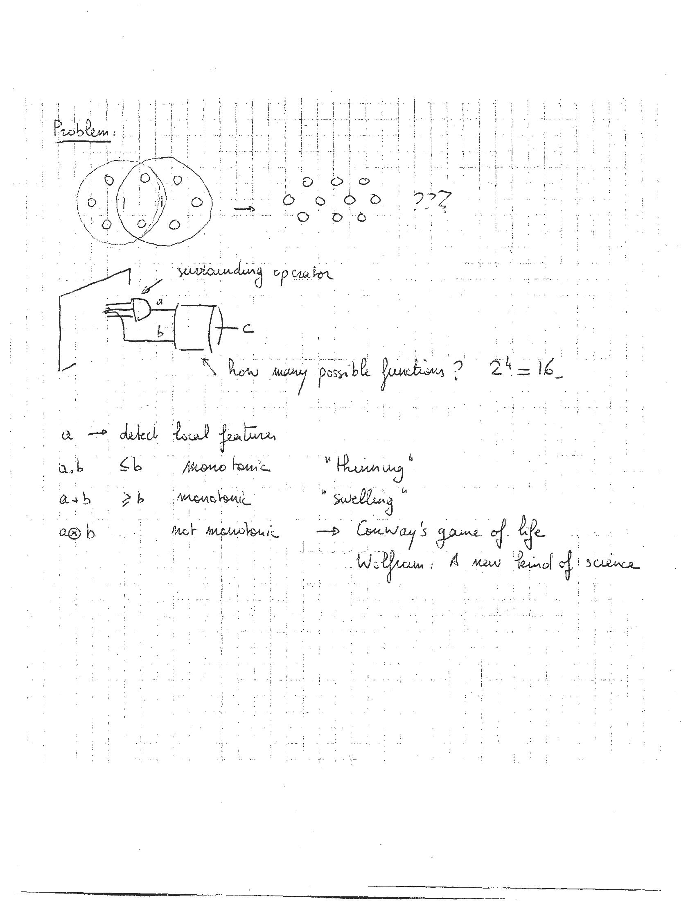

# l13


## 1

```markdown
Quiz #1 Reminder in continuous images

[ 0 1 ]
[ 1 ]

E(x,y) = E(x)

p = ∫∫ |E(x)| dx dy = ∫ |E_x| dx = 2L (E_x0 - E_x1) = 2L ∨
independent of edge curvature.

If edge is curved? Perimeter

Consider:

[ 0 1 ]
[ 1 ]

∂E/∂x + ∂E/∂z ∂z/∂x + ∂E/∂y ∂y/∂x = l'(l) cosθ

z = √(x² + y²) ⇒ dz/dy = x/√(x² + y²) = r cosθ/2

∫_π ∫_R0-e |l(λ)| dλ dθ

2D

p = ∫_∞ ∫_∞ √(E_x² + E_y²) dx dy

∫_π ∫_∞ √(E_x² + E_y²) dλ dθ
```

ASCII Art:

```
  o
  |
  |
  |
  |
  |
  |
  |
  |
  |
  |
  |
  |
  |
  |
  |
  |
  |
  |
  |
  |
  |
  |
  |
  |
  |
  |
  |
  |
  |
  |
  |
  |
  |
  |
  |
  |
  |
  |
  |
  |
  |
  |
  |
  |
  |
  |
  |
  |
  |
  |
  |
  |
  |
  |
  |
  |
  |
  |
  |
  |
  |
  |
  |
  |
  |
  |
  |
  |
  |
  |
  |
  |
  |
  |
  |
  |
  |
  |
  |
  |
  |
  |
  |
  |
  |
  |
  |
  |
  |
  |
  |
  |
  |
  |
  |
  |
  |
  |
  |
  |
  |
  |
  |
  |
  |
  |
  |
  |
  |
  |
  |
  |
  |
  |
  |
  |
  |
  |
  |
  |
  |
  |
  |
  |
  |
  |
  |
  |
  |
  |
  |
  |
  |
  |
  |
  |
  |
  |
  |
  |
  |
  |
  |
  |
  |
  |
  |
  |
  |
  |
  |
  |
  |
  |
  |
  |
  |
  |
  |
  |
  |
  |
  |
  |
  |
  |
  |
  |
  |
  |
  |
  |
  |
  |
  |
  |
  |
  |
  |
  |
  |
  |
  |
  |
  |
  |
  |
  |
  |
  |
  |
  |
  |
  |
  |
  |
  |
  |
  |
  |
  |
  |
  |
  |
  |
  |
  |
  |
  |
  |
  |
  |
  |
  |
  |
  |
  |
  |
  |
  |
  |
  |
  |
  |
  |
  |
  |
  |
  |
  |
  |
  |
  |
  |
  |
  |
  |
  |
  |
  |
  |
  |
  |
  |
  |
  |
  |
  |
  |
  |
  |
  |
  |
  |
  |
  |
  |
  |
  |
  |
  |
  |
  |
  |
  |
  |
  |
  |
  |
  |
  |
  |
  |
  |
  |
  |
  |
  |
  |
  |
  |
  |
  |
  |
  |
  |
  |
  |
  |
  |
  |
  |
  |
  |
  |
  |
  |
  |
  |
  |
  |
  |
  |
  |
  |
  |
  |
  |
  |
  |
  |
  |
  |
  |
  |
  |
  |
  |
  |
  |
  |
  |
  |
  |
  |
  |
  |
  |
  |
  |
  |
  |
  |
  |
  |
  |
  |
  |
  |
  |
  |
  |
  |
  |
  |
  |
  |
  |
  |
  |
  |
  |
  |
  |
  |
  |
  |
  |
  |
  |
  |
  |
  |
  |
  |
  |
  |
  |
  |
  |
  |
  |
  |
  |
  |
  |
  |
  |
  |
  |
  |
  |
  |
  |
  |
  |
  |
  |
  |
  |
  |
  |
  |
  |
  |
  |
  |
  |
  |
  |
  |
  |
  |
  |
  |
  |
  |
  |
  |
  |
  |
  |
  |
  |
  |
  |
  |
  |
  |
  |
  |
  |
  |
  |
  |
  |
  |
  |
  |
  |
  |
  |
  |
  |
  |
  |
  |
  |
  |
  |
  |
  |
  |
  |
  |
  |
  |
  |
  |
  |
  |
  |
  |
  |
  |
  |
  |
  |
  |
  |
  |
  |
  |
  |
  |
  |
  |
  |
  |
  |
  |
  |
  |
  |
  |
  |
  |
  |
  |
  |
  |
  |
  |
  |
  |
  |
  |
  |
  |
  |
  |
  |
  |
  |
  |
  |
  |
  |
  |
  |
  |
  |
  |
  |
  |
  |
  |
  |
  |
  |
  |
  |
  |
  |
  |
  |
  |
  |
  |
  |
  |
  |
  |
  |
  |
  |
  |
  |
  |
  |
  |
  |
  |
  |
  |
  |
  |
  |
  |
  |
  |
  |
  |
  |
  |
  |
  |
  |
  |
  |
  |
  |
  |
  |
  |
  |
  |
  |
  |
  |
  |
  |
  |
  |
  |
  |
  |
  |
  |
  |
  |
  |
  |
  |
  |
  |
  |
  |
  |
  |
  |
  |
  |
  |
  |
  |
  |
  |
  |
  |
  |
  |
  |
  |
  |
  |
  |
  |
  |
  |
  |
  |
  |
  |
  |
  |
  |
  |
  |
  |
  |
  |
  |
  |
  |
  |
  |
  |
  |
  |
  |
  |
  |
  |
  |
  |
  |
  |
  |
  |
  |
  |
  |
  |
  |
  |
  |
  |
  |
  |
  |
  |
  |
  |
  |
  |
  |
  |
  |
  |
  |
  |
  |
  |
  |
  |
  |
  |
  |
  |
  |
  |
  |
  |
  |
  |
  |
  |
  |
  |
  |
  |
  |
  |
  |
  |
  |
  |
  |
  |
  |
  |
  |
  |
  |
  |
  |
  |
  |
  |
  |
  |
  |
  |
  |
  |
  |
  |
  |
  |
  |
  |
  |
  |
  |
  |
  |
  |
  |
  |
  |
  |
  |
  |
  |
  |
  |
  |
  |
  |
  |
  |
  |
  |
  |
  |
  |
  |
  |
  |
  |
  |
  |
  |
  |
  |
  |
  |
  |
  |
  |
  |
  |
  |
  |
  |
  |
  |
  |
  |
  |
  |
  |
  |
  |
  |
  |
  |
  |
  |
  |
  |
  |
  |
  |
  |
  |
  |
  |
  |
  |
  |
  |
  |
  |
  |
  |
  |
  |
  |
  |
  |
  |
  |
  |
  |
  |
  |
  |
  |
  |
  |
  |
  |
  |
  |
  |
  |
  |
  |
  |
  |
  |
  |
  |
  |
  |
  |
  |
  |
  |
  |
  |
  |
  |
  |
  |
  |
  |
  |
  |
  |
  |
  |
  |
  |
  |
  |
  |
  |
  |
  |
  |
  |
  |
  |
  |
  |
  |
  |
  |
  |
  |
  |
  |
  |
  |
  |
  |
  |
  |
  |
  |
  |
  |
  |
  |
  |
  |
  |
  |
  |
  |
  |
  |
  |
  |
  |
  |
  |
  |
  |
  |
  |
  |
  |
  |
  |
  |
  |
  |
  |
  |
  |
  |
  |
  |
  |
  |
  |
  |
  |
  |
  |
  |
  |
  |
  |
  |
  |
  |
  |
  |
  |
  |
  |
  |
  |
  |
  |
  |
  |
  |
  |
  |
  |
  |
  |
  |
  |
  |
  |
  |
  |
  |
  |
  |
  |
  |
  |
  |
  |
  |
  |
  |
  |
  |
  |
  |
  |
  |
  |
  |
  |
  |
  |
  |
  |
  |
  |
  |
  |
  |
  |
  |
  |
  |
  |
  |
  |
  |
  |
  |
  |
  |
  |
  |
  |
  |
  |
  |
  |
  |
  |
  |
  |
  |
  |
  |
  |
  |
  |
  |
  |
  |
  |
  |
  |
  |
  |
  |
  |
  |
  |
  |
  |
  |
  |
  |
  |
  |
  |
  |
  |
  |
  |
  |
  |
  |
  |
  |
  |
  |
  |
  |
  |
  |
  |
  |
  |
  |
  |
  |
  |
  |
  |
  |
  |
  |
  |
  |
  |
  |
  |
  |
  |
  |
  |
  |
  |
  |
  |
  |
  |
  |
  |
  |
  |
  |
  |
  |
  |
  |
  |
  |
  |
  |
  |
  |
  |
  |
  |
  |
  |
  |
  |
  |
  |
  |
  |
  |
  |
  |
  |
  |
  |
  |
  |
  |
  |
  |
  |
  |
  |
  |
  |
  |
  |
  |
  |
  |
  |
  |
  |
  |
  |
  |
  |
  |
  |
  |
  |
  |
  |
  |
  |
  |
  |
  |
  |
  |
  |
  |
  |
  |
  |
  |
  |
  |
  |
  |
  |
  |
  |
  |
  |
  |
  |
  |
  |
  |
  |
  |
  |
  |
  |
  |
  |
  |
  |
  |
  |
  |
  |
  |
  |
  |
  |
  |
  |
  |
  |
  |
  |
  |
  |
  |
  |
  |
  |
  |
  |
  |
  |
  |
  |
  |
  |
  |
  |
  |
  |
  |
  |
  |
  |
  |
  |
  |
  |
  |
  |
  |
  |
  |
  |
  |
  |
  |
  |
  |
  |
  |
  |
  |
  |
  |
  |
  |
  |
  |
  |
  |
  |
  |
  |
  |
  |
  |
  |
  |
  |
  |
  |
  |
  |
  |
  |
  |
  |
  |
  |
  |
  |
  |
  |
  |
  |
  |
  |
  |
  |
  |
  |
  |
  |
  |
  |
  |
  |
  |
  |
  |
  |
  |
  |
  |
  |
  |
  |
  |
  |
  |
  |
  |
  |
  |
  |
  |
  |
  |
  |
  |
  |
  |
  |
  |
  |
  |
  |
  |
  |
  |
  |
  |
  |
  |
  |
  |
  |
  |
  |
  |
  |
  |
  |
  |
  |
  |
  |
  |
  |
  |
  |
  |
  |
  |
  |
  |
  |
  |
  |
  |
  |
  |
  |
  |
  |
  |
  |
  |
  |
  |
  |
  |
  |
  |
  |
  |
  |
  |
  |
  |
  |
  |
  |
  |
  |
  |
  |
  |
  |
  |
  |
  |
  |
  |
  |
  |
  |
  |
  |
  |
  |
  |
  |
  |
  |
  |
  |
  |
  |
  |
  |
  |
  |
  |
  |
  |
  |
  |
  |
  |
  |
  |
  |
  |
  |
  |
  |
  |
  |
  |
  |
  |
  |
  |
  |
  |
  |
  |
  |
  |
  |
  |
  |
  |
  |
  |
  |
  |
  |
  |
  |
  |
  |
  |
  |
  |
  |
  |
  |
  |
  |
  |
  |
  |
  |
  |
  |
  |
  |
  |
  |
  |
  |
  |
  |
  |
  |
  |
  |
  |
  |
  |
  |
  |
  |
  |
  |
  |
  |
  |
  |
  |
  |
  |
  |
  |
  |
  |
  |
  |
  |
  |
  |
  |
  |
  |
  |
  |
  |
  |
  |
  |
  |
  |
  |
  |
  |
  |
  |
  |
  |
  |
  |
  |
  |
  |
  |
  |
  |
  |
  |
  |
  |
  |
  |
  |
  |
  |
  |
  |
  |
  |
  |
  |
  |
  |
  |
  |
  |
  |
  |
  |
  |
  |
  |
  |
  |
  |
  |
  |
  |
  |
  |
  |
  |
  |
  |
  |
  |
  |
  |
  |
  |
  |
  |
  |
  |
  |
  |
  |
  |
  |
  |
  |
  |
  |
  |
  |
  |
  |
  |
  |
  |
  |
  |
  |
  |
  |
  |
  |
  |
  |
  |
  |
  |
  |
  |
  |
  |
  |
  |
  |
  |
  |
  |
  |
  |
  |
  |
  |
  |
  |
  |
  |
  |
  |
  |
  |
  |
  |
  |
  |
  |
  |
  |
  |
  |
  |
  |
  |
  |
  |
  |
  |
  |
  |
  |
  |
  |
  |
  |
  |
  |
  |
  |
  |
  |
  |
  |
  |
  |
  |
  |
  |
  |
  |
  |
  |
  |
  |
  |
  |
  |
  |
  |
  |
  |
  |
  |
  |
  |
  |
  |
  |
  |
  |
  |
  |
  |
  |
  |
  |
  |
  |
  |
  |
  |
  |
  |
  |
  |
  |
  |
  |
  |
  |
  |
  |
  |
  |
  |
  |
  |
  |
  |
  |
  |
  |
  |
  |
  |
  |
  |
  |
  |
  |
  |
  |
  |
  |
  |
  |
  |
  |
  |
  |
  |
  |
  |
  |
  |
  |
  |
  |
  |
  |
  |
  |
  |
  |
  |
  |
  |
  |
  |
  |
  |
  |
  |
  |
  |
  |
  |
  |
  |
  |
  |
  |
  |
  |
  |
  |
  |
  |
  |
  |
  |
  |
  |
  |
  |
  |
  |
  |
  |
  |
  |
  |
  |
  |
  |
  |
  |
  |
  |
  |
  |
  |
  |
  |
  |
  |
  |
  |
  |
  |
  |
  |
  |
  |
  |
  |
  |
  |
  |
  |
  |
  |
  |
  |
  |
  |
  |
  |
  |
  |
  |
  |
  |
  |
  |
  |
  |
  |
  |
  |
  |
  |
  |
  |
  |
  |
  |
  |
  |
  |
  |
  |
  |
  |
  |
  |
  |
  |
  |
  |
  |
  |
  |
  |
  |
  |
  |
  |
  |
  |
  |
  |
  |
  |
  |
  |
  |
  |
  |
  |
  |
  |
  |
  |
  |
  |
  |
  |
  |
  |
  |
  |
  |
  |
  |
  |
  |
  |
  |
  |
  |
  |
  |
  |
  |
  |
  |
  |
  |
  |
  |
  |
  |
  |
  |
  |
  |
  |
  |
  |
  |
  |
  |
  |
  |
  |
  |
  |
  |
  |
  |
  |
  |
  |
  |
  |
  |
  |
  |
  |
  |
  |
  |
  |
  |
  |
  |
  |
  |
  |
  |
  |
  |
  |
  |
  |
  |
  |
  |
  |
  |
  |
  |
  |
  |
  |
  |
  |
  |
  |
  |
  |
  |
  |
  |
  |
  |
  |
  |
  |
  |
  |
  |
  |
  |
  |
  |
  |
  |
  |
  |
  |
  |
  |
  |
  |
  |
  |
  |
  |
  |
  |
  |
  |
  |
  |
  |
  |
  |
  |
  |
  |
  |
  |
  |
  |
  |
  |
  |
  |
  |
  |
  |
  |
  |
  |
  |
  |
  |
  |
  |
  |
  |
  |
  |
  |
  |
  |
  |
  |
  |
  |
  |
  |
  |
  |
  |
  |
  |
  |
  |
  |
  |
  |
  |
  |
  |
  |
  |
  |
  |
  |
  |
  |
  |
  |
  |
  |
  |
  |
  |
  |
  |
  |
  |
  |
  |
  |
  |
  |
  |
  |
  |
  |
  |
  |
  |
  |
  |
  |
  |
  |
  |
  |
  |
  |
  |
  |
  |
  |
  |
  |
  |
  |
  |
  |
  |
  |
  |
  |
  |
  |
  |
  |
  |
  |
  |
  |
  |
  |
  |
  |
  |
  |
  |
  |
  |
  |
  |
  |
  |
  |
  |
  |
  |
  |
  |
  |
  |
  |
  |
  |
  |
  |
  |
  |
  |
  |
  |
  |
  |
  |
  |
  |
  |
  |
  |
  |
  |
  |
  |
  |
  |
  |
  |
  |
  |
  |
  |
  |
  |
  |
  |
  |
  |
  |
  |
  |
  |
  |
  |
  |
  |
  |
  |
  |
  |
  |
  |
  |
  |
  |
  |
  |
  |
  |
  |
  |
  |
  |
  |
  |
  |
  |
  |
  |
  |
  |
  |
  |
  |
  |
  |
  |
  |
  |
  |
  |
  |
  |
  |
  |
  |
  |
  |
  |
  |
  |
  |
  |
  |
  |
  |
  |
  |
  |
  |
  |
  |
  |
  |
  |
  |
  |
  |
  |
  |
  |
  |
  |
  |
  |
  |
  |
  |
  |
  |
  |
  |
  |
  |
  |
  |
  |
  |
  |
  |
  |
  |
  |
  |
  |
  |
  |
  |
  |
  |
  |
  |
  |
  |
  |
  |
  |
  |
  |
  |
  |
  |
  |
  |
  |
  |
  |
  |
  |
  |
  |
  |
  |
  |
  |
  |
  |
  |
  |
  |
  |
  |
  |
  |
  |
  |
  |
  |
  |
  |
  |
  |
  |
  |
  |
  |
  |
  |
  |
  |
  |
  |
  |
  |
  |
  |
  |
  |
  |
  |
  |
  |
  |
  |
  |
  |
  |
  |
  |
  |
  |
  |
  |
  |
  |
  |
  |
  |
  |
  |
  |
  |
  |
  |
  |
  |
  |
  |
  |
  |
  |
  |
  |
  |
  |
  |
  |
  |
  |
  |
  |
  |
  |
  |
  |
  |
  |
  |
  |
  |
  |
  |
  |
  |
  |
  |
  |
  |
  |
  |
  |
  |
  |
  |
  |
  |
  |
  |
  |
  |
  |
  |
  |
  |
  |
  |
  |
  |
  |
  |
  |
  |
  |
  |
  |
  |
  |
  |
  |
  |
  |
  |
  |
  |
  |
  |
  |
  |
  |
  |
  |
  |
  |
  |
  |
  |
  |
  |
  |
  |
  |
  |
  |
  |
  |
  |
  |
  |
  |
  |
  |
  |
  |
  |
  |
  |
  |
  |
  |
  |
  |
  |
  |
  |
  |
  |
  |
  |
  |
  |
  |
  |
  |
  |
  |
  |
  |
  |
  |
  |
  |
  |
  |
  |
  |
  |
  |
  |
  |
  |
  |
  |
  |
  |
  |
  |
  |
  |
  |
  |
  |
  |
  |
  |
  |
  |
  |
  |
  |
  |
  |
  |
  |
  |
  |
  |
  |
  |
  |
  |
  |
  |
  |
  |
  |
  |
  |
  |
  |
  |
  |
  |
  |
  |
  |
  |
  |
  |
  |
  |
  |
  |
  |
  |
  |
  |
  |
  |
  |
  |
  |
  |
  |
  |
  |
  |
  |
  |
  |
  |
  |
  |
  |
  |
  |
  |
  |
  |
  |
  |
  |
  |
  |
  |
  |
  |
  |
  |
  |
  |
  |
  |
  |
  |
  |
  |
  |
  |
  |
  |
  |
  |
  |
  |
  |
  |
  |
  |
  |
  |
  |
  |
  |
  |
  |
  |
  |
  |
  |
  |
  |
  |
  |
  |
  |
  |
  |
  |
  |
  |
  |
  |
  |
  |
  |
  |
  |
  |
  |
  |
  |
  |
  |
  |
  |
  |
  |
  |
  |
  |
  |
  |
  |
  |
  |
  |
  |
  |
  |
  |
  |
  |
  |
  |
  |
  |
  |
  |
  |
  |
  |
  |
  |
  |
  |
  |
  |
  |
  |
  |
  |
  |
  |
  |
  |
  |
  |
  |
  |
  |
  |
  |
  |
  |
  |
  |
  |
  |
  |
  |
  |
  |
  |
  |
  |
  |
  |
  |
  |
  |
  |
  |
  |
  |
  |
  |
  |
  |
  |
  |
  |
  |
  |
  |
  |
  |
  |
  |
  |
  |
  |
  |
  |
  |
  |
  |
  |
  |
  |
  |
  |
  |
  |
  |
  |
  |
  |
  |
  |
  |
  |
  |
  |
  |
  |
  |
  |
  |
  |
  |
  |
  |
  |
  |
  |
  |
  |
  |
  |
  |
  |
  |
  |
  |
  |
  |
  |
  |
  |
  |
  |
  |
  |
  |
  |
  |
  |
  |
  |
  |
  |
  |
  |
  |
  |
  |
  |
  |
  |
  |
  |
  |
  |
  |
  |
  |
  |
  |
  |
  |
  |
  |
  |
  |
  |
  |
  |
  |
  |
  |
  |
  |
  |
  |
  |
  |
  |
  |
  |
  |
  |
  |
  |
  |
  |
  |
  |
  |
  |
  |
  |
  |
  |
  |
  |
  |
  |
  |
  |
  |
  |
  |
  |
  |
  |
  |
  |
  |
  |
  |
  |
  |
  |
  |
  |
  |
  |
  |
  |
  |
  |
  |
  |
  |
  |
  |
  |
  |
  |
  |
  |
  |
  |
  |
  |
  |
  |
  |
  |
  |
  |
  |
  |
  |
  |
  |
  |
  |
  |
  |
  |
  |
  |
  |
  |
  |
  |
  |
  |
  |
  |
  |
  |
  |
  |
  |
  |
  |
  |
  |
  |
  |
  |
  |
  |
  |
  |
  |
  |
  |
  |
  |
  |
  |
  |
  |
  |
  |
  |
  |
  |
  |
  |
  |
  |
  |
  |
  |
  |
  |
  |
  |
  |
  |
  |
  |
  |
  |
  |
  |
  |
  |
  |
  |
  |
  |
  |
  |
  |
  |
  |
  |
  |
  |
  |
  |
  |
  |
  |
  |
  |
  |
  |
  |
  |
  |
  |
  |
  |
  |
  |
  |
  |
  |
  |
  |
  |
  |
  |
  |
  |
  |
  |
  |
  |
  |
  |
  |
  |
  |
  |
  |
  |
  |
  |
  |
  |
  |
  |
  |
  |
  |
  |
  |
  |
  |
  |
  |
  |
  |
  |
  |
  |
  |
  |
  |
  |
  |
  |
  |
  |
  |
  |
  |
  |
  |
  |
  |
  |
  |
  |
  |
  |
  |
  |
  |
  |
  |
  |
  |
  |
  |
  |
  |
  |
  |
  |
  |
  |
  |
  |
  |
  |
  |
  |
  |
  |
  |
  |
  |
  |
  |
  |
  |
  |
  |
  |
  |
  |
  |
  |
  |
  |
  |
  |
  |
  |
  |
  |
  |
  |
  |
  |
  |
  |
  |
  |
  |
  |
  |
  |
  |
  |
  |
  |
  |
  |
  |
  |
  |
  |
  |
  |
  |
  |
  |
  |
  |
  |
  |
  |
  |
  |
  |
  |
  |
  |
  |
  |
  |
  |
  |
  |
  |
  |
  |
  |
  |
  |
  |
  |
  |
  |
  |
  |
  |
  |
  |
  |
  |
  |
  |
  |
  |
  |
  |
  |
  |
  |
  |
  |
  |
  |
  |
  |
  |
  |
  |
  |
  |
  |
  |
  |
  |
  |
  |
  |
  |
  |
  |
  |
  |
  |
  |
  |
  |
  |
  |
  |
  |
  |
  |
  |
  |
  |
  |
  |
  |
  |
  |
  |
  |
  |
  |
  |
  |
  |
  |
  |
  |
  |
  |
  |
  |
  |
  |
  |
  |
  |
  |
  |
  |
  |
  |
  |
  |
  |
  |
  |
  |
  |
  |
  |
  |
  |
  |
  |
  |
  |
  |
  |
  |
  |
  |
  |
  |
  |
  |
  |
  |
  |
  |
  |
  |
  |
  |
  |
  |
  |
  |
  |
  |
  |
  |
  |
  |
  |
  |
  |
  |
  |
  |
  |
  |
  |
  |
  |
  |
  |
  |
  |
  |
  |
  |
  |
  |
  |
  |
  |
  |
  |
  |
  |
  |
  |
  |
  |
  |
  |
  |
  |
  |
  |
  |
  |
  |
  |
  |
  |
  |
  |
  |
  |
  |
  |
  |
  |
  |
  |
  |
  |
  |
  |
  |
  |
  |
  |
  |
  |
  |
  |
  |
  |
  |
  |
  |
  |
  |
  |
  |
  |
  |
  |
  |
  |
  |
  |
  |
  |
  |
  |
  |
  |
  |
  |
  |
  |
  |
  |
  |
  |
  |
  |
  |
  |
  |
  |
  |
  |
  |
  |
  |
  |
  |
  |
  |
  |
  |
  |
  |
  |
  |
  |
  |
  |
  |
  |
  |
  |
  |
  |
  |
  |
  |
  |
  |
  |
  |
  |
  |
  |
  |
  |
  |
  |
  |
  |
  |
  |
  |
  |
  |
  |
  |
  |
  |
  |
  |
  |
  |
  |
  |
  |
  |
  |
  |
  |
  |
  |
  |
  |
  |
  |
  |
  |
  |
  |
  |
  |
  |
  |
  |
  |
  |
  |
  |
  |
  |
  |
  |
  |
  |
  |
  |
  |
  |
  |
  |
  |
  |
  |
  |
  |
  |
  |
  |
  |
  |
  |
  |
  |
  |
  |
  |
  |
  |
  |
  |
  |
  |
  |
  |
  |
  |
  |
  |
  |
  |
  |
  |
  |
  |
  |
  |
  |
  |
  |
  |
  |
  |
  |
  |
  |
  |
  |
  |
  |
  |
  |
  |
  |
  |
  |
  |
  |
  |
  |
  |
  |
  |
  |
  |
  |
  |
  |
  |
  |
  |
  |
  |
  |
  |
  |
  |
  |
  |
  |
  |
  |
  |
  |
  |
  |
  |
  |
  |
  |
  |
  |
  |
  |
  |
  |
  |
  |
  |
  |
  |
  |
  |
  |
  |
  |
  |
  |
  |
  |
  |
  |
  |
  |
  |
  |
  |
  |
  |
  |
  |
  |
  |
  |
  |
  |
  |
  |
  |
  |
  |
  |
  |
  |
  |
  |
  |
  |
  |
  |
  |
  |
  |
  |
  |
  |
  |
  |
  |
  |
  |
  |
  |
  |
  |
  |
  |
  |
  |
  |
  |
  |
  |
  |
  |
  |
  |
  |
  |
  |
  |
  |
  |
  |
  |
  |
  |
  |
  |
  |
  |
  |
  |
  |
  |
  |
  |
  |
  |
  |
  |
  |
  |
  |
  |
  |
  |
  |
  |
  |
  |
  |
  |
  |
  |
  |
  |
  |
  |
  |
  |
  |
  |
  |
  |
  |
  |
  |
  |
  |
  |
  |
  |
  |
  |
  |
  |
  |
  |
  |
  |
  |
  |
  |
  |
  |
  |
  |
  |
  |
  |
  |
  |
  |
  |
  |
  |
  |
  |
  |
  |
  |
  |
  |
  |
  |
  |
  |
  |
  |
  |
  |
  |
  |
  |
  |
  |
  |
  |
  |
  |
  |
  |
  |
  |
  |
  |
  |
  |
  |
  |
  |
  |
  |
  |
  |
  |
  |
  |
  |
  |
  |
  |
  |
  |
  |
  |
  |
  |
  |
  |
  |
  |
  |
  |
  |
  |
  |
  |
  |
  |
  |
  |
  |
  |
  |
  |
  |
  |
  |
  |
  |
  |
  |
  |
  |
  |
  |
  |
  |
  |
  |
  |
  |
  |
  |
  |
  |
  |
  |
  |
  |
  |
  |
  |
  |
  |
  |
  |
  |
  |
  |
  |
  |
  |
  |
  |
  |
  |
  |
  |
  |
  |
  |
  |
  |
  |
  |
  |
  |
  |
  |
  |
  |
  |
  |
  |
  |
  |
  |
  |
  |
  |
  |
  |
  |
  |
  |
  |
  |
  |
  |
  |
  |
  |
  |
  |
  |
  |
  |
  |
  |
  |
  |
  |
  |
  |
  |
  |
  |
  |
  |
  |
  |
  |
  |
  |
  |
  |
  |
  |
  |
  |
  |
  |
  |
  |
  |
  |
  |
  |
  |
  |
  |
  |
  |
  |
  |
  |
  |
  |
  |
  |
  |
  |
  |
  |
  |
  |
  |
  |
  |
  |
  |
  |
  |
  |
  |
  |
  |
  |
  |
  |
  |
  |
  |
  |
  |
  |
  |
  |
  |
  |
  |
  |
  |
  |
  |
  |
  |
  |
  |
  |
  |
  |
  |
  |
  |
  |
  |
  |
  |
  |
  |
  |
  |
  |
  |
  |
  |
  |
  |
  |
  |
  |
  |
  |
  |
  |
  |
  |
  |
  |
  |
  |
  |
  |
  |
  |
  |
  |
  |
  |
  |
  |
  |
  |
  |
  |
  |
  |
  |
  |
  |
  |
  |
  |
  |
  |
  |
  |
  |
  |
  |
  |
  |
  |
  |
  |
  |
  |
  |
  |
  |
  |
  |
  |
  |
  |
  |
  |
  |
  |
  |
  |
  |
  |
  |
  |
  |
  |
  |
  |
  |
  |
  |
  |
  |
  |
  |
  |
  |
  |
  |
  |
  |
  |
  |
  |
  |
  |
  |
  |
  |
  |
  |
  |
  |
  |
  |
  |
  |
  |
  |
  |
  |
  |
  |
  |
  |
  |
  |
  |
  |
  |
  |
  |
  |
  |
  |
  |
  |
  |
  |
  |
  |
  |
  |
  |
  |
  |
  |
  |
  |
  |
  |
  |
  |
  |
  |
  |
  |
  |
  |
  |
  |
  |
  |
  |
  |
  |
  |
  |
  |
  |
  |
  |
  |
  |
  |
  |
  |
  |
  |
  |
  |
  |
  |
  |
  |
  |
  |
  |
  |
  |
  |
  |
  |
  |
  |
  |
  |
  |
  |
  |
  |
  |
  |
  |
  |
  |
  |
  |
  |
  |
  |
  |
  |
  |
  |
  |
  |
  |
  |
  |
  |
  |
  |
  |
  |
  |
  |
  |
  |
  |
  |
  |
  |
  |
  |
  |
  |
  |
  |
  |
  |
  |
  |
  |
  |
  |
  |
  |
  |
  |
  |
  |
  |
  |
  |
  |
  |
  |
  |
  |
  |
  |
  |
  |
  |
  |
  |
  |
  |
  |
  |
  |
  |
  |
  |
  |
  |
  |
  |
  |
  |
  |
  |
  |
  |
  |
  |
  |
  |
  |
  |
  |
  |
  |
  |
  |
  |
  |
  |
  |
  |
  |
  |
  |
  |
  |
  |
  |
  |
  |
  |
  |
  |
  |
  |
  |
  |
  |
  |
  |
  |
  |
  |
  |
  |
  |
  |
  |
  |
  |
  |
  |
  |
  |
  |
  |
  |
  |
  |
  |
  |
  |
  |
  |
  |
  |
  |
  |
  |
  |
  |
  |
  |
  |
  |
  |
  |
  |
  |
  |
  |
  |
  |
  |
  |
  |
  |
  |
  |
  |
  |
  |
  |
  |
  |
  |
  |
  |
  |
  |
  |
  |
  |
  |
  |
  |
  |
  |
  |
  |
  |
  |
  |
  |
  |
  |
  |
  |
  |
  |
  |
  |
  |
  |
  |
  |
  |
  |
  |
  |
  |
  |
  |
  |
  |
  |
  |
  |
  |
  |
  |
  |
  |
  |
  |
  |
  |
  |
  |
  |
  |
  |
  |
  |
  |
  |
  |
  |
  |
  |
  |
  |
  |
  |
  |
  |
  |
  |
  |
  |
  |
  |
  |
  |
  |
  |
  |
  |
  |
  |
  |
  |
  |
  |
  |
  |
  |
  |
  |
  |
  |
  |
  |
  |
  |
  |
  |
  |
  |
  |
  |
  |
  |
  |
  |
  |
  |
  |
  |
  |
  |
  |
  |
  |
  |
  |
  |
  |
  |
  |
  |
  |
  |
  |
  |
  |
  |
  |
  |
  |
  |
  |
  |
  |
  |
  |
  |
  |
  |
  |
  |
  |
  |
  |
  |
  |
  |
  |
  |
  |
  |
  |
  |
  |
  |
  |
  |
  |
  |
  |
  |
  |
  |
  |
  |
  |
  |
  |
  |
  |
  |
  |
  |
  |
  |
  |
  |
  |
  |
  |
  |
  |
  |
  |
  |
  |
  |
  |
  |
  |
  |
  |
  |
  |
  |
  |
  |
  |
  |
  |
  |
  |
  |
  |
  |
  |
  |
  |
  |
  |
  |
  |
  |
  |
  |
  |
  |
  |
  |
  |
  |
  |
  |
  |
  |
  |
  |
  |
  |
  |
  |
  |
  |
  |
  |
  |
  |
  |
  |
  |
  |
  |
  |
  |
  |
  |
  |
  |
  |
  |
  |
  |
  |
  |
  |
  |
  |
  |
  |
  |
  |
  |
  |
  |
  |
  |
  |
  |
  |
  |
  |
  |
  |
  |
  |
  |
  |
  |
  |
  |
  |
  |
  |
  |
  |
  |
  |
  |
  |
  |
  |
  |
  |
  |
  |
  |
  |
  |
  |
  |
  |
  |
  |
  |
  |
  |
  |
  |
  |
  |
  |
  |
  |
  |
  |
  |
  |
  |
  |
  |
  |
  |
  |
  |
  |
  |
  |
  |
  |
  |
  |
  |
  |
  |
  |
  |
  |
  |
  |
  |
  |
  |
  |
  |
  |
  |
  |
  |
  |
  |
  |
  |
  |
  |
  |
  |
  |
  |
  |
  |
  |
  |
  |
  |
  |
  |
  |
  |
  |
  |
  |
  |
  |
  |
  |
  |
  |
  |
  |
  |
  |
  |
  |
  |
  |
  |
  |
  |
  |
  |
  |
  |
  |
  |
  |
  |
  |
  |
  |
  |
  |
  |
  |
  |
  |
  |
  |
  |
  |
  |
  |
  |
  |
  |
  |
  |
  |
  |
  |
  |
  |
  |
  |
  |
  |
  |
  |
  |
  |
  |
  |
  |
  |
  |
  |
  |
  |
  |
  |
  |
  |
  |
  |
  |
  |
  |
  |
  |
  |
  |
  |
  |
  |
  |
  |
  |
  |
  |
  |
  |
  |
  |
  |
  |
  |
  |
  |
  |
  |
  |
  |
  |
  |
  |
  |
  |
  |
  |
  |
  |
  |
  |
  |
  |
  |
  |
  |
  |
  |
  |
  |
  |
  |
  |
  |
  |
  |
  |
  |
  |
  |
  |
  |
  |
  |
  |
  |
  |
  |
  |
  |
  |
  |
  |
  |
  |
  |
  |
  |
  |
  |
  |
  |
  |
  |
  |
  |
  |
  |
  |
  |
  |
  |
  |
  |
  |
  |
  |
  |
  |
  |
  |
  |
  |
  |
  |
  |
  |
  |
  |
  |
  |
  |
  |
  |
  |
  |
  |
  |
  |
  |
  |
  |
  |
  |
  |
  |
  |
  |
  |
  |
  |
  |
  |
  |
  |
  |
  |
  |
  |
  |
  |
  |
  |
  |
  |
  |
  |
  |
  |
  |
  |
  |
  |
  |
  |
  |
  |
  |
  |
  |
  |
  |
  |
  |
  |
  |
  |
  |
  |
  |
  |
  |
  |
  |
  |
  |
  |
  |
  |
  |
  |
  |
  |
  |
  |
  |
  |
  |
  |
  |
  |
  |
  |
  |
  |
  |
  |
  |
  |
  |
  |
  |
  |
  |
  |
  |
  |
  |
  |
  |
  |
  |
  |
  |
  |
  |
  |
  |
  |
  |
  |
  |
  |
  |
  |
  |
  |
  |
  |
  |
  |
  |
  |
  |
  |
  |
  |
  |
  |
  |
  |
  |
  |
  |
  |
  |
  |
  |
  |
  |
  |
  |
  |
  |
  |
  |
  |
  |
  |
  |
  |
  |
  |
  |
  |
  |
  |
  |
  |
  |
  |
  |
  |
  |
  |
  |
  |
  |
  |
  |
  |
  |
  |
  |
  |
  |
  |
  |
  |
  |
  |
  |
  |
  |
  |
  |
  |
  |
  |
  |
  |
  |
  |
  |
  |
  |
  |
  |
  |
  |
  |
  |
  |
  |
  |
  |
  |
  |
  |
  |
  |
  |
  |
  |
  |
  |
  |
  |
  |
  |
  |
  |
  |
  |
  |
  |
  |
  |
  |
  |
  |
  |
  |
  |
  |
  |
  |
  |
  |
  |
  |
  |
  |
  |
  |
  |
  |
  |
  |
  |
  |
  |
  |
  |
  |
  |
  |
  |
  |
  |
  |
  |
  |
  |
  |
  |
  |
  |
  |
  |
  |
  |
  |
  |
  |
  |
  |
  |
  |
  |
  |
  |
  |
  |
  |
  |
  |
  |
  |
  |
  |
  |
  |
  |
  |
  |
  |
  |
  |
  |
  |
  |
  |
  |
  |
  |
  |
  |
  |
  |
  |
  |
  |
  |
  |
  |
  |
  |
  |
  |
  |
  |
  |
  |
  |
  |
  |
  |
  |
  |
  |
  |
  |
  |
  |
  |
  |
  |
  |
  |
  |
  |
  |
  |
  |
  |
  |
  |
  |
  |
  |
  |
  |
  |
  |
  |
  |
  |
  |
  |
  |
  |
  |
  |
  |
  |
  |
  |
  |
  |
  |
  |
  |
  |
  |
  |
  |
  |
  |
  |
  |
  |
  |
  |
  |
  |
  |
  |
  |
  |
  |
  |
  |
  |
  |
  |
  |
  |
  |
  |
  |
  |
  |
  |
  |
  |
  |
  |
  |
  |
  |
  |
  |
  |
  |
  |
  |
  |
  |
  |
  |
  |
  |
  |
  |
  |
  |
  |
  |
  |
  |
  |
  |
  |
  |
  |
  |
  |
  |
  |
  |
  |
  |
  |
  |
  |
  |
  |
  |
  |
  |
  |
  |
  |
  |
  |
  |
  |
  |
  |
  |
  |
  |
  |
  |
  |
  |
  |
  |
  |
  |
  |
  |
  |
  |
  |
  |
  |
  |
  |
  |
  |
  |
  |
  |
  |
  |
  |
  |
  |
  |
  |
  |
  |
  |
  |
  |
  |
  |
  |
  |
  |
  |
  |
  |
  |
  |
  |
  |
  |
  |
  |
  |
  |
  |
  |
  |
  |
  |
  |
  |
  |
  |
  |
  |
  |
  |
  |
  |
  |
  |
  |
  |
  |
  |
  |
  |
  |
  |
  |
  |
  |
  |
  |
  |
  |
  |
  |
  |
  |
  |
  |
  |
  |
  |
  |
  |
  |
  |
  |
  |
  |
  |
  |
  |
  |
  |
  |
  |
  |
  |
  |
  |
  |
  |
  |
  |
  |
  |
  |
  |
  |
  |
  |
  |
  |
  |
  |
  |
  |
  |
  |
  |
  |
  |
  |
  |
  |
  |
  |
  |
  |
  |
  |
  |
  |
  |
  |
  |
  |
  |
  |
  |
  |
  |
  |
  |
  |
  |
  |
  |
  |
  |
  |
  |
  |
  |
  |
  |
  |
  |
  |
  |
  |
  |
  |
  |
  |
  |
  |
  |
  |
  |
  |
  |
  |
  |
  |
  |
  |
  |
  |
  |
  |
  |
  |
  |
  |
  |
  |
  |
  |
  |
  |
  |
  |
  |
  |
  |
  |
  |
  |
  |
  |
  |
  |
  |
  |
  |
  |
  |
  |
  |
  |
  |
  |
  |
  |
  |
  |
  |
  |
  |
  |
  |
  |
  |
  |
  |
  |
  |
  |
  |
  |
  |
  |
  |
  |
  |
  |
  |
  |
  |
  |
  |
  |
  |
  |
  |
  |
  |
  |
  |
  |
  |
  |
  |
  |
  |
  |
  |
  |
  |
  |
  |
  |
  |
  |
  |
  |
  |
  |
  |
  |
  |
  |
  |
  |
  |
  |
  |
  |
  |
  |
  |
  |
  |
  |
  |
  |
  |
  |
  |
  |
  |
  |
  |
  |
  |
  |
  |
  |
  |
  |
  |
  |
  |
  |
  |
  |
  |
  |
  |
  |
  |
  |
  |
  |
  |
  |
  |
  |
  |
  |
  |
  |
  |
  |
  |
  |
  |
  |
  |
  |
  |
  |
  |
  |
  |
  |
  |
  |
  |
  |
  |
  |
  |
  |
  |
  |
  |
  |
  |
  |
  |
  |
  |
  |
  |
  |
  |
  |
  |
  |
  |
  |
  |
  |
  |
  |
  |
  |
  |
  |
  |
  |
  |
  |
  |
  |
  |
  |
  |
  |
  |
  |
  |
  |
  |
  |
  |
  |
  |
  |
  |
  |
  |
  |
  |
  |
  |
  |
  |
  |
  |
  |
  |
  |
  |
  |
  |
  |
  |
  |
  |
  |
  |
  |
  |
  |
  |
  |
  |
  |
  |
  |
  |
  |
  |
  |
  |
  |
  |
  |
  |
  |
  |
  |
  |
  |
  |
  |
  |
  |
  |
  |
  |
  |
  |
  |
  |
  |
  |
  |
  |
  |
  |
  |
  |
  |
  |
  |
  |
  |
  |
  |
  |
  |
  |
  |
  |
  |
  |
  |
  |
  |
  |
  |
  |
  |
  |
  |
  |
  |
  |
  |
  |
  |
  |
  |
  |
  |
  |
  |
  |
  |
  |
  |
  |
  |
  |
  |
  |
  |
  |
  |
  |
  |
  |
  |
  |
  |
  |
  |
  |
  |
  |
  |
  |
  |
  |
  |
  |
  |
  |
  |
  |
  |
  |
  |
  |
  |
  |
  |
  |
  |
  |
  |
  |
  |
  |
  |
  |
  |
  |
  |
  |
  |
  |
  |
  |
  |
  |
  |
  |
  |
  |
  |
  |
  |
  |
  |
  |
  |
  |
  |
  |
  |
  |
  |
  |
  |
  |
  |
  |
  |
  |
  |
  |
  |
  |
  |
  |
  |
  |
  |
  |
  |
  |
  |
  |
  |
  |
  |
  |
  |
  |
  |
  |
  |
  |
  |
  |
  |
  |
  |
  |
  |
  |
  |
  |
  |
  |
  |
  |
  |
  |
  |
  |
  |
  |
  |
  |
  |
  |
  |
  |
  |
  |
  |
  |
  |
  |
  |
  |
  |
  |
  |
  |
  |
  |
  |
  |
  |
  |
  |
  |
  |
  |
  |
  |
  |
  |
  |
  |
  |
  |
  |
  |
  |
  |
  |
  |
  |
  |
  |
  |
  |
  |
  |
  |
  |
  |
  |
  |
  |
  |
  |
  |
  |
  |
  |
  |
  |
  |
  |
  |
  |
  |
  |
  |
  |
  |
  |
  |
  |
  |
  |
  |
  |
  |
  |
  |
  |
  |
  |
  |
  |
  |
  |
  |
  |
  |
  |
  |
  |
  |
  |
  |
  |
  |
  |
  |
  |
  |
  |
  |
  |
  |
  |
  |
  |
  |
  |
  |
  |
  |
  |
  |
  |
  |
  |
  |
  |
  |
  |
  |
  |
  |
  |
  |
  |
  |
  |
  |
  |
  |
  |
  |
  |
  |
  |
  |
  |
  |
  |
  |
  |
  |
  |
  |
  |
  |
  |
  |
  |
  |
  |
  |
  |
  |
  |
  |
  |
  |
  |
  |
  |
  |
  |
  |
  |
  |
  |
  |
  |
  |
  |
  |
  |
  |
  |
  |
  |
  |
  |
  |
  |
  |
  |
  |
  |
  |
  |
  |
  |
  |
  |
  |
  |
  |
  |
  |
  |
  |
  |
  |
  |
  |
  |
  |
  |
  |
  |
  |
  |
  |
  |
  |
  |
  |
  |
  |
  |
  |
  |
  |
  |
  |
  |
  |
  |
  |
  |
  |
  |
  |
  |
  |
  |
  |
  |
  |
  |
  |
  |
  |
  |
  |
  |
  |
  |
  |
  |
  |
  |
  |
  |
  |
  |
  |
  |
  |
  |
  |
  |
  |
  |
  |
  |
  |
  |
  |
  |
  |
  |
  |
  |
  |
  |
  |
  |
  |
  |
  |
  |
  |
  |
  |
  |
  |
  |
  |
  |
  |
  |
  |
  |
  |
  |
  |
  |
  |
  |
  |
  |
  |
  |
  |
  |
  |
  |
  |
  |
  |
  |
  |
  |
  |
  |
  |
  |
  |
  |
  |
  |
  |
  |
  |
  |
  |
  |
  |
  |
  |
  |
  |
  |
  |
  |
  |
  |
  |
  |
  |
  |
  |
  |
  |
  |
  |
  |
  |
  |
  |
  |
  |
  |
  |
  |
  |
  |
  |
  |
  |
  |
  |
  |
  |
  |
  |
  |
  |
  |
  |
  |
  |
  |
  |
  |
  |
  |
  |
  |
  |
  |
  |
  |
  |
  |
  |
  |
  |
  |
  |
  |
  |
  |
  |
  |
  |
  |
  |
  |
  |
  |
  |
  |
  |
  |
  |
  |
  |
  |
  |
  |
  |
  |
  |
  |
  |
  |
  |
  |
  |
  |
  |
  |
  |
  |
  |
  |
  |
  |
  |
  |
  |
  |
  |
  |
  |
  |
  |
  |
  |
  |
  |
  |
  |
  |
  |
  |
  |
  |
  |
  |
  |
  |
  |
  |
  |
  |
  |
  |
  |
  |
  |
  |
  |
  |
  |
  |
  |
  |
  |
  |
  |
  |
  |
  |
  |
  |
  |
  |
  |
  |
  |
  |
  |
  |
  |
  |
  |
  |
  |
  |
  |
  |
  |
  |
  |
  |
  |
  |
  |
  |
  |
  |
  |
  |
  |
  |
  |
  |
  |
  |
  |
  |
  |
  |
  |
  |
  |
  |
  |
  |
  |
  |
  |
  |
  |
  |
  |
  |
  |
  |
  |
  |
  |
  |
  |
  |
  |
  |
  |
  |
  |
  |
  |
  |
  |
  |
  |
  |
  |
  |
  |
  |
  |
  |
  |
  |
  |
  |
  |
  |
  |
  |
  |
  |
  |
  |
  |
  |
  |
  |
  |
  |
  |
  |
  |
  |
  |
  |
  |
  |
  |
  |
  |
  |
  |
  |
  |
  |
  |
  |
  |
  |
  |
  |
  |
  |
  |
  |
  |
  |
  |
  |
  |
  |
  |
  |
  |
  |
  |
  |
  |
  |
  |
  |
  |
  |
  |
  |
  |
  |
  |
  |
  |
  |
  |
  |
  |
  |
  |
  |
  |
  |
  |
  |
  |
  |
  |
  |
  |
  |
  |
  |
  |
  |
  |
  |
  |
  |
  |
  |
  |
  |
  |
  |
  |
  |
  |
  |
  |
  |
  |
  |
  |
  |
  |
  |
  |
  |
  |
  |
  |
  |
  |
  |
  |
  |
  |
  |
  |
  |
  |
  |
  |
  |
  |
  |
  |
  |
  |
  |
  |
  |
  |
  |
  |
  |
  |
  |
  |
  |
  |
  |
  |
  |
  |
  |
  |
  |
  |
  |
  |
  |
  |
  |
  |
  |
  |
  |
  |
  |
  |
  |
  |
  |
  |
  |
  |
  |
  |
  |
  |
  |
  |
  |
  |
  |
  |
  |
  |
  |
  |
  |
  |
  |
  |
  |
  |
  |
  |
  |
  |
  |
  |
  |
  |
  |
  |
  |
  |
  |
  |
  |
  |
  |
  |
  |
  |
  |
  |
  |
  |
  |
  |
  |
  |
  |
  |
  |
  |
  |
  |
  |
  |
  |
  |
  |
  |
  |
  |
  |
  |
  |
  |
  |
  |
  |
  |
  |
  |
  |
  |
  |
  |
  |
  |
  |
  |
  |
  |
  |
  |
  |
  |
  |
  |
  |
  |
  |
  |
  |
  |
  |
  |
  |
  |
  |
  |
  |
  |
  |
  |
  |
  |
  |
  |
  |
  |
  |
  |
  |
  |
  |
  |
  |
  |
  |
  |
  |
  |
  |
  |
  |
  |
  |
  |
  |
  |
  |
  |
  |
  |
  |
  |
  |
  |
  |
  |
  |
  |
  |
  |
  |
  |
  |
  |
  |
  |
  |
  |
  |
  |
  |
  |
  |
  |
  |
  |
  |
  |
  |
  |
  |
  |
  |
  |
  |
  |
  |
  |
  |
  |
  |
  |
  |
  |
  |
  |
  |
  |
  |
  |
  |
  |
  |
  |
  |
  |
  |
  |
  |
  |
  |
  |
  |
  |
  |
  |
  |
  |
  |
  |
  |
  |
  |
  |
  |
  |
  |
  |
  |
  |
  |
  |
  |
  |
  |
  |
  |
  |
  |
  |
  |
  |
  |
  |
  |
  |
  |
  |
  |
  |
  |
  |
  |
  |
  |
  |
  |
  |
  |
  |
  |
  |
  |
  |
  |
  |
  |
  |
  |
  |
  |
  |
  |
  |
  |
  |
  |
  |
  |
  |
  |
  |
  |
  |
  |
  |
  |
  |
  |
  |
  |
  |
  |
  |
  |
  |
  |
  |
  |
  |
  |
  |
  |
  |
  |
  |
  |
  |
  |
  |
  |
  |
  |
  |
  |
  |
  |
  |
  |
  |
  |
  |
  |
  |
  |
  |
  |
  |
  |
  |
  |
  |
  |
  |
  |
  |
  |
  |
  |
  |
  |
  |
  |
  |
  |
  |
  |
  |
  |
  |
  |
  |
  |
  |
  |
  |
  |
  |
  |
  |
  |
  |
  |
  |
  |
  |
  |
  |
  |
  |
  |
  |
  |
  |
  |
  |
  |
  |
  |
  |
  |
  |
  |
  |
  |
  |
  |
  |
  |
  |
  |
  |
  |
  |
  |
  |
  |
  |
  |
  |
  |
  |
  |
  |
  |
  |
  |
  |
  |
  |
  |
  |
  |
  |
  |
  |
  |
  |
  |
  |
  |
  |
  |
  |
  |
  |
  |
  |
  |
  |
  |
  |
  |
  |
  |
  |
  |
  |
  |
  |
  |
  |
  |
  |
  |
  |
  |
  |
  |
  |
  |
  |
  |
  |
  |
  |
  |
  |
  |
  |
  |
  |
  |
  |
  |
  |
  |
  |
  |
  |
  |
  |
  |
  |
  |
  |
  |
  |
  |
  |
  |
  |
  |
  |
  |
  |
  |
  |
  |
  |
  |
  |
  |
  |
  |
  |
  |
  |
  |
  |
  |
  |
  |
  |
  |
  |
  |
  |
  |
  |
  |
  |
  |
  |
  |
  |
  |
  |
  |
  |
  |
  |
  |
  |
  |
  |
  |
  |
  |
  |
  |
  |
  |
  |
  |
  |
  |
  |
  |
  |
  |
  |
  |
  |
  |
  |
  |
  |
  |
  |
  |
  |
  |
  |
  |
  |
  |
  |
  |
  |
  |
  |
  |
  |
  |
  |
  |
  |
  |
  |
  |
  |
  |
  |
  |
  |
  |
  |
  |
  |
  |
  |
  |
  |
  |
  |
  |
  |
  |
  |
  |
  |
  |
  |
  |
  |
  |
  |
  |
  |
  |
  |
  |
  |
  |
  |
  |
  |
  |
  |
  |
  |
  |
  |
  |
  |
  |
  |
  |
  |
  |
  |
  |
  |
  |
  |
  |
  |
  |
  |
  |
  |
  |
  |
  |
  |
  |
  |
  |
  |
  |
  |
  |
  |
  |
  |
  |
  |
  |
  |
  |
  |
  |
  |
  |
  |
  |
  |
  |
  |
  |
  |
  |
  |
  |
  |
  |
  |
  |
  |
  |
  |
  |
  |
  |
  |
  |
  |
  |
  |
  |
  |
  |
  |
  |
  |
  |
  |
  |
  |
  |
  |
  |
  |
  |
  |
  |
  |
  |
  |
  |
  |
  |
  |
  |
  |
  |
  |
  |
  |
  |
  |
  |
  |
  |
  |
  |
  |
  |
  |
  |
  |
  |
  |
  |
  |
  |
  |
  |
  |
  |
  |
  |
  |
  |
  |
  |
  |
  |
  |
  |
  |
  |
  |
  |
  |
  |
  |
  |
  |
  |
  |
  |
  |
  |
  |
  |
  |
  |
  |
  |
  |
  |
  |
  |
  |
  |
  |
  |
  |
  |
  |
  |
  |
  |
  |
  |
  |
  |
  |
  |
  |
  |
  |
  |
  |
  |
  |
  |
  |
  |
  |
  |
  |
  |
  |
  |
  |
  |
  |
  |
  |
  |
  |
  |
  |
  |
  |
  |
  |
  |
  |
  |
  |
  |
  |
  |
  |
  |
  |
  |
  |
  |
  |
  |
  |
  |
  |
  |
  |
  |
  |
  |
  |
  |
  |
  |
  |
  |
  |
  |
  |
  |
  |
  |
  |
  |
  |
  |
  |
  |
  |
  |
  |
  |
  |
  |
  |
  |
  |
  |
  |
  |
  |
  |
  |
  |
  |
  |
  |
  |
  |
  |
  |
  |
  |
  |
  |
  |
  |
  |
  |
  |
  |
  |
  |
  |
  |
  |
  |
  |
  |
  |
  |
  |
  |
  |
  |
  |
  |
  |
  |
  |
  |
  |
  |
  |
  |
  |
  |
  |
  |
  |
  |
  |
  |
  |
  |
  |
  |
  |
  |
  |
  |
  |
  |
  |
  |
  |
  |
  |
  |
  |
  |
  |
  |
  |
  |
  |
  |
  |
  |
  |
  |
  |
  |
  |
  |
  |
  |
  |
  |
  |
  |
  |
  |
  |
  |
  |
  |
  |
  |
  |
  |
  |
  |
  |
  |
  |
  |
  |
  |
  |
  |
  |
  |
  |
  |
  |
  |
  |
  |
  |
  |
  |
  |
  |
  |
  |
  |
  |
  |
  |
  |
  |
  |
  |
  |
  |
  |
  |
  |
  |
  |
  |
  |
  |
  |
  |
  |
  |
  |
  |
  |
  |
  |
  |
  |
  |
  |
  |
  |
  |
  |
  |
  |
  |
  |
  |
  |
  |
  |
  |
  |
  |
  |
  |
  |
  |
  |
  |
  |
  |
  |
  |
  |
  |
  |
  |
  |
  |
  |
  |
  |
  |
  |
  |
  |
  |
  |
  |
  |
  |
  |
  |
  |
  |
  |
  |
  |
  |
  |
  |
  |
  |
  |
  |
  |
  |
  |
  |
  |
  |
  |
  |
  |
  |
  |
  |
  |
  |
  |
  |
  |
  |
  |
  |
  |
  |
  |
  |
  |
  |
  |
  |
  |
  |
  |
  |
  |
  |
  |
  |
  |
  |
  |
  |
  |
  |
  |
  |
  |
  |
  |
  |
  |
  |
  |
  |
  |
  |
  |
  |
  |
  |
  |
  |
  |
  |
  |
  |
  |
  |
  |
  |
  |
  |
  |
  |
  |
  |
  |
  |
  |
  |
  |
  |
  |
  |
  |
  |
  |
  |
  |
  |
  |
  |
  |
  |
  |
  |
  |
  |
  |
  |
  |
  |
  |
  |
  |
  |
  |
  |
  |
  |
  |
  |
  |
  |
  |
  |
  |
  |
  |
  |
  |
  |
  |
  |
  |
  |
  |
  |
  |
  |
  |
  |
  |
  |
  |
  |
  |
  |
  |
  |
  |
  |
  |
  |
  |
  |
  |
  |
  |
  |
  |
  |
  |
  |
  |
  |
  |
  |
  |
  |
  |
  |
  |
  |
  |
  |
  |
  |
  |
  |
  |
  |
  |
  |
  |
  |
  |
  |
  |
  |
  |
  |
  |
  |
  |
  |
  |
  |
  |
  |
  |
  |
  |
  |
  |
  |
  |
  |
  |
  |
  |
  |
  |
  |
  |
  |
  |
  |
  |
  |
  |
  |
  |
  |
  |
  |
  |
  |
  |
  |
  |
  |
  |
  |
  |
  |
  |
  |
  |
  |
  |
  |
  |
  |
  |
  |
  |
  |
  |
  |
  |
  |
  |
  |
  |
  |
  |
  |
  |
  |
  |
  |
  |
  |
  |
  |
  |
  |
  |
  |
  |
  |
  |
  |
  |
  |
  |
  |
  |
  |
  |
  |
  |
  |
  |
  |
  |
  |
  |
  |
  |
  |
  |
  |
  |
  |
  |
  |
  |
  |
  |
  |
  |
  |
  |
  |
  |
  |
  |
  |
  |
  |
  |
  |
  |
  |
  |
  |
  |
  |
  |
  |
  |
  |
  |
  |
  |
  |
  |
  |
  |
  |
  |
  |
  |
  |
  |
  |
  |
  |
  |
  |
  |
  |
  |
  |
  |
  |
  |
  |
  |
  |
  |
  |
  |
  |
  |
  |
  |
  |
  |
  |
  |
  |
  |
  |
  |
  |
  |
  |
  |
  |
  |
  |
  |


---

## 2

```markdown
as ε → 0  ≈ ∫₀^π |h(R)|R dα = ∫₀^π R (h(R+ε) + h(R-ε)) dΩ

2πR₀ = P

Circular arc tangent continuous approximation

Area A = ∬ E(x,y) dxdy

Addition Set Property

A(x) + A(y) = A(x ∪ y) + A(x ∩ y)

Area satisfies ASP.

A(x ∪ y) - A(x) = A(y) - A(x ∩ y)

A(x ∪ Δx) - A(x) = A(Δx) - A(x ∩ Δx)

A(xⁿ ∪ Δxⁿ) - A(xⁿ) = A(Δxⁿ) - A(xⁿ ∩ Δxⁿ)

ΔAⁿ = A(xⁿ) - A(xⁿ ∩ Δxⁿ)

ex: Δxⁿ sample pixel
```

ASCII Art:

```
          /\
         /  \
        /    \
       /      \
      /        \
     /          \
    /            \
   /              \
  /                \
 /                  \
/                    \
```

Note: The ASCII art is a simple representation and may not fully capture the complexity of the original drawing.


---

## 3

```markdown
Stream direction and slice the image into this direction

Area: 
\[ x^m_n \Delta x^n = 0 \]
\[ A = \sum \Delta A^m = \sum A(\Delta x^m) \]

Perimeter:
\[ P = \sum \Delta P^m - \sum P^m \Delta P^m \]

Euler number:
\[ E = n(\text{object}) - n(\text{holes}) \]

\[ B \]
\[ E = 1 - 2 = -1 \]

\[ 1 \]
\[ E = 3 \]

Algorithm
- \( E \geq 0 \)
1. \( E_1 = 1 - 0 = 0 \) (ASP)
2. \( E_2 = E_1 + 2 - 1 = 2 \)
3. \( E_3 = E_1 + 2 - 2 = E_2 \) etc...

8. \( E_3 = 0 \) ??? How to improve?

\[ E = n \left( \begin{array}{c} \text{ } \\ \text{ } \end{array} \right) - n \left( \begin{array}{c} \text{ } \\ \text{ } \end{array} \right) \]

\[ +1 \quad \text{ } \quad 0 \]

\[ -1 \quad \text{ } \quad 0 \]
```

ASCII Art:

```
Stream direction
  |
  |
  |  1  2  3
  |  _______
  | |       |
  | |       |
  | |_______|
  |
```

```
B
 ____
|    |
|____|

1
 __
|  |
|__|
```

```
+1
 ____
|    |
|____|

0
 ____
|    |
|____|

-1
 ____
|    |
|____|
```


---

## 4

```markdown
Back to discrete Urel

stream

M ( O ) M

O

0 9
0 1

1 0
1 1

G - connectiveness

N₀  O O
   O

N₁  O O
   O O
   O

N₂  O
   O
   O

N₃  O
   O
   O

E = 1/6 (N₁ - N₂)

P = √(1/6) (N₀ + N₂)

A = 1/6 (N₁ + 2N₂ + 3N₃)

ex:

N₁ = 6  N₀ = N₂ = N₃ = 0  E = 1  P = 1  A = 1
                            wrong P = 6

N₀ = 0  N₁ = 9  N₂ = 3  N₃ = 1

E = 1  P = 12  A = 3
```

ASCII Art:

```
Back to discrete Urel

stream

M ( O ) M

O

0 9
0 1

1 0
1 1

G - connectiveness

N₀  O O
   O

N₁  O O
   O O
   O

N₂  O
   O
   O

N₃  O
   O
   O

E = 1/6 (N₁ - N₂)

P = √(1/6) (N₀ + N₂)

A = 1/6 (N₁ + 2N₂ + 3N₃)

ex:

N₁ = 6  N₀ = N₂ = N₃ = 0  E = 1  P = 1  A = 1
                            wrong P = 6

N₀ = 0  N₁ = 9  N₂ = 3  N₃ = 1

E = 1  P = 12  A = 3
```


---

## 5

```markdown
Iterative Motif Computation

Euler differential
How does E change as one changes one pixel. 
E* = ΔE / ΔI

safe change

unsafe change

Hexagonal grid
very hard on square grid!

2^6 = 64 patterns + rotational symmetry + mirror images

  o o o       o o o
o o o o  -> o o o o
  o o o       o o o
E* = 0

  o o o       o o o
o o o o  -> o o o o
  o o o       o o o
E* = -1

  o o o       o o o
o o o o  -> o o o o
  o o o       o o o
E* = -2

  o o o       o o o
o o o o  -> o o o o
  o o o       o o o
E* = +1
```

```plaintext
  o o o       o o o
o o o o  -> o o o o
  o o o       o o o

  o o o       o o o
o o o o  -> o o o o
  o o o       o o o

  o o o       o o o
o o o o  -> o o o o
  o o o       o o o

  o o o       o o o
o o o o  -> o o o o
  o o o       o o o
```


---

## 6

```markdown
Problem

surrounding operator

how many possible functions? 2^4 = 16

a -> detect local features

a.b <= b monotonic "thinning"
a+b >= b monotonic "swelling"
a⊕b not monotonic -> Conway's game of life
Wolfram: A new kind of science
```

ASCII Art:

```
  . . . . . . . . . . . . . . . . . . . . . . . . . . . . . . . . . . . . . . . . . . . . . . . . . . . . . . . . . . . . . . . . . . . . . . . . . . . . . . . . . . . . . . . . . . . . . . . . . . . . . . . . . . . . . . . . . . . . . . . . . . . . . . . . . . . . . . . . . . . . . . . . . . . . . . . . . . . . . . . . . . . . . . . . . . . . . . . . . . . . . . . . . . . . . . . . . . . . . . . . . . . . . . . . . . . . . . . . . . . . . . . . . . . . . . . . . . . . . . . . . . . . . . . . . . . . . . . . . . . . . . . . . . . . . . . . . . . . . . . . . . . . . . . . . . . . . . . . . . . . . . . . . . . . . . . . . . . . . . . . . . . . . . . . . . . . . . . . . . . . . . . . . . . . . . . . . . . . . . . . . . . . . . . . . . . . . . . . . . . . . . . . . . . . . . . . . . . . . . . . . . . . . . . . . . . . . . . . . . . . . . . . . . . . . . . . . . . . . . . . . . . . . . . . . . . . . . . . . . . . . . . . . . . . . . . . . . . . . . . . . . . . . . . . . . . . . . . . . . . . . . . . . . . . . . . . . . . . . . . . . . . . . . . . . . . . . . . . . . . . . . . . . . . . . . . . . . . . . . . . . . . . . . . . . . . . . . . . . . . . . . . . . . . . . . . . . . . . . . . . . . . . . . . . . . . . . . . . . . . . . . . . . . . . . . . . . . . . . . . . . . . . . . . . . . . . . . . . . . . . . . . . . . . . . . . . . . . . . . . . . . . . . . . . . . . . . . . . . . . . . . . . . . . . . . . . . . . . . . . . . . . . . . . . . . . . . . . . . . . . . . . . . . . . . . . . . . . . . . . . . . . . . . . . . . . . . . . . . . . . . . . . . . . . . . . . . . . . . . . . . . . . . . . . . . . . . . . . . . . . . . . . . . . . . . . . . . . . . . . . . . . . . . . . . . . . . . . . . . . . . . . . . . . . . . . . . . . . . . . . . . . . . . . . . . . . . . . . . . . . . . . . . . . . . . . . . . . . . . . . . . . . . . . . . . . . . . . . . . . . . . . . . . . . . . . . . . . . . . . . . . . . . . . . . . . . . . . . . . . . . . . . . . . . . . . . . . . . . . . . . . . . . . . . . . . . . . . . . . . . . . . . . . . . . . . . . . . . . . . . . . . . . . . . . . . . . . . . . . . . . . . . . . . . . . . . . . . . . . . . . . . . . . . . . . . . . . . . . . . . . . . . . . . . . . . . . . . . . . . . . . . . . . . . . . . . . . . . . . . . . . . . . . . . . . . . . . . . . . . . . . . . . . . . . . . . . . . . . . . . . . . . . . . . . . . . . . . . . . . . . . . . . . . . . . . . . . . . . . . . . . . . . . . . . . . . . . . . . . . . . . . . . . . . . . . . . . . . . . . . . . . . . . . . . . . . . . . . . . . . . . . . . . . . . . . . . . . . . . . . . . . . . . . . . . . . . . . . . . . . . . . . . . . . . . . . . . . . . . . . . . . . . . . . . . . . . . . . . . . . . . . . . . . . . . . . . . . . . . . . . . . . . . . . . . . . . . . . . . . . . . . . . . . . . . . . . . . . . . . . . . . . . . . . . . . . . . . . . . . . . . . . . . . . . . . . . . . . . . . . . . . . . . . . . . . . . . . . . . . . . . . . . . . . . . . . . . . . . . . . . . . . . . . . . . . . . . . . . . . . . . . . . . . . . . . . . . . . . . . . . . . . . . . . . . . . . . . . . . . . . . . . . . . . . . . . . . . . . . . . . . . . . . . . . . . . . . . . . . . . . . . . . . . . . . . . . . . . . . . . . . . . . . . . . . . . . . . . . . . . . . . . . . . . . . . . . . . . . . . . . . . . . . . . . . . . . . . . . . . . . . . . . . . . . . . . . . . . . . . . . . . . . . . . . . . . . . . . . . . . . . . . . . . . . . . . . . . . . . . . . . . . . . . . . . . . . . . . . . . . . . . . . . . . . . . . . . . . . . . . . . . . . . . . . . . . . . . . . . . . . . . . . . . . . . . . . . . . . . . . . . . . . . . . . . . . . . . . . . . . . . . . . . . . . . . . . . . . . . . . . . . . . . . . . . . . . . . . . . . . . . . . . . . . . . . . . . . . . . . . . . . . . . . . . . . . . . . . . . . . . . . . . . . . . . . . . . . . . . . . . . . . . . . . . . . . . . . . . . . . . . . . . . . . . . . . . . . . . . . . . . . . . . . . . . . . . . . . . . . . . . . . . . . . . . . . . . . . . . . . . . . . . . . . . . . . . . . . . . . . . . . . . . . . . . . . . . . . . . . . . . . . . . . . . . . . . . . . . . . . . . . . . . . . . . . . . . . . . . . . . . . . . . . . . . . . . . . . . . . . . . . . . . . . . . . . . . . . . . . . . . . . . . . . . . . . . . . . . . . . . . . . . . . . . . . . . . . . . . . . . . . . . . . . . . . . . . . . . . . . . . . . . . . . . . . . . . . . . . . . . . . . . . . . . . . . . . . . . . . . . . . . . . . . . . . . . . . . . . . . . . . . . . . . . . . . . . . . . . . . . . . . . . . . . . . . . . . . . . . . . . . . . . . . . . . . . . . . . . . . . . . . . . . . . . . . . . . . . . . . . . . . . . . . . . . . . . . . . . . . . . . . . . . . . . . . . . . . . . . . . . . . . . . . . . . . . . . . . . . . . . . . . . . . . . . . . . . . . . . . . . . . . . . . . . . . . . . . . . . . . . . . . . . . . . . . . . . . . . . . . . . . . . . . . . . . . . . . . . . . . . . . . . . . . . . . . . . . . . . . . . . . . . . . . . . . . . . . . . . . . . . . . . . . . . . . . . . . . . . . . . . . . . . . . . . . . . . . . . . . . . . . . . . . . . . . . . . . . . . . . . . . . . . . . . . . . . . . . . . . . . . . . . . . . . . . . . . . . . . . . . . . . . . . . . . . . . . . . . . . . . . . . . . . . . . . . . . . . . . . . . . . . . . . . . . . . . . . . . . . . . . . . . . . . . . . . . . . . . . . . . . . . . . . . . . . . . . . . . . . . . . . . . . . . . . . . . . . . . . . . . . . . . . . . . . . . . . . . . . . . . . . . . . . . . . . . . . . . . . . . . . . . . . . . . . . . . . . . . . . . . . . . . . . . . . . . . . . . . . . . . . . . . . . . . . . . . . . . . . . . . . . . . . . . . . . . . . . . . . . . . . . . . . . . . . . . . . . . . . . . . . . . . . . . . . . . . . . . . . . . . . . . . . . . . . . . . . . . . . . . . . . . . . . . . . . . . . . . . . . . . . . . . . . . . . . . . . . . . . . . . . . . . . . . . . . . . . . . . . . . . . . . . . . . . . . . . . . . . . . . . . . . . . . . . . . . . . . . . . . . . . . . . . . . . . . . . . . . . . . . . . . . . . . . . . . . . . . . . . . . . . . . . . . . . . . . . . . . . . . . . . . . . . . . . . . . . . . . . . . . . . . . . . . . . . . . . . . . . . . . . . . . . . . . . . . . . . . . . . . . . . . . . . . . . . . . . . . . . . . . . . . . . . . . . . . . . . . . . . . . . . . . . . . . . . . . . . . . . . . . . . . . . . . . . . . . . . . . . . . . . . . . . . . . . . . . . . . . . . . . . . . . . . . . . . . . . . . . . . . . . . . . . . . . . . . . . . . . . . . . . . . . . . . . . . . . . . . . . . . . . . . . . . . . . . . . . . . . . . . . . . . . . . . . . . . . . . . . . . . . . . . . . . . . . . . . . . . . . . . . . . . . . . . . . . . . . . . . . . . . . . . . . . . . . . . . . . . . . . . . . . . . . . . . . . . . . . . . . . . . . . . . . . . . . . . . . . . . . . . . . . . . . . . . . . . . . . . . . . . . . . . . . . . . . . . . . . . . . . . . . . . . . . . . . . . . . . . . . . . . . . . . . . . . . . . . . . . . . . . . . . . . . . . . . . . . . . . . . . . . . . . . . . . . . . . . . . . . . . . . . . . . . . . . . . . . . . . . . . . . . . . . . . . . . . . . . . . . . . . . . . . . . . . . . . . . . . . . . . . . . . . . . . . . . . . . . . . . . . . . . . . . . . . . . . . . . . . . . . . . . . . . . . . . . . . . . . . . . . . . . . . . . . . . . . . . . . . . . . . . . . . . . . . . . . . . . . . . . . . . . . . . . . . . . . . . . . . . . . . . . . . . . . . . . . . . . . . . . . . . . . . . . . . . . . . . . . . . . . . . . . . . . . . . . . . . . . . . . . . . . . . . . . . . . . . . . . . . . . . . . . . . . . . . . . . . . . . . . . . . . . . . . . . . . . . . . . . . . . . . . . . . . . . . . . . . . . . . . . . . . . . . . . . . . . . . . . . . . . . . . . . . . . . . . . . . . . . . . . . . . . . . . . . . . . . . . . . . . . . . . . . . . . . . . . . . . . . . . . . . . . . . . . . . . . . . . . . . . . . . . . . . . . . . . . . . . . . . . . . . . . . . . . . . . . . . . . . . . . . . . . . . . . . . . . . . . . . . . . . . . . . . . . . . . . . . . . . . . . . . . . . . . . . . . . . . . . . . . . . . . . . . . . . . . . . . . . . . . . . . . . . . . . . . . . . . . . . . . . . . . . . . . . . . . . . . . . . . . . . . . . . . . . . . . . . . . . . . . . . . . . . . . . . . . . . . . . . . . . . . . . . . . . . . . . . . . . . . . . . . . . . . . . . . . . . . . . . . . . . . . . . . . . . . . . . . . . . . . . . . . . . . . . . . . . . . . . . . . . . . . . . . . . . . . . . . . . . . . . . . . . . . . . . . . . . . . . . . . . . . . . . . . . . . . . . . . . . . . . . . . . . . . . . . . . . . . . . . . . . . . . . . . . . . . . . . . . . . . . . . . . . . . . . . . . . . . . . . . . . . . . . . . . . . . . . . . . . . . . . . . . . . . . . . . . . . . . . . . . . . . . . . . . . . . . . . . . . . . . . . . . . . . . . . . . . . . . . . . . . . . . . . . . . . . . . . . . . . . . . . . . . . . . . . . . . . . . . . . . . . . . . . . . . . . . . . . . . . . . . . . . . . . . . . . . . . . . . . . . . . . . . . . . . . . . . . . . . . . . . . . . . . . . . . . . . . . . . . . . . . . . . . . . . . . . . . . . . . . . . . . . . . . . . . . . . . . . . . . . . . . . . . . . . . . . . . . . . . . . . . . . . . . . . . . . . . . . . . . . . . . . . . . . . . . . . . . . . . . . . . . . . . . . . . . . . . . . . . . . . . . . . . . . . . . . . . . . . . . . . . . . . . . . . . . . . . . . . . . . . . . . . . . . . . . . . . . . . . . . . . . . . . . . . . . . . . . . . . . . . . . . . . . . . . . . . . . . . . . . . . . . . . . . . . . . . . . . . . . . . . . . . . . . . . . . . . . . . . . . . . . . . . . . . . . . . . . . . . . . . . . . . . . . . . . . . . . . . . . . . . . . . . . . . . . . . . . . . . . . . . . . . . . . . . . . . . . . . . . . . . . . . . . . . . . . . . . . . . . . . . . . . . . . . . . . . . . . . . . . . . . . . . . . . . . . . . . . . . . . . . . . . . . . . . . . . . . . . . . . . . . . . . . . . . . . . . . . . . . . . . . . . . . . . . . . . . . . . . . . . . . . . . . . . . . . . . . . . . . . . . . . . . . . . . . . . . . . . . . . . . . . . . . . . . . . . . . . . . . . . . . . . . . . . . . . . . . . . . . . . . . . . . . . . . . . . . . . . . . . . . . . . . . . . . . . . . . . . . . . . . . . . . . . . . . . . . . . . . . . . . . . . . . . . . . . . . . . . . . . . . . . . . . . . . . . . . . . . . . . . . . . . . . . . . . . . . . . . . . . . . . . . . . . . . . . . . . . . . . . . . . . . . . . . . . . . . . . . . . . . . . . . . . . . . . . . . . . . . . . . . . . . . . . . . . . . . . . . . . . . . . . . . . . . . . . . . . . . . . . . . . . . . . . . . . . . . . . . . . . . . . . . . . . . . . . . . . . . . . . . . . . . . . . . . . . . . . . . . . . . . . . . . . . . . . . . . . . . . . . . . . . . . . . . . . . . . . . . . . . . . . . . . . . . . . . . . . . . . . . . . . . . . . . . . . . . . . . . . . . . . . . . . . . . . . . . . . . . . . . . . . . . . . . . . . . . . . . . . . . . . . . . . . . . . . . . . . . . . . . . . . . . . . . . . . . . . . . . . . . . . . . . . . . . . . . . . . . . . . . . . . . . . . . . . . . . . . . . . . . . . . . . . . . . . . . . . . . . . . . . . . . . . . . . . . . . . . . . . . . . . . . . . . . . . . . . . . . . . . . . . . . . . . . . . . . . . . . . . . . . . . . . . . . . . . . . . . . . . . . . . . . . . . . . . . . . . . . . . . . . . . . . . . . . . . . . . . . . . . . . . . . . . . . . . . . . . . . . . . . . . . . . . . . . . . . . . . . . . . . . . . . . . . . . . . . . . . . . . . . . . . . . . . . . . . . . . . . . . . . . . . . . . . . . . . . . . . . . . . . . . . . . . . . . . . . . . . . . . . . . . . . . . . . . . . . . . . . . . . . . . . . . . . . . . . . . . . . . . . . . . . . . . . . . . . . . . . . . . . . . . . . . . . . . . . . . . . . . . . . . . . . . . . . . . . . . . . . . . . . . . . . . . . . . . . . . . . . . . . . . . . . . . . . . . . . . . . . . . . . . . . . . . . . . . . . . . . . . . . . . . . . . . . . . . . . . . . . . . . . . . . . . . . . . . . . . . . . . . . . . . . . . . . . . . . . . . . . . . . . . . . . . . . . . . . . . . . . . . . . . . . . . . . . . . . . . . . . . . . . . . . . . . . . . . . . . . . . . . . . . . . . . . . . . . . . . . . . . . . . . . . . . . . . . . . . . . . . . . . . . . . . . . . . . . . . . . . . . . . . . . . . . . . . . . . . . . . . . . . . . . . . . . . . . . . . . . . . . . . . . . . . . . . . . . . . . . . . . . . . . . . . . . . . . . . . . . . . . . . . . . . . . . . . . . . . . . . . . . . . . . . . . . . . . . . . . . . . . . . . . . . . . . . . . . . . . . . . . . . . . . . . . . . . . . . . . . . . . . . . . . . . . . . . . . . . . . . . . . . . . . . . . . . . . . . . . . . . . . . . . . . . . . . . . . . . . . . . . . . . . . . . . . . . . . . . . . . . . . . . . . . . . . . . . . . . . . . . . . . . . . . . . . . . . . . . . . . . . . . . . . . . . . . . . . . . . . . . . . . . . . . . . . . . . . . . . . . . . . . . . . . . . . . . . . . . . . . . . . . . . . . . . . . . . . . . . . . . . . . . . . . . . . . . . . . . . . . . . . . . . . . . . . . . . . . . . . . . . . . . . . . . . . . . . . . . . . . . . . . . . . . . . . . . . . . . . . . . . . . . . . . . . . . . . . . . . . . . . . . . . . . . . . . . . . . . . . . . . . . . . . . . . . . . . . . . . . . . . . . . . . . . . . . . . . . . . . . . . . . . . . . . . . . . . . . . . . . . . . . . . . . . . . . . . . . . . . . . . . . . . . . . . . . . . . . . . . . . . . . . . . . . . . . . . . . . . . . . . . . . . . . . . . . . . . . . . . . . . . . . . . . . . . . . . . . . . . . . . . . . . . . . . . . . . . . . . . . . . . . . . . . . . . . . . . . . . . . . . . . . . . . . . . . . . . . . . . . . . . . . . . . . . . . . . . . . . . . . . . . . . . . . . . . . . . . . . . . . . . . . . . . . . . . . . . . . . . . . . . . . . . . . . . . . . . . . . . . . . . . . . . . . . . . . . . . . . . . . . . . . . . . . . . . . . . . . . . . . . . . . . . . . . . . . . . . . . . . . . . . . . . . . . . . . . . . . . . . . . . . . . . . . . . . . . . . . . . . . . . . . . . . . . . . . . . . . . . . . . . . . . . . . . . . . . . . . . . . . . . . . . . . . . . . . . . . . . . . . . . . . . . . . . . . . . . . . . . . . . . . . . . . . . . . . . . . . . . . . . . . . . . . . . . . . . . . . . . . . . . . . . . . . . . . . . . . . . . . . . . . . . . . . . . . . . . . . . . . . . . . . . . . . . . . . . . . . . . . . . . . . . . . . . . . . . . . . . . . . . . . . . . . . . . . . . . . . . . . . . . . . . . . . . . . . . . . . . . . . . . . . . . . . . . . . . . . . . . . . . . . . . . . . . . . . . . . . . . . . . . . . . . . . . . . . . . . . . . . . . . . . . . . . . . . . . . . . . . . . . . . . . . . . . . . . . . . . . . . . . . . . . . . . . . . . . . . . . . . . . . . . . . . . . . . . . . . . . . . . . . . . . . . . . . . . . . . . . . . . . . . . . . . . . . . . . . . . . . . . . . . . . . . . . . . . . . . . . . . . . . . . . . . . . . . . . . . . . . . . . . . . . . . . . . . . . . . . . . . . . . . . . . . . . . . . . . . . . . . . . . . . . . . . . . . . . . . . . . . . . . . . . . . . . . . . . . . . . . . . . . . . . . . . . . . . . . . . . . . . . . . . . . . . . . . . . . . . . . . . . . . . . . . . . . . . . . . . . . . . . . . . . . . . . . . . . . . . . . . . . . . . . . . . . . . . . . . . . . . . . . . . . . . . . . . . . . . . . . . . . . . . . . . . . . . . . . . . . . . . . . . . . . . . . . . . . . . . . . . . . . . . . . . . . . . . . . . . . . . . . . . . . . . . . . . . . . . . . . . . . . . . . . . . . . . . . . . . . . . . . . . . . . . . . . . . . . . . . . . . . . . . . . . . . . . . . . . . . . . . . . . . . . . . . . . . . . . . . . . . . . . . . . . . . . . . . . . . . . . . . . . . . . . . . . . . . . . . . . . . . . . . . . . . . . . . . . . . . . . . . . . . . . . . . . . . . . . . . . . . . . . . . . . . . . . . . . . . . . . . . . . . . . . . . . . . . . . . . . . . . . . . . . . . . . . . . . . . . . . . . . . . . . . . . . . . . . . . . . . . . . . . . . . . . . . . . . . . . . . . . . . . . . . . . . . . . . . . . . . . . . . . . . . . . . . . . . . . . . . . . . . . . . . . . . . . . . . . . . . . . . . . . . . . . . . . . . . . . . . . . . . . . . . . . . . . . . . . . . . . . . . . . . . . . . . . . . . . . . . . . . . . . . . . . . . . . . . . . . . . . . . . . . . . . . . . . . . . . . . . . . . . . . . . . . . . . . . . . . . . . . . . . . . . . . . . . . . . . . . . . . . . . . . . . . . . . . . . . . . . . . . . . . . . . . . . . . . . . . . . . . . . . . . . . . . . . . . . . . . . . . . . . . . . . . . . . . . . . . . . . . . . . . . . . . . . . . . . . . . . . . . . . . . . . . . . . . . . . . . . . . . . . . . . . . . . . . . . . . . . . . . . . . . . . . . . . . . . . . . . . . . . . . . . . . . . . . . . . . . . . . . . . . . . . . . . . . . . . . . . . . . . . . . . . . . . . . . . . . . . . . . . . . . . . . . . . . . . . . . . . . . . . . . . . . . . . . . . . . . . . . . . . . . . . . . . . . . . . . . . . . . . . . . . . . . . . . . . . . . . . . . . . . . . . . . . . . . . . . . . . . . . . . . . . . . . . . . . . . . . . . . . . . . . . . . . . . . . . . . . . . . . . . . . . . . . . . . . . . . . . . . . . . . . . . . . . . . . . . . . . . . . . . . . . . . . . . . . . . . . . . . . . . . . . . . . . . . . . . . . . . . . . . . . . . . . . . . . . . . . . . . . . . . . . . . . . . . . . . . . . . . . . . . . . . . . . . . . . . . . . . . . . . . . . . . . . . . . . . . . . . . . . . . . . . . . . . . . . . . . . . . . . . . . . . . . . . . . . . . . . . . . . . . . . . . . . . . . . . . . . . . . . . . . . . . . . . . . . . . . . . . . . . . . . . . . . . . . . . . . . . . . . . . . . . . . . . . . . . . . . . . . . . . . . . . . . . . . . . . . . . . . . . . . . . . . . . . . . . . . . . . . . . . . . . . . . . . . . . . . . . . . . . . . . . . . . . . . . . . . . . . . . . . . . . . . . . . . . . . . . . . . . . . . . . . . . . . . . . . . . . . . . . . . . . . . . . . . . . . . . . . . . . . . . . . . . . . . . . . . . . . . . . . . . . . . . . . . . . . . . . . . . . . . . . . . . . . . . . . . . . . . . . . . . . . . . . . . . . . . . . . . . . . . . . . . . . . . . . . . . . . . . . . . . . . . . . . . . . . . . . . . . . . . . . . . . . . . . . . . . . . . . . . . . . . . . . . . . . . . . . . . . . . . . . . . . . . . . . . . . . . . . . . . . . . . . . . . . . . . . . . . . . . . . . . . . . . . . . . . . . . . . . . . . . . . . . . . . . . . . . . . . . . . . . . . . . . . . . . . . . . . . . . . . . . . . . . . . . . . . . . . . . . . . . . . . . . . . . . . . . . . . . . . . . . . . . . . . . . . . . . . . . . . . . . . . . . . . . . . . . . . . . . . . . . . . . . . . . . . . . . . . . . . . . . . . . . . . . . . . . . . . . . . . . . . . . . . . . . . . . . . . . . . . . . . . . . . . . . . . . . . . . . . . . . . . . . . . . . . . . . . . . . . . . . . . . . . . . . . . . . . . . . . . . . . . . . . . . . . . . . . . . . . . . . . . . . . . . . . . . . . . . . . . . . . . . . . . . . . . . . . . . . . . . . . . . . . . . . . . . . . . . . . . . . . . . . . . . . . . . . . . . . . . . . . . . . . . . . . . . . . . . . . . . . . . . . . . . . . . . . . . . . . . . . . . . . . . . . . . . . . . . . . . . . . . . . . . . . . . . . . . . . . . . . . . . . . . . . . . . . . . . . . . . . . . . . . . . . . . . . . . . . . . . . . . . . . . . . . . . . . . . . . . . . . . . . . . . . . . . . . . . . . . . . . . . . . . . . . . . . . . . . . . . . . . . . . . . . . . . . . . . . . . . . . . . . . . . . . . . . . . . . . . . . . . . . . . . . . . . . . . . . . . . . . . . . . . . . . . . . . . . . . . . . . . . . . . . . . . . . . . . . . . . . . . . . . . . . . . . . . . . . . . . . . . . . . . . . . . . . . . . . . . . . . . . . . . . . . . . . . . . . . . . . . . . . . . . . . . . . . . . . . . . . . . . . . . . . . . . . . . . . . . . . . . . . . . . . . . . . . . . . . . . . . . . . . . . . . . . . . . . . . . . . . . . . . . . . . . . . . . . . . . . . . . . . . . . . . . . . . . . . . . . . . . . . . . . . . . . . . . . . . . . . . . . . . . . . . . . . . . . . . . . . . . . . . . . . . . . . . . . . . . . . . . . . . . . . . . . . . . . . . . . . . . . . . . . . . . . . . . . . . . . . . . . . . . . . . . . . . . . . . . . . . . . . . . . . . . . . . . . . . . . . . . . . . . . . . . . . . . . . . . . . . . . . . . . . . . . . . . . . . . . . . . . . . . . . . . . . . . . . . . . . . . . . . . . . . . . . . . . . . . . . . . . . . . . . . . . . . . . . . . . . . . . . . . . . . . . . . . . . . . . . . . . . . . . . . . . . . . . . . . . . . . . . . . . . . . . . . . . . . . . . . . . . . . . . . . . . . . . . . . . . . . . . . . . . . . . . . . . . . . . . . . . . . . . . . . . . . . . . . . . . . . . . . . . . . . . . . . . . . . . . . . . . . . . . . . . . . . . . . . . . . . . . . . . . . . . . . . . . . . . . . . . . . . . . . . . . . . . . . . . . . . . . . . . . . . . . . . . . . . . . . . . . . . . . . . . . . . . . . . . . . . . . . . . . . . . . . . . . . . . . . . . . . . . . . . . . . . . . . . . . . . . . . . . . . . . . . . . . . . . . . . . . . . . . . . . . . . . . . . . . . . . . . . . . . . . . . . . . . . . . . . . . . . . . . . . . . . . . . . . . . . . . . . . . . . . . . . . . . . . . . . . . . . . . . . . . . . . . . . . . . . . . . . . . . . . . . . . . . . . . . . . . . . . . . . . . . . . . . . . . . . . . . . . . . . . . . . . . . . . . . . . . . . . . . . . . . . . . . . . . . . . . . . . . . . . . . . . . . . . . . . . . . . . . . . . . . . . . . . . . . . . . . . . . . . . . . . . . . . . . . . . . . . . . . . . . . . . . . . . . . . . . . . . . . . . . . . . . . . . . . . . . . . . . . . . . . . . . . . . . . . . . . . . . . . . . . . . . . . . . . . . . . . . . . . . . . . . . . . . . . . . . . . . . . . . . . . . . . . . . . . . . . . . . . . . . . . . . . . . . . . . . . . . . . . . . . . . . . . . . . . . . . . . . . . . . . . . . . . . . . . . . . . . . . . . . . . . . . . . . . . . . . . . . . . . . . . . . . . . . . . . . . . . . . . . . . . . . . . . . . . . . . . . . . . . . . . . . . . . . . . . . . . . . . . . . . . . . . . . . . . . . . . . . . . . . . . . . . . . . . . . . . . . . . . . . . . . . . . . . . . . . . . . . . . . . . . . . . . . . . . . . . . . . . . . . . . . . . . . . . . . . . . . . . . . . . . . . . . . . . . . . . . . . . . . . . . . . . . . . . . . . . . . . . . . . . . . . . . . . . . . . . . . . . . . . . . . . . . . . . . . . . . . . . . . . . . . . . . . . . . . . . . . . . . . . . . . . . . . . . . . . . . . . . . . . . . . . . . . . . . . . . . . . . . . . . . . . . . . . . . . . . . . . . . . . . . . . . . . . . . . . . . . . . . . . . . . . . . . . . . . . . . . . . . . . . . . . . . . . . . . . . . . . . . . . . . . . . . . . . . . . . . . . . . . . . . . . . . . . . . . . . . . . . . . . . . . . . . . . . . . . . . . . . . . . . . . . . . . . . . . . . . . . . . . . . . . . . . . . . . . . . . . . . . . . . . . . . . . . . . . . . . . . . . . . . . . . . . . . . . . . . . . . . . . . . . . . . . . . . . . . . . . . . . . . . . . . . . . . . . . . . . . . . . . . . . . . . . . . . . . . . . . . . . . . . . . . . . . . . . . . . . . . . . . . . . . . . . . . . . . . . . . . . . . . . . . . . . . . . . . . . . . . . . . . . . . . . . . . . . . . . . . . . . . . . . . . . . . . . . . . . . . . . . . . . . . . . . . . . . . . . . . . . . . . . . . . . . . . . . . . . . . . . . . . . . . . . . . . . . . . . . . . . . . . . . . . . . . . . . . . . . . . . . . . . . . . . . . . . . . . . . . . . . . . . . . . . . . . . . . . . . . . . . . . . . . . . . . . . . . . . . . . . . . . . . . . . . . . . . . . . . . . . . . . . . . . . . . . . . . . . . . . . . . . . . . . . . . . . . . . . . . . . . . . . . . . . . . . . . . . . . . . . . . . . . . . . . . . . . . . . . . . . . . . . . . . . . . . . . . . . . . . . . . . . . . . . . . . . . . . . . . . . . . . . . . . . . . . . . . . . . . . . . . . . . . . . . . . . . . . . . . . . . . . . . . . . . . . . . . . . . . . . . . . . . . . . . . . . . . . . . . . . . . . . . . . . . . . . . . . . . . . . . . . . . . . . . . . . . . . . . . . . . . . . . . . . . . . . . . . . . . . . . . . . . . . . . . . . . . . . . . . . . . . . . . . . . . . . . . . . . . . . . . . . . . . . . . . . . . . . . . . . . . . . . . . . . . . . . . . . . . . . . . . . . . . . . . . . . . . . . . . . . . . . . . . . . . . . . . . . . . . . . . . . . . . . . . . . . . . . . . . . . . . . . . . . . . . . . . . . . . . . . . . . . . . . . . . . . . . . . . . . . . . . . . . . . . . . . . . . . . . . . . . . . . . . . . . . . . . . . . . . . . . . . . . . . . . . . . . . . . . . . . . . . . . . . . . . . . . . . . . . . . . . . . . . . . . . . . . . . . . . . . . . . . . . . . . . . . . . . . . . . . . . . . . . . . . . . . . . . . . . . . . . . . . . . . . . . . . . . . . . . . . . . . . . . . . . . . . . . . . . . . . . . . . . . . . . . . . . . . . . . . . . . . . . . . . . . . . . . . . . . . . . . . . . . . . . . . . . . . . . . . . . . . . . . . . . . . . . . . . . . . . . . . . . . . . . . . . . . . . . . . . . . . . . . . . . . . . . . . . . . . . . . . . . . . . . . . . . . . . . . . . . . . . . . . . . . . . . . . . . . . . . . . . . . . . . . . . . . . . . . . . . . . . . . . . . . . . . . . . . . . . . . . . . . . . . . . . . . . . . . . . . . . . . . . . . . . . . . . . . . . . . . . . . . . . . . . . . . . . . . . . . . . . . . . . . . . . . . . . . . . . . . . . . . . . . . . . . . . . . . . . . . . . . . . . . . . . . . . . . . . . . . . . . . . . . . . . . . . . . . . . . . . . . . . . . . . . . . . . . . . . . . . . . . . . . . . . . . . . . . . . . . . . . . . . . . . . . . . . . . . . . . . . . . . . . . . . . . . . . . . . . . . . . . . . . . . . . . . . . . . . . . . . . . . . . . . . . . . . . . . . . . . . . . . . . . . . . . . . . . . . . . . . . . . . . . . . . . . . . . . . . . . . . . . . . . . . . . . . . . . . . . . . . . . . . . . . . . . . . . . . . . . . . . . . . . . . . . . . . . . . . . . . . . . . . . . . . . . . . . . . . . . . . . . . . . . . . . . . . . . . . . . . . . . . . . . . . . . . . . . . . . . . . . . . . . . . . . . . . . . . . . . . . . . . . . . . . . . . . . . . . . . . . . . . . . . . . . . . . . . . . . . . . . . . . . . . . . . . . . . . . . . . . . . . . . . . . . . . . . . . . . . . . . . . . . . . . . . . . . . . . . . . . . . . . . . . . . . . . . . . . . . . . . . . . . . . . . . . . . . . . . . . . . . . . . . . . . . . . . . . . . . . . . . . . . . . . . . . . . . . . . . . . . . . . . . . . . . . . . . . . . . . . . . . . . . . . . . . . . . . . . . . . . . . . . . . . . . . . . . . . . . . . . . . . . . . . . . . . . . . . . . . . . . . . . . . . . . . . . . . . . . . . . . . . . . . . . . . . . . . . . . . . . . . . . . . . . . . . . . . . . . . . . . . . . . . . . . . . . . . . . . . . . . . . . . . . . . . . . . . . . . . . . . . . . . . . . . . . . . . . . . . . . . . . . . . . . . . . . . . . . . . . . . . . . . . . . . . . . . . . . . . . . . . . . . . . . . . . . . . . . . . . . . . . . . . . . . . . . . . . . . . . . . . . . . . . . . . . . . . . . . . . . . . . . . . . . . . . . . . . . . . . . . . . . . . . . . . . . . . . . . . . . . . . . . . . . . . . . . . . . . . . . . . . . . . . . . . . . . . . . . . . . . . . . . . . . . . . . . . . . . . . . . . . . . . . . . . . . . . . . . . . . . . . . . . . . . . . . . . . . . . . . . . . . . . . . . . . . . . . . . . . . . . . . . . . . . . . . . . . . . . . . . . . . . . . . . . . . . . . . . . . . . . . . . . . . . . . . . . . . . . . . . . . . . . . . . . . . . . . . . . . . . . . . . . . . . . . . . . . . . . . . . . . . . . . . . . . . . . . . . . . . . . . . . . . . . . . . . . . . . . . . . . . . . . . . . . . . . . . . . . . . . . . . . . . . . . . . . . . . . . . . . . . . . . . . . . . . . . . . . . . . . . . . . . . . . . . . . . . . . . . . . . . . . . . . . . . . . . . . . . . . . . . . . . . . . . . . . . . . . . . . . . . . . . . . . . . . . . . . . . . . . . . . . . . . . . . . . . . . . . . . . . . . . . . . . . . . . . . . . . . . . . . . . . . . . . . . . . . . . . . . . . . . . . . . . . . . . . . . . . . . . . . . . . . . . . . . . . . . . . . . . . . . . . . . . . . . . . . . . . . . . . . . . . . . . . . . . . . . . . . . . . . . . . . . . . . . . . . . . . . . . . . . . . . . . . . . . . . . . . . . . . . . . . . . . . . . . . . . . . . . . . . . . . . . . . . . . . . . . . . . . . . . . . . . . . . . . . . . . . . . . . . . . . . . . . . . . . . . . . . . . . . . . . . . . . . . . . . . . . . . . . . . . . . . . . . . . . . . . . . . . . . . . . . . . . . . . . . . . . . . . . . . . . . . . . . . . . . . . . . . . . . . . . . . . . . . . . . . . . . . . . . . . . . . . . . . . . . . . . . . . . . . . . . . . . . . . . . . . . . . . . . . . . . . . . . . . . . . . . . . . . . . . . . . . . . . . . . . . . . . . . . . . . . . . . . . . . . . . . . . . . . . . . . . . . . . . . . . . . . . . . . . . . . . . . . . . . . . . . . . . . . . . . . . . . . . . . . . . . . . . . . . . . . . . . . . . . . . . . . . . . . . . . . . . . . . . . . . . . . . . . . . . . . . . . . . . . . . . . . . . . . . . . . . . . . . . . . . . . . . . . . . . . . . . . . . . . . . . . . . . . . . . . . . . . . . . . . . . . . . . . . . . . . . . . . . . . . . . . . . . . . . . . . . . . . . . . . . . . . . . . . . . . . . . . . . . . . . . . . . . . . . . . . . . . . . . . . . . . . . . . . . . . . . . . . . . . . . . . . . . . . . . . . . . . . . . . . . . . . . . . . . . . . . . . . . . . . . . . . . . . . . . . . . . . . . . . . . . . . . . . . . . . . . . . . . . . . . . . . . . . . . . . . . . . . . . . . . . . . . . . . . . . . . . . . . . . . . . . . . . . . . . . . . . . . . . . . . . . . . . . . . . . . . . . . . . . . . . . . . . . . . . . . . . . . . . . . . . . . . . . . . . . . . . . . . . . . . . . . . . . . . . . . . . . . . . . . . . . . . . . . . . . . . . . . . . . . . . . . . . . . . . . . . . . . . . . . . . . . . . . . . . . . . . . . . . . . . . . . . . . . . . . . . . . . . . . . . . . . . . . . . . . . . . . . . . . . . . . . . . . . . . . . . . . . . . . . . . . . . . . . . . . . . . . . . . . . . . . . . . . . . . . . . . . . . . . . . . . . . . . . . . . . . . . . . . . . . . . . . . . . . . . . . . . . . . . . . . . . . . . . . . . . . . . . . . . . . . . . . . . . . . . . . . . . . . . . . . . . . . . . . . . . . . . . . . . . . . . . . . . . . . . . . . . . . . . . . . . . . . . . . . . . . . . . . . . . . . . . . . . . . . . . . . . . . . . . . . . . . . . . . . . . . . . . . . . . . . . . . . . . . . . . . . . . . . . . . . . . . . . . . . . . . . . . . . . . . . . . . . . . . . . . . . . . . . . . . . . . . . . . . . . . . . . . . . . . . . . . . . . . . . . . . . . . . . . . . . . . . . . . . . . . . . . . . . . . . . . . . . . . . . . . . . . . . . . . . . . . . . . . . . . . . . . . . . . . . . . . . . . . . . . . . . . . . . . . . . . . . . . . . . . . . . . . . . . . . . . . . . . . . . . . . . . . . . . . . . . . . . . . . . . . . . . . . . . . . . . . . . . . . . . . . . . . . . . . . . . . . . . . . . . . . . . . . . . . . . . . . . . . . . . . . . . . . . . . . . . . . . . . . . . . . . . . . . . . . . . . . . . . . . . . . . . . . . . . . . . . . . . . . . . . . . . . . . . . . . . . . . . . . . . . . . . . . . . . . . . . . . . . . . . . . . . . . . . . . . . . . . . . . . . . . . . . . . . . . . . . . . . . . . . . . . . . . . . . . . . . . . . . . . . . . . . . . . . . . . . . . . . . . . . . . . . . . . . . . . . . . . . . . . . . . . . . . . . . . . . . . . . . . . . . . . . . . . . . . . . . . . . . . . . . . . . . . . . . . . . . . . . . . . . . . . . . . . . . . . . . . . . . . . . . . . . . . . . . . . . . . . . . . . . . . . . . . . . . . . . . . . . . . . . . . . . . . . . . . . . . . . . . . . . . . . . . . . . . . . . . . . . . . . . . . . . . . . . . . . . . . . . . . . . . . . . . . . . . . . . . . . . . . . . . . . . . . . . . . . . . . . . . . . . . . . . . . . . . . . . . . . . . . . . . . . . . . . . . . . . . . . . . . . . . . . . . . . . . . . . . . . . . . . . . . . . . . . . . . . . . . . . . . . . . . . . . . . . . . . . . . . . . . . . . . . . . . . . . . . . . . . . . . . . . . . . . . . . . . . . . . . . . . . . . . . . . . . . . . . . . . . . . . . . . . . . . . . . . . . . . . . . . . . . . . . . . . . . . . . . .


---
